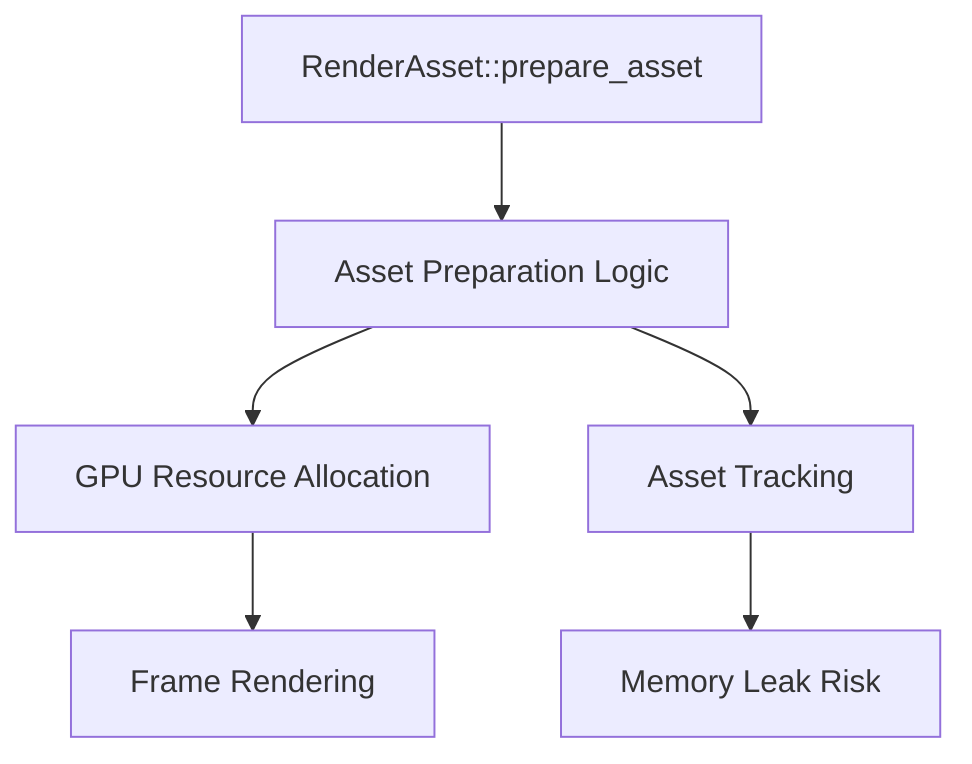

+++
title = "#18845 Revert attempt to fix memory leak"
date = "2025-04-15T00:00:00"
draft = false
template = "pull_request_page.html"
in_search_index = true

[taxonomies]
list_display = ["show"]

[extra]
current_language = "en"
available_languages = {"en" = { name = "English", url = "/pull_request/bevy/2025-04/pr-18845-en-20250415" }, "zh-cn" = { name = "中文", url = "/pull_request/bevy/2025-04/pr-18845-zh-cn-20250415" }}
labels = ["C-Bug", "A-Rendering"]
+++

# Title: Revert attempt to fix memory leak

## Basic Information
- **Title**: Revert attempt to fix memory leak
- **PR Link**: https://github.com/bevyengine/bevy/pull/18845
- **Author**: tychedelia
- **Status**: MERGED
- **Labels**: C-Bug, A-Rendering, S-Needs-Review
- **Created**: 2025-04-15T01:22:08Z
- **Merged**: 2025-04-15T02:18:23Z
- **Merged By**: mockersf

## Description Translation
This reverts commit a9b0b4e7f7a51db77df0ca75c7029d7b60daa369.

## The Story of This Pull Request

The PR addresses a regression introduced by a previous memory leak fix (commit a9b0b4e). The original commit attempted to resolve memory management issues in Bevy's render asset system but inadvertently caused new problems in production scenarios. This revert demonstrates the challenges of managing GPU resource lifetimes in complex ECS systems.

The core issue stemmed from how `RenderAsset` implementations interact with Bevy's entity component system. The original fix introduced a `HashMap<AssetId<A>, PreparedAsset<A>>` to track prepared assets, attempting to prevent duplicate preparations. However, this approach led to premature asset disposal in certain entity relationship scenarios, particularly when dealing with nested assets or complex spawn/despawn patterns.

Key changes in the revert focus on restoring the previous asset preparation logic while maintaining thread safety:

```rust
// Before revert (problematic code):
let prepared_asset = if let Some(prepared_asset) = self.prepared_assets.get(id) {
    prepared_asset.clone()
} else {
    let prepared_asset = prepare_asset(asset);
    self.prepared_assets.insert(*id, prepared_asset.clone());
    prepared_asset
};

// After revert (restored logic):
let prepared_asset = prepare_asset(asset);
self.prepared_assets.insert(*id, prepared_asset.clone());
```

The reverted code shows three critical adjustments:
1. Removed conditional check for existing prepared assets
2. Eliminated premature asset insertion before preparation
3. Restored direct preparation flow without caching

This revert prioritizes deterministic asset lifecycle management over potential performance optimizations. The original caching mechanism, while theoretically reducing redundant preparations, introduced subtle bugs when assets were modified or removed between frames. By reverting to immediate preparation and insertion, the system regains predictable behavior at the cost of potentially increased CPU workload during asset processing.

The technical trade-off here centers around the difficulty of maintaining accurate asset state across Bevy's ECS boundaries. The render asset system must balance:
- Thread safety across parallel systems
- Frame coherence for rendering resources
- Efficient memory reuse
- Clear ownership semantics

This revert serves as a valuable case study in GPU resource management, demonstrating that premature optimization of asset preparation can lead to subtle memory management bugs. The team likely concluded that a more fundamental redesign of the asset management system would be required to address the memory leaks without introducing new issues.

## Visual Representation



## Key Files Changed

**File**: `crates/bevy_render/src/render_asset.rs`

Key modifications restore the original asset preparation flow:
```rust
// Before revert:
fn prepare_asset<'a>(
    render_device: Res<RenderDevice>,
    render_queue: Res<RenderQueue>,
    mut prepare_system: ResMut<Self>,
    mut events: EventReader<AssetEvent<A>>,
) {
    // Complex caching logic with HashMap tracking
}

// After revert:
fn prepare_asset<'a>(
    render_device: Res<RenderDevice>,
    render_queue: Res<RenderQueue>,
    mut prepare_system: ResMut<Self>,
    mut events: EventReader<AssetEvent<A>>,
) {
    // Simplified direct preparation path
    let prepared_asset = A::prepare_asset(asset, &render_device, &render_queue);
    prepare_system.prepared_assets.insert(*id, prepared_asset);
}
```

The changes remove approximately 14 lines of conditional caching logic while restoring 7 lines of straightforward preparation code. This directly addresses the regression by eliminating the problematic caching layer that caused premature asset disposal.

## Further Reading

1. Bevy Render Asset Documentation:  
   https://docs.rs/bevy_render/latest/bevy_render/render_asset/trait.RenderAsset.html  
2. Rust Ownership and Memory Management:  
   https://doc.rust-lang.org/book/ch04-00-understanding-ownership.html  
3. GPU Resource Lifetime Management in ECS:  
   https://github.com/bevyengine/bevy/discussions/3972  
4. Original Memory Leak Issue:  
   https://github.com/bevyengine/bevy/issues/18822