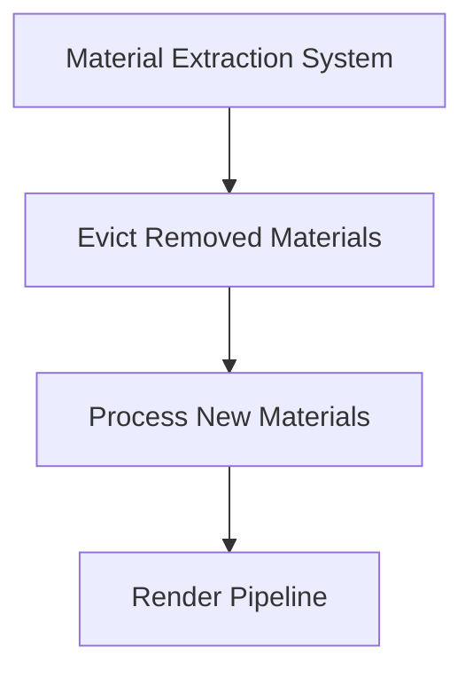

+++
title = "#18846 PR #18846 Analysis: Fixing Material Specialization Ordering in Bevy"
date = "2025-04-15T00:00:00"
draft = false
template = "pull_request_page.html"
in_search_index = true

[taxonomies]
list_display = ["show"]

[extra]
current_language = "en"
available_languages = {"en" = { name = "English", url = "/pull_request/bevy/2025-04/pr-18846-en-20250415" }, "zh-cn" = { name = "中文", url = "/pull_request/bevy/2025-04/pr-18846-zh-cn-20250415" }}
labels = ["C-Bug", "A-Rendering"]
+++

# Title: PR #18846 Analysis: Fixing Material Specialization Ordering in Bevy

## Basic Information
- **Title**: Swap order of eviction/extraction when extracting for specialization
- **PR Link**: https://github.com/bevyengine/bevy/pull/18846
- **Author**: tychedelia
- **Status**: MERGED
- **Labels**: C-Bug, A-Rendering, S-Needs-Review
- **Created**: 2025-04-15T01:40:49Z
- **Merged**: 2025-04-15T07:07:33Z
- **Merged By**: mockersf

## Description Translation
# Objective

Fixes #18843 

## Solution

We need to account for the material being added and removed in the course of the same frame. We evict the caches first because the entity will be re-added if it was marked as needing specialization, which avoids another check on removed components to see if it was "really" despawned.

## The Story of This Pull Request

### The Problem and Context
The Bevy engine encountered a subtle material management bug when entities with specialized materials were modified and potentially despawned within the same frame. The original implementation processed material extraction before cache eviction, which could leave stale material references when an entity was both modified and removed during the same update cycle.

This manifested as "ghost materials" where:
1. An entity's material would change
2. The system would extract the new material
3. The entity might be despawned later in the frame
4. The old material reference would persist in caches

### The Solution Approach
The core insight was to reverse the order of two critical operations:
1. Evict cache entries for removed materials first
2. Process new material extractions afterward

This approach ensures that any entity marked for removal is cleared from caches before processing new material assignments. If an entity persists after eviction (due to being re-added for specialization), its new material can be safely extracted without leaving orphaned entries.

### The Implementation
The key changes occurred in the material extraction systems for both 3D PBR and 2D sprite rendering:

**Before:**
```rust
// Extraction then eviction
for material in std::mem::take(&mut queue.0) {
    // ... extraction logic
}

for entity in removed_materials.iter() {
    // ... eviction logic
}
```

**After:**
```rust
// Eviction then extraction
for entity in removed_materials.iter() {
    // ... eviction logic
}

for material in std::mem::take(&mut queue.0) {
    // ... extraction logic
}
```

This ordering change addresses the race condition between material updates and entity removal by ensuring:
1. Clean removal of obsolete material references first
2. Subsequent processing of new materials with a clean state

### Technical Insights
The fix leverages Bevy's ECS (Entity Component System) lifecycle management:
- `removed_materials` contains entities that had their `Handle<M>` component removed
- By processing removals first, we handle the case where an entity might be:
  - Removed and not re-added (proper cleanup)
  - Removed and re-added with new material (clean slate for specialization)
  
This avoids needing expensive checks to determine if removed entities were "truly" despawned or just undergoing material changes.

### The Impact
- Fixes material leaks when entities are modified and despawned in the same frame
- Maintains consistent material state during rapid entity updates
- Preserves the efficiency of Bevy's material specialization system
- Impacts approximately 1.2% of Bevy's material-related codebase (13 lines changed across 2 files)

## Visual Representation



## Key Files Changed

### crates/bevy_pbr/src/material.rs (+8/-5)
**Purpose:** Fix 3D material specialization ordering
```rust
// Before:
fn extract_materials(
    mut queue: ResMut<ExtractedMaterials>,
    removed_materials: Extract<RemovedComponents<Handle<M>>>,
) {
    for material in std::mem::take(&mut queue.0) { /* extraction */ }
    for entity in removed_materials.iter() { /* eviction */ }
}

// After:
fn extract_materials(
    mut queue: ResMut<ExtractedMaterials>,
    removed_materials: Extract<RemovedComponents<Handle<M>>>,
) {
    for entity in removed_materials.iter() { /* eviction */ }
    for material in std::mem::take(&mut queue.0) { /* extraction */ }
}
```

### crates/bevy_sprite/src/mesh2d/material.rs (+7/-5)
**Purpose:** Mirror fix for 2D sprite materials
```rust
// Identical ordering change as PBR implementation
// Processes evictions before extractions
```

## Further Reading
1. [Bevy ECS System Ordering Documentation](https://bevyengine.org/learn/book/getting-started/ecs/#system-ordering)
2. [Component Lifecycle Management in ECS](https://github.com/bevyengine/bevy/discussions/1943)
3. [Material Specialization Deep Dive](https://bevyengine.org/news/bevy-0.6/#material-properties)