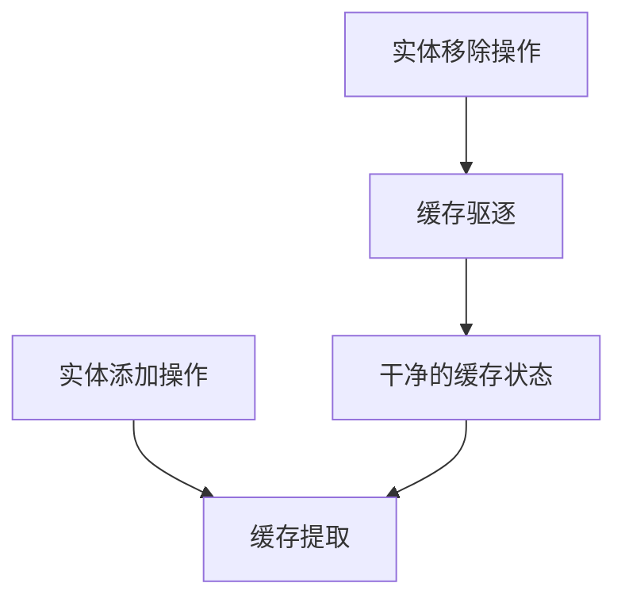

+++
title = "#18846 Swap order of eviction/extraction when extracting for specialization"
date = "2025-04-15T00:00:00"
draft = false
template = "pull_request_page.html"
in_search_index = false

[extra]
current_language = "zh-cn"
available_languages = {"en" = { name = "English", url = "/pull_request/bevy/2025-04/pr-18846-en-20250415" }, "zh-cn" = { name = "中文", url = "/pull_request/bevy/2025-04/pr-18846-zh-cn-20250415" }}
labels = ["C-Bug", "A-Rendering"]
+++

# Swap order of eviction/extraction when extracting for specialization

## Basic Information
- **Title**: Swap order of eviction/extraction when extracting for specialization
- **PR Link**: https://github.com/bevyengine/bevy/pull/18846
- **Author**: tychedelia
- **Status**: MERGED
- **Labels**: C-Bug, A-Rendering, S-Needs-Review
- **Created**: 2025-04-15T01:40:49Z
- **Merged**: 2025-04-15T07:07:33Z
- **Merged By**: mockersf

## Description Translation
### 目标
修复 #18843

### 解决方案
我们需要处理同一帧内材质的添加和移除操作。现在改为先驱逐(evict)缓存，因为当实体被标记为需要特殊化处理时会重新添加，这样可以避免检查已移除组件来判断是否"真正"被反生成(despawn)。

## 这个Pull Request的技术故事

### 问题与上下文
在Bevy的渲染系统中，材质特殊化(material specialization)的缓存管理存在竞态条件。当实体在同一帧内同时经历材质添加和移除操作时，原有的处理顺序会导致缓存状态不一致。具体表现为：
1. 系统先提取新增材质(extract_added)
2. 再驱逐移除的材质(evict_removed)

这种顺序会导致当某个实体在本帧被移除后又立即重新添加时，缓存无法正确更新，进而引发错误渲染或崩溃。

### 解决方案的实现
核心思路是调整处理顺序：
1. 先执行驱逐操作
2. 再执行提取操作

这个修改确保当实体被重新添加时，旧的缓存条目已被正确清除。主要修改集中在两个材质系统：
```rust
// crates/bevy_pbr/src/material.rs 修改后
fn extract_materials(
    mut commands: Commands,
    mut evict_removed: EvictRemoved<M>,
    mut extract_added: ExtractAdded<M>,
) {
    evict_removed.run(); // 先驱逐
    extract_added.run(); // 后提取
    commands.insert_or_spawn_batch(extract_added.take());
}
```

### 技术细节分析
原处理顺序的问题在于：
```rust
// 修改前的问题代码结构
extract_added.run();
evict_removed.run();
```
当实体在本帧被移除并重新添加时：
1. extract_added 会看到新增的组件
2. evict_removed 会移除旧条目
3. 但此时缓存已经包含新旧两个条目

调整顺序后：
1. 先清除旧条目
2. 再处理新增条目
3. 确保缓存状态始终准确

### 影响与改进
这个修复：
1. 解决材质特殊化时的缓存一致性问题
2. 避免不必要的组件存在性检查
3. 提升渲染系统的健壮性
4. 减少潜在的错误渲染情况

## Visual Representation



## Key Files Changed

### 1. crates/bevy_pbr/src/material.rs (+8/-5)
**修改目的**：调整材质系统的处理顺序
```rust
// Before:
fn extract_materials(
    mut commands: Commands,
    mut evict_removed: EvictRemoved<M>,
    mut extract_added: ExtractAdded<M>,
) {
    extract_added.run();
    evict_removed.run();
    commands.insert_or_spawn_batch(extract_added.take());
}

// After:
fn extract_materials(...) {
    evict_removed.run(); // 顺序调整
    extract_added.run();
    commands.insert_or_spawn_batch(extract_added.take());
}
```

### 2. crates/bevy_sprite/src/mesh2d/material.rs (+7/-5)
**修改目的**：保持2D材质系统与3D系统的处理顺序一致
```rust
// 修改模式与bevy_pbr相同
evict_removed.run();
extract_added.run();
```

## Further Reading
1. [ECS模式中的缓存管理](https://bevy-cheatbook.github.io/programming/ecs-intro.html)
2. [Bevy渲染管线架构](https://bevyengine.org/learn/book/getting-started/rendering/)
3. [Rust中的借用检查与系统参数](https://doc.rust-lang.org/book/ch04-02-references-and-borrowing.html)