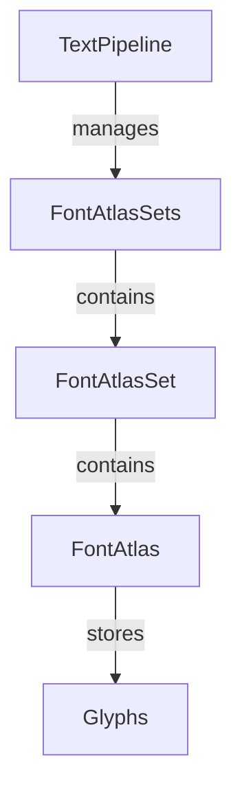

+++
title = "#18850 `FontAtlasSet` fixes"
date = "2025-04-27T00:00:00"
draft = false
template = "pull_request_page.html"
in_search_index = true

[taxonomies]
list_display = ["show"]

[extra]
current_language = "en"
available_languages = {"en" = { name = "English", url = "/pull_request/bevy/2025-04/pr-18850-en-20250427" }, "zh-cn" = { name = "中文", url = "/pull_request/bevy/2025-04/pr-18850-zh-cn-20250427" }}
labels = ["C-Bug", "C-Docs", "A-Text"]
+++

# Title

## Basic Information
- **Title**: `FontAtlasSet` fixes
- **PR Link**: https://github.com/bevyengine/bevy/pull/18850
- **Author**: ickshonpe
- **Status**: MERGED
- **Labels**: C-Bug, C-Docs, S-Ready-For-Final-Review, A-Text
- **Created**: 2025-04-15T10:01:45Z
- **Merged**: 2025-04-26T21:42:03Z
- **Merged By**: mockersf

## Description Translation
# Objective

Fix problems with  `FontAtlasSet`:

* `FontAtlasSet` derives `Asset` but `FontAtlasSet`s are not Bevy assets.
* The doc comments state that `FontAtlasSet`s are assets that are created automatically when fonts are loaded. They aren't, they are created as needed during text updates. 

## Solution
* Removed the `Asset` derive.
* Rewrote the doc comments.


## The Story of This Pull Request

The PR addresses two related issues in Bevy's text rendering system centered around the `FontAtlasSet` implementation. The core problem stemmed from an incorrect type definition and misleading documentation that could lead to developer misconceptions about how font atlases are managed.

The first issue was a type system mismatch: `FontAtlasSet` incorrectly derived the `Asset` trait through `#[derive(Debug, TypePath, Asset)]`. This created a false expectation that these sets behave like standard Bevy assets, when in reality they're managed differently. The `Asset` derivation would enable operations like loading through the asset server or watching for changes - capabilities that weren't actually supported or intended for this type.

The second problem involved documentation inaccuracies. The original comments stated:
```rust
/// A `FontAtlasSet` is an [`Asset`].
/// 
/// There is one `FontAtlasSet` for each font:
/// - When a [`Font`] is loaded as an asset...
/// - ~When a font is loaded as a system font...
```
This description incorrectly suggested automatic asset creation tied to font loading, when the actual implementation creates `FontAtlasSet` instances on-demand during text layout operations via `TextPipeline::queue_text`.

The solution involved two targeted changes:
1. **Trait Correction**: Removing the `Asset` derive from the struct definition
2. **Documentation Update**: Rewriting the module-level comments to accurately reflect the actual creation and management workflow

The key implementation change appears simple but has important implications:
```rust
// Before:
#[derive(Debug, TypePath, Asset)]
pub struct FontAtlasSet { ... }

// After:
#[derive(Debug, TypePath)]
pub struct FontAtlasSet { ... }
```
By removing the `Asset` derive, the type system now correctly reflects that these sets aren't managed through Bevy's asset pipeline. This prevents potential misuse where developers might try to interact with them as regular assets.

The documentation was revised to clarify:
```rust
/// There is at most one `FontAtlasSet` for each font, stored in the `FontAtlasSets` resource.
/// `FontAtlasSet`s are added and updated by the [`queue_text`] function.
```
This accurately describes how the text rendering system manages atlas sets through the `TextPipeline` rather than through asset loading mechanisms.

These changes address potential developer confusion and prevent incorrect assumptions about the type's capabilities. The documentation improvements help align API expectations with actual system behavior, particularly important for engine contributors working on text rendering features.

## Visual Representation



## Key Files Changed

**crates/bevy_text/src/font_atlas_set.rs** (+4/-12)

Key changes:
1. Removed incorrect Asset trait derivation
2. Updated documentation comments

Before:
```rust
#[derive(Debug, TypePath, Asset)]
pub struct FontAtlasSet {
    font_atlases: HashMap<FontAtlasKey, Vec<FontAtlas>>,
}

/// A `FontAtlasSet` is an [`Asset`].
/// 
/// There is one `FontAtlasSet` for each font...
/// It is used by [`TextPipeline::queue_text`]
```

After:
```rust
#[derive(Debug, TypePath)]
pub struct FontAtlasSet {
    font_atlases: HashMap<FontAtlasKey, Vec<FontAtlas>>,
}

/// There is at most one `FontAtlasSet` for each font...
/// `FontAtlasSet`s are added and updated by the [`queue_text`] function.
```

These changes ensure type system accuracy and provide correct usage documentation while maintaining all existing functionality.

## Further Reading

1. [Bevy Asset System Documentation](https://bevyengine.org/learn/book/assets/)
2. [Bevy Text Rendering Guide](https://bevyengine.org/learn/book/features/text/)
3. [Rust API Guidelines on Type Conversions](https://rust-lang.github.io/api-guidelines/interoperability.html) (Relevant for trait implementation decisions)