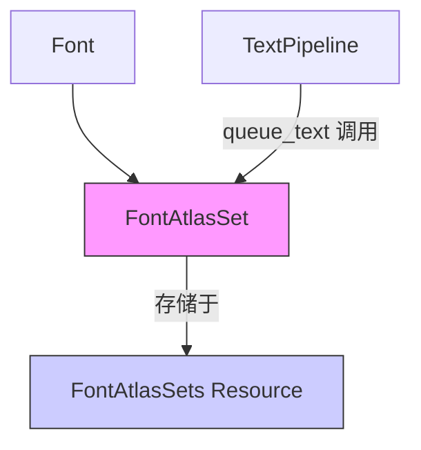

+++
title = "#18850 `FontAtlasSet` fixes"
date = "2025-04-27T00:00:00"
draft = false
template = "pull_request_page.html"
in_search_index = false

[extra]
current_language = "zh-cn"
available_languages = {"en" = { name = "English", url = "/pull_request/bevy/2025-04/pr-18850-en-20250427" }, "zh-cn" = { name = "中文", url = "/pull_request/bevy/2025-04/pr-18850-zh-cn-20250427" }}
labels = ["C-Bug", "C-Docs", "A-Text"]
+++

# FontAtlasSet 修复分析报告

## Basic Information
- **Title**: `FontAtlasSet` fixes
- **PR Link**: https://github.com/bevyengine/bevy/pull/18850
- **Author**: ickshonpe
- **Status**: MERGED
- **Labels**: C-Bug, C-Docs, S-Ready-For-Final-Review, A-Text
- **Created**: 2025-04-15T10:01:45Z
- **Merged**: 2025-04-26T21:42:03Z
- **Merged By**: mockersf

## Description Translation
### 目标
修复 `FontAtlasSet` 的问题：
* `FontAtlasSet` 继承自 `Asset`，但实际上并不是 Bevy 的资产类型
* 文档注释声称 `FontAtlasSet` 是字体加载时自动创建的资产，但实际是在文本更新时按需创建的

### 解决方案
* 移除 `Asset` 继承
* 重写文档注释

## The Story of This Pull Request

### 问题背景与上下文
在 Bevy 的文本渲染系统中，`FontAtlasSet` 承担着管理字体图集的重要职责。该结构体存在两个主要问题：

1. **类型定义矛盾**：尽管 `FontAtlasSet` 通过 `#[derive(Asset)]` 标记为资产类型，但实际上它并未被注册为真正的 Bevy 资产。这种不一致可能导致以下问题：
   - 开发者误以为可以通过标准资产系统管理 `FontAtlasSet`
   - 潜在的资产事件误触发风险

2. **文档误导**：现有文档声称这些图集在字体加载时自动创建，但实际上它们是在文本组件更新时按需生成的。这种错误说明会导致开发者对系统行为的错误认知，影响调试和功能扩展。

### 解决方案与实现
核心修改集中在两个层面：

**1. 类型修正**
```rust
// Before:
#[derive(Debug, TypePath, Asset)]
pub struct FontAtlasSet {
    font_atlases: HashMap<FontAtlasKey, Vec<FontAtlas>>,
}

// After:
#[derive(Debug, TypePath)]
pub struct FontAtlasSet {
    font_atlases: HashMap<FontAtlasKey, Vec<FontAtlas>>,
}
```
移除 `Asset` 继承明确其非资产性质，避免了类型系统的误用可能性。

**2. 文档重构**
```rust
// 原文档（问题描述）：
/// A `FontAtlasSet` is an [`Asset`].
/// When a [`Font`] is loaded... a `FontAtlasSet` asset is created

// 新文档（准确描述）：
/// There is at most one `FontAtlasSet` for each font, stored in the `FontAtlasSets` resource.
/// `FontAtlasSet`s are added and updated by the [`queue_text`] function.
```
新文档明确：
- 图集的实际存储位置（`FontAtlasSets` 资源）
- 创建/更新机制（通过 `queue_text` 函数）
- 生命周期管理方式（按需生成）

### 技术考量
- **类型安全**：通过移除错误的资产标记，确保类型系统准确反映实际使用场景
- **文档精确性**：准确描述图集生命周期，帮助开发者理解文本渲染管线的工作机制
- **架构一致性**：保持与 Bevy 现有资源管理模式的统一（资源 vs 资产）

### 影响与改进
1. **消除潜在错误**：防止开发者错误地尝试通过资产系统操作 `FontAtlasSet`
2. **提升可维护性**：准确的文档减少未来开发中的认知成本
3. **性能优化基础**：明确的按需创建机制文档为后续性能优化提供正确上下文

## Visual Representation



## Key Files Changed

### `crates/bevy_text/src/font_atlas_set.rs` (+4/-12)
**关键修改：**
1. 移除 Asset 继承
```diff
- use bevy_asset::{Asset, AssetEvent, AssetId, Assets};
+ use bevy_asset::{AssetEvent, AssetId, Assets};
```
2. 文档重写
```diff
- /// A `FontAtlasSet` is an [`Asset`].
- /// There is one `FontAtlasSet` for each font...
+ /// There is at most one `FontAtlasSet` for each font...
+ /// `FontAtlasSet`s are added and updated by...
```

## Further Reading
1. [Bevy 资产系统文档](https://bevyengine.org/learn/book/assets/)
2. [ECS 资源管理指南](https://bevyengine.org/learn/book/ecs-resources/)
3. [文本渲染管线源码分析](https://github.com/bevyengine/bevy/blob/main/crates/bevy_text/src/pipeline.rs)