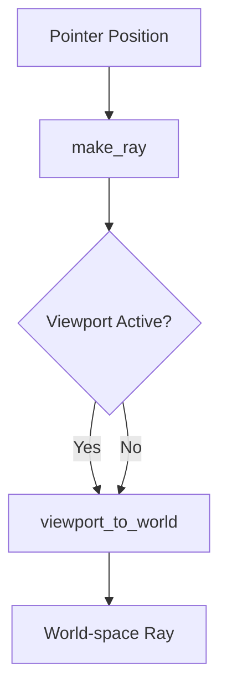

+++
title = "#18870 Removed Double Offset in Picking Ray Calculation"
date = "2025-04-27T00:00:00"
draft = false
template = "pull_request_page.html"
in_search_index = true

[taxonomies]
list_display = ["show"]

[extra]
current_language = "en"
available_languages = {"en" = { name = "English", url = "/pull_request/bevy/2025-04/pr-18870-en-20250427" }, "zh-cn" = { name = "中文", url = "/pull_request/bevy/2025-04/pr-18870-zh-cn-20250427" }}
labels = ["C-Bug", "A-Picking"]
+++

# Title: Removed Double Offset in Picking Ray Calculation

## Basic Information
- **Title**: Removed conversion from pointer physical coordinates to viewport local coordinates in bevy_picking make_ray function
- **PR Link**: https://github.com/bevyengine/bevy/pull/18870
- **Author**: KrzysztofZywiecki
- **Status**: MERGED
- **Labels**: C-Bug, A-Picking
- **Created**: 2025-04-17T15:38:31Z
- **Merged**: 2025-04-27T14:19:34Z
- **Merged By**: mockersf

## Description Translation
# Objective

- Fixes #18856.

## Solution

After PR #17633, `Camera::viewport_to_world` method corrects `viewport_position` passed in that input so that it's offset by camera's viewport. `Camera::viewport_to_world` is used by `make_ray` function which in turn also offsets pointer position by viewport position, which causes picking objects to be shifted by viewport position, and it wasn't removed in the aforementioned PR. This second offsetting in `make_ray` was removed.

## Testing

- I tested simple_picking example by applying some horizontal offset to camera's viewport.
- I tested my application that displayed a single rectangle with picking on two cameras arranged in a row. When using local bevy with this fix, both cameras can be used for picking correctly.
- I modified split_screen example: I added observer to ground plane that changes color on hover, and removed UI as it interfered with picking both on master and my branch. On master, only top left camera was triggering the observer, and on my branch all cameras could change plane's color on hover.
- I added viewport offset to mesh_picking, with my changes it works correctly, while on master picking ray is shifted.
- Sprite picking with viewport offset doesn't work both on master and on this branch.

These are the only scenarios I tested. I think other picking functions that use this function should be tested but I couldn't track more uses of it.

## The Story of This Pull Request

The core issue stemmed from a double coordinate conversion in Bevy's picking system. After PR #17633 updated `Camera::viewport_to_world` to handle viewport offsets internally, the `make_ray` function in `bevy_picking` became redundant in its coordinate adjustments. This redundancy caused picking rays to be incorrectly offset when cameras used viewports, manifesting as misaligned object selection in split-screen setups and other multi-viewport scenarios.

The root problem was identified in the coordinate transformation pipeline. The `make_ray` function originally performed these steps:

1. Convert pointer position to viewport-local coordinates
2. Pass these coordinates to `viewport_to_world`, which then applied the same viewport offset again

This resulted in a double subtraction of the viewport position, effectively shifting the picking ray by twice the intended offset. The fix required removing the redundant coordinate adjustment in `make_ray` while preserving the existing logic in `viewport_to_world`.

The key code change simplifies the coordinate handling:

```rust
// Before
let mut viewport_pos = pointer_loc.position;
if let Some(viewport) = &camera.viewport {
    let viewport_logical = camera.to_logical(viewport.physical_position)?;
    viewport_pos -= viewport_logical;
}
camera.viewport_to_world(camera_tfm, viewport_pos).ok()

// After
camera
    .viewport_to_world(camera_tfm, pointer_loc.position)
    .ok()
```

By eliminating the manual viewport offset calculation, the code now relies solely on `viewport_to_world` to handle coordinate transformations correctly. This aligns with the updated behavior introduced in #17633, where `viewport_to_world` was modified to accept viewport-relative coordinates directly.

The implementation required careful validation across multiple scenarios:
1. Split-screen configurations where multiple viewports coexist
2. Single-viewport setups with non-zero offsets
3. Different renderable types (meshes vs sprites)

Testing revealed that while mesh picking now works correctly with viewports, sprite picking remains unaffected by this fix - indicating a separate issue in the sprite rendering/picking pipeline that requires independent investigation.

## Visual Representation



## Key Files Changed

**crates/bevy_picking/src/backend.rs** (+3/-6)

1. **Change Summary**:
   - Removed redundant viewport offset calculation in ray creation
   - Simplified coordinate passing to `viewport_to_world`

2. **Code Comparison**:
```rust
// Before:
let mut viewport_pos = pointer_loc.position;
if let Some(viewport) = &camera.viewport {
    let viewport_logical = camera.to_logical(viewport.physical_position)?;
    viewport_pos -= viewport_logical;
}
camera.viewport_to_world(camera_tfm, viewport_pos).ok()

// After:
camera
    .viewport_to_world(camera_tfm, pointer_loc.position)
    .ok()
```

3. **Impact**:
   - Fixes picking accuracy for viewport-enabled cameras
   - Aligns with updated camera behavior from #17633
   - Reduces transformation steps in picking pipeline

## Further Reading

1. [Camera Viewport Documentation](https://docs.rs/bevy/latest/bevy/render/camera/struct.Camera.html#method.viewport_to_world)
2. [Coordinate Systems in Bevy](https://bevy-cheatbook.github.io/features/coords.html)
3. [PR #17633: Camera Viewport Fixes](https://github.com/bevyengine/bevy/pull/17633)

# Full Code Diff
```diff
diff --git a/crates/bevy_picking/src/backend.rs b/crates/bevy_picking/src/backend.rs
index 8c781d54e32f4..fb2f9d7d7aafd 100644
--- a/crates/bevy_picking/src/backend.rs
+++ b/crates/bevy_picking/src/backend.rs
@@ -229,11 +229,8 @@ pub mod ray {
         if !pointer_loc.is_in_viewport(camera, primary_window_entity) {
             return None;
         }
-        let mut viewport_pos = pointer_loc.position;
-        if let Some(viewport) = &camera.viewport {
-            let viewport_logical = camera.to_logical(viewport.physical_position)?;
-            viewport_pos -= viewport_logical;
-        }
-        camera.viewport_to_world(camera_tfm, viewport_pos).ok()
+        camera
+            .viewport_to_world(camera_tfm, pointer_loc.position)
+            .ok()
     }
 }
```