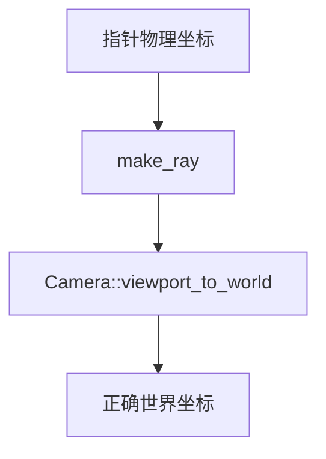

+++
title = "#18870 Removed conversion from pointer physical coordinates to viewport local coordinates in bevy_picking make_ray function"
date = "2025-04-27T00:00:00"
draft = false
template = "pull_request_page.html"
in_search_index = false

[extra]
current_language = "zh-cn"
available_languages = {"en" = { name = "English", url = "/pull_request/bevy/2025-04/pr-18870-en-20250427" }, "zh-cn" = { name = "中文", url = "/pull_request/bevy/2025-04/pr-18870-zh-cn-20250427" }}
+++

# Removed conversion from pointer physical coordinates to viewport local coordinates in bevy_picking make_ray function

## 基本信息
- **标题**: Removed conversion from pointer physical coordinates to viewport local coordinates in bevy_picking make_ray function
- **PR链接**: https://github.com/bevyengine/bevy/pull/18870
- **作者**: KrzysztofZywiecki
- **状态**: 已合并
- **标签**: C-Bug, A-Picking
- **创建时间**: 2025-04-17T15:38:31Z
- **合并时间**: 2025-04-27T14:19:34Z
- **合并者**: mockersf

## 描述翻译
### 目标
- 修复 #18856

### 解决方案
在 PR #17633 之后，`Camera::viewport_to_world` 方法会自动校正传入的 `viewport_position`，使其包含相机的视口偏移。`make_ray` 函数在使用该方法时又额外应用了视口偏移，导致拾取位置出现双倍偏移。本次修改移除了 `make_ray` 中多余的视口偏移计算。

### 测试
- 在 simple_picking 示例中应用水平视口偏移进行验证
- 在自定义应用中测试两个并排相机的拾取功能
- 修改 split_screen 示例验证多相机拾取
- 在 mesh_picking 中添加视口偏移测试
- 确认 sprite 拾取问题与本次修改无关（主分支和本分支均存在问题）

## 技术分析

### 问题背景与上下文
在 Bevy 的拾取系统中，`make_ray` 函数负责将屏幕坐标转换为世界空间的射线。PR #17633 改进了相机的视口处理逻辑，使 `Camera::viewport_to_world` 方法能够自动处理视口偏移。然而 `make_ray` 函数中仍然保留了旧版的视口偏移计算，导致双重偏移问题。具体表现为当相机设置视口偏移时，拾取位置与实际渲染位置不匹配。

### 解决方案与实现
核心修改位于 `backend.rs` 的 `ray::make_ray` 函数：

```rust
// 修改前代码
let mut viewport_pos = pointer_loc.position;
if let Some(viewport) = &camera.viewport {
    let viewport_logical = camera.to_logical(viewport.physical_position)?;
    viewport_pos -= viewport_logical;
}
camera.viewport_to_world(...)

// 修改后代码
camera.viewport_to_world(camera_tfm, pointer_loc.position).ok()
```

原有代码存在两个问题：
1. 手动将物理坐标转换为逻辑坐标时使用了 `to_logical` 方法
2. 在调用 `viewport_to_world` 前进行了不必要的视口偏移扣除

PR #17633 已使 `viewport_to_world` 内部自动处理视口偏移，因此直接传入原始坐标即可。这个修改使坐标转换流程符合单一职责原则，消除了冗余计算。

### 技术影响
1. **坐标系统统一**：确保所有视口相关的坐标转换统一由 `Camera::viewport_to_world` 处理
2. **多相机支持**：修复分屏场景下多个视口的正确拾取行为
3. **性能优化**：减少不必要的坐标转换计算步骤

### 验证策略
作者采用了分层测试方法：
1. **基础功能验证**：在 simple_picking 示例中测试基础拾取功能
2. **复杂场景测试**：自定义双相机布局验证视口边界处理
3. **示例改造测试**：修改 split_screen 示例，添加交互式拾取反馈
4. **回归测试**：确保 mesh_picking 在视口偏移下的正常运作

## 关键文件变更
### `crates/bevy_picking/src/backend.rs` (+3/-6)
核心修改移除了视口坐标的手动转换逻辑：
```rust
// 修改前：
let mut viewport_pos = pointer_loc.position;
if let Some(viewport) = &camera.viewport {
    let viewport_logical = camera.to_logical(viewport.physical_position)?;
    viewport_pos -= viewport_logical;
}
camera.viewport_to_world(camera_tfm, viewport_pos).ok()

// 修改后：
camera
    .viewport_to_world(camera_tfm, pointer_loc.position)
    .ok()
```
这个修改直接传递原始坐标到 `viewport_to_world`，依赖相机自身处理视口偏移，简化了坐标转换流程。

## 后续建议
1. **精灵拾取问题追踪**：需要单独调查 sprite 拾取在视口偏移下的异常行为
2. **坐标系统文档**：建议在 Camera 文档中明确视口坐标转换的职责划分
3. **测试覆盖增强**：为所有使用 `viewport_to_world` 的接口添加视口偏移测试用例



## 完整代码差异
```diff
diff --git a/crates/bevy_picking/src/backend.rs b/crates/bevy_picking/src/backend.rs
index 8c781d54e32f4..fb2f9d7d7aafd 100644
--- a/crates/bevy_picking/src/backend.rs
+++ b/crates/bevy_picking/src/backend.rs
@@ -229,11 +229,8 @@ pub mod ray {
         if !pointer_loc.is_in_viewport(camera, primary_window_entity) {
             return None;
         }
-        let mut viewport_pos = pointer_loc.position;
-        if let Some(viewport) = &camera.viewport {
-            let viewport_logical = camera.to_logical(viewport.physical_position)?;
-            viewport_pos -= viewport_logical;
-        }
-        camera.viewport_to_world(camera_tfm, viewport_pos).ok()
+        camera
+            .viewport_to_world(camera_tfm, pointer_loc.position)
+            .ok()
     }
 }
```