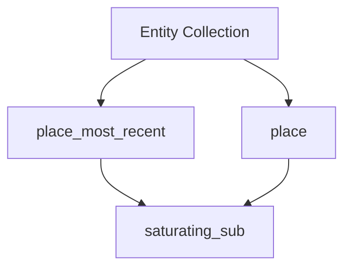

+++
title = "#18891 Fixing Index Overflow in Entity Relationship Management"
date = "2025-04-21T00:00:00"
draft = false
template = "pull_request_page.html"
in_search_index = true

[taxonomies]
list_display = ["show"]

[extra]
current_language = "en"
available_languages = {"en" = { name = "English", url = "/pull_request/bevy/2025-04/pr-18891-en-20250421" }, "zh-cn" = { name = "中文", url = "/pull_request/bevy/2025-04/pr-18891-zh-cn-20250421" }}
labels = ["C-Bug", "A-ECS"]
+++

# Title: Fixing Index Overflow in Entity Relationship Management

## Basic Information  
- **Title**: don't overflow when relations are empty  
- **PR Link**: https://github.com/bevyengine/bevy/pull/18891  
- **Author**: mockersf  
- **Status**: MERGED  
- **Labels**: C-Bug, A-ECS, S-Ready-For-Final-Review  
- **Created**: 2025-04-21T10:38:34Z  
- **Merged**: 2025-04-21T21:02:13Z  
- **Merged By**: mockersf  

## Description Translation  
# Objective  
- Fixes #18890  

## Solution  
- Don't overflow when subtracting, bound at 0  

## Testing  
- Reproducer from the issue now works  

## The Story of This Pull Request  
The PR addresses an integer underflow bug in Bevy's ECS relationship management system. The core issue occurred when manipulating empty entity collections, where index calculations could attempt to subtract 1 from a zero-length collection.  

In the original implementation, two methods (`place_most_recent` and `place`) contained unsafe index calculations:  
```rust
let index = index.min(self.len() - 1);
```  
When `self.len()` was 0, this would compute `0 - 1`, causing an integer underflow. In Rust debug builds, this would panic; in release builds, it would wrap to the maximum usize value, leading to unexpected behavior.

The solution replaces the subtraction with a saturating operation:  
```rust
let index = index.min(self.len().saturating_sub(1));
```  
This change ensures the subtraction never goes below zero. The `saturating_sub` method is a common Rust pattern for safe integer arithmetic, returning 0 instead of wrapping when underflow would occur.

The bug manifested when manipulating entity relationships with empty collections, particularly in scenarios involving hierarchy operations. The fix maintains the existing insertion logic while adding bounds checking for empty collection edge cases.

## Visual Representation  


## Key Files Changed  
**crates/bevy_ecs/src/relationship/relationship_source_collection.rs** (+2/-2)  

Before:  
```rust
let index = index.min(self.len() - 1);
```

After:  
```rust
let index = index.min(self.len().saturating_sub(1));
```

The changes occur in two nearly identical code blocks handling entity placement. This consistency ensures both code paths benefit from the same safety check. The modification preserves the original insertion logic's behavior while preventing underflow in empty collection scenarios.

## Further Reading  
- Rust Integer Methods: [std::primitive::usize#method.saturating_sub](https://doc.rust-lang.org/std/primitive.usize.html#method.saturating_sub)  
- Bevy ECS Relationships: [Bevy Book - ECS Relationships](https://bevyengine.org/learn/book/ecs-relationships/)  
- Integer Overflow Handling: [Rust by Example - Overflow](https://doc.rust-lang.org/rust-by-example/types/numbers/overflow.html)  

# Full Code Diff  
```diff
diff --git a/crates/bevy_ecs/src/relationship/relationship_source_collection.rs b/crates/bevy_ecs/src/relationship/relationship_source_collection.rs
index 1a83c6c8255da..c2c9bd94d8235 100644
--- a/crates/bevy_ecs/src/relationship/relationship_source_collection.rs
+++ b/crates/bevy_ecs/src/relationship/relationship_source_collection.rs
@@ -213,7 +213,7 @@ impl OrderedRelationshipSourceCollection for Vec<Entity> {
 
     fn place_most_recent(&mut self, index: usize) {
         if let Some(entity) = self.pop() {
-            let index = index.min(self.len() - 1);
+            let index = index.min(self.len().saturating_sub(1));
             self.insert(index, entity);
         }
     }
@@ -221,7 +221,7 @@ impl OrderedRelationshipSourceCollection for Vec<Entity> {
     fn place(&mut self, entity: Entity, index: usize) {
         if let Some(current) = <[Entity]>::iter(self).position(|e| *e == entity) {
             // The len is at least 1, so the subtraction is safe.
-            let index = index.min(self.len() - 1);
+            let index = index.min(self.len().saturating_sub(1));
             Vec::remove(self, current);
             self.insert(index, entity);
         };
```