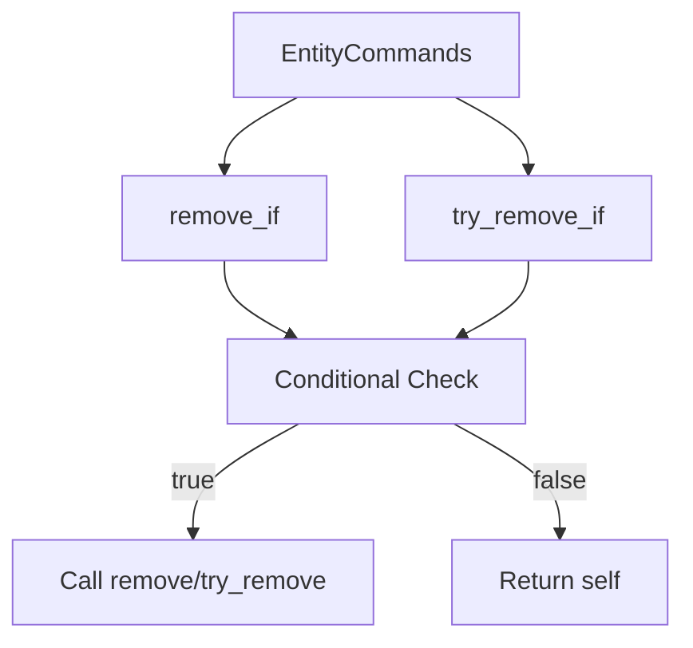

+++
title = "#18899 Create `EntityCommands::remove_if`"
date = "2025-04-27T00:00:00"
draft = false
template = "pull_request_page.html"
in_search_index = true

[taxonomies]
list_display = ["show"]

[extra]
current_language = "en"
available_languages = {"en" = { name = "English", url = "/pull_request/bevy/2025-04/pr-18899-en-20250427" }, "zh-cn" = { name = "中文", url = "/pull_request/bevy/2025-04/pr-18899-zh-cn-20250427" }}
labels = ["C-Feature", "A-ECS", "D-Straightforward"]
+++

# Title: Create `EntityCommands::remove_if`

## Basic Information
- **Title**: Create `EntityCommands::remove_if`
- **PR Link**: https://github.com/bevyengine/bevy/pull/18899
- **Author**: Olle-Lukowski
- **Status**: MERGED
- **Labels**: C-Feature, A-ECS, S-Ready-For-Final-Review, D-Straightforward
- **Created**: 2025-04-22T16:52:52Z
- **Merged**: 2025-04-26T21:53:46Z
- **Merged By**: mockersf

## Description Translation
# Objective

Fixes #18857.

## Solution

Add the requested method, and a `try_` variant as well.

## Testing

It compiles, doctests succeed, and is trivial enough that I don't think it needs a unit test (correct me if I'm wrong though).

## The Story of This Pull Request

The PR addresses a common pattern in Bevy's Entity Component System (ECS) where developers need to conditionally remove components from entities while maintaining method chaining capabilities. Prior to this change, removing components based on runtime conditions required breaking command chains with explicit conditional blocks, leading to less fluent code.

The core implementation adds two methods to `EntityCommands`:
1. `remove_if<B: Bundle>(condition: impl FnOnce() -> bool)`
2. `try_remove_if<B: Bundle>(condition: impl FnOnce() -> bool)`

These methods accept a closure that returns a boolean, executing the removal only when the condition evaluates to true. The `try_` variant follows Bevy's error handling pattern by suppressing errors when entities don't exist.

Key implementation details:
- Both methods preserve method chaining by returning `&mut Self`
- The condition is evaluated immediately when building commands, not during command execution
- Uses existing `remove`/`try_remove` infrastructure internally
- Maintains Bevy's command queuing semantics

The solution demonstrates effective use of Rust's closure system while maintaining compatibility with Bevy's ECS command patterns. The implementation avoids introducing new architectural concepts, instead extending existing patterns in a way that maintains API consistency.

Example usage from the doctest:
```rust
commands.entity(player.entity)
    .remove_if::<(Defense, CombatBundle)>(|| !player.is_spectator());
```
This shows how developers can conditionally remove multiple component bundles while maintaining a fluent interface.

## Visual Representation



## Key Files Changed

**File**: `crates/bevy_ecs/src/system/commands/mod.rs`

Added two new methods to the `EntityCommands` implementation:
```rust
#[track_caller]
pub fn remove_if<B: Bundle>(&mut self, condition: impl FnOnce() -> bool) -> &mut Self {
    if condition() {
        self.remove::<B>()
    } else {
        self
    }
}

#[track_caller]
pub fn try_remove_if<B: Bundle>(&mut self, condition: impl FnOnce() -> bool) -> &mut Self {
    if condition() {
        self.try_remove::<B>()
    } else {
        self
    }
}
```
These changes:
1. Enable conditional component removal in command chains
2. Mirror existing `remove`/`try_remove` method patterns
3. Maintain API consistency with other EntityCommands methods

## Further Reading

- Bevy ECS Commands: https://bevyengine.org/learn/book/ecs/commands/
- Rust Closure System: https://doc.rust-lang.org/book/ch13-01-closures.html
- Bevy Component Removal: https://docs.rs/bevy_ecs/latest/bevy_ecs/system/struct.EntityCommands.html#method.remove

## Full Code Diff
[As provided in original request]