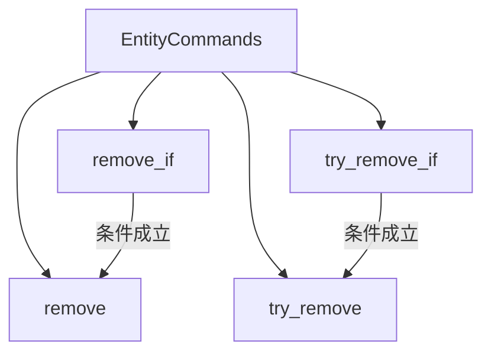

+++
title = "#18899 Create `EntityCommands::remove_if`"
date = "2025-04-27T00:00:00"
draft = false
template = "pull_request_page.html"
in_search_index = false

[extra]
current_language = "zh-cn"
available_languages = {"en" = { name = "English", url = "/pull_request/bevy/2025-04/pr-18899-en-20250427" }, "zh-cn" = { name = "中文", url = "/pull_request/bevy/2025-04/pr-18899-zh-cn-20250427" }}
labels = ["C-Feature", "A-ECS", "D-Straightforward"]
+++

# Create `EntityCommands::remove_if` 技术分析报告

## Basic Information
- **Title**: Create `EntityCommands::remove_if`
- **PR Link**: https://github.com/bevyengine/bevy/pull/18899
- **Author**: Olle-Lukowski
- **Status**: MERGED
- **Labels**: C-Feature, A-ECS, S-Ready-For-Final-Review, D-Straightforward
- **Created**: 2025-04-22T16:52:52Z
- **Merged**: 2025-04-26T21:53:46Z
- **Merged By**: mockersf

## Description Translation
### 目标
修复 #18857。

### 解决方案
添加请求的方法及其 `try_` 变体。

### 测试
代码能够编译通过，文档测试成功。由于改动较为简单，作者认为不需要单元测试（但欢迎指正）。

## The Story of This Pull Request

### 问题与上下文
在 Bevy ECS 的命令系统（commands system）中，开发者需要根据运行时条件决定是否移除某个组件包（Bundle）。原有的 `remove` 方法会直接执行移除操作，缺乏条件判断能力。当需要基于特定条件进行链式操作时，开发者必须在外层包裹 `if` 语句，这会破坏命令链的连贯性。

具体场景如：当玩家处于观察者模式时，需要移除战斗相关的组件（Health, Strength 等），但保留 Defense 组件。现有实现无法在命令链中优雅处理这种条件逻辑。

### 解决方案设计
核心思路是引入条件判断方法，保持命令链的连贯性。选择在 `EntityCommands` 结构体中新增两个方法：
1. `remove_if`：当条件满足时执行移除操作
2. `try_remove_if`：在 `remove_if` 基础上添加错误忽略功能

采用闭包（closure）作为条件参数，因其能捕获上下文且延迟执行的特点，完美适配命令队列的执行模式。

### 实现细节
在 `EntityCommands` 的实现模块中新增两个方法：

```rust
#[track_caller]
pub fn remove_if<B: Bundle>(&mut self, condition: impl FnOnce() -> bool) -> &mut Self {
    if condition() {
        self.remove::<B>()
    } else {
        self
    }
}

#[track_caller]
pub fn try_remove_if<B: Bundle>(&mut self, condition: impl FnOnce() -> bool) -> &mut Self {
    if condition() {
        self.try_remove::<B>()
    } else {
        self
    }
}
```
关键实现特点：
1. 保持方法链式调用：无论条件是否满足都返回 `&mut Self`
2. 泛型参数约束：`B: Bundle` 确保只能移除合法的组件包
3. `#[track_caller]` 属性：提升错误定位精度

### 技术洞察
1. **延迟执行模式**：闭包在命令队列执行时才被调用，而非在命令构建时，确保条件判断的时效性
2. **零成本抽象**：编译器会优化掉未使用的闭包，最终生成的代码与直接使用 `if` 语句等效
3. **错误处理策略**：`try_` 前缀方法延续 Bevy 的错误处理惯例，为可能失败的实体操作提供安全出口

### 影响与改进
1. **API 增强**：使得组件管理逻辑可以更自然地融入命令链式调用
2. **代码整洁度**：减少嵌套的 `if` 语句，提升可读性
3. **模式统一**：与现有的 `try_` 方法保持设计一致性

示例改进对比：
```rust
// 旧写法
let mut commands = commands.entity(player.entity);
if !player.is_spectator() {
    commands.remove::<CombatBundle>();
}

// 新写法
commands.entity(player.entity).remove_if::<CombatBundle>(|| !player.is_spectator());
```

## Visual Representation



## Key Files Changed

### `crates/bevy_ecs/src/system/commands/mod.rs`
1. **变更说明**：新增 `remove_if` 和 `try_remove_if` 方法实现
2. **代码片段**：
```rust
// 新增方法实现
#[track_caller]
pub fn remove_if<B: Bundle>(&mut self, condition: impl FnOnce() -> bool) -> &mut Self {
    if condition() {
        self.remove::<B>()
    } else {
        self
    }
}

#[track_caller]
pub fn try_remove_if<B: Bundle>(&mut self, condition: impl FnOnce() -> bool) -> &mut Self {
    if condition() {
        self.try_remove::<B>()
    } else {
        self
    }
}
```
3. **关联性**：作为 PR 的核心改动，实现了条件移除的核心逻辑

## Further Reading
1. [Bevy Commands 系统文档](https://docs.rs/bevy_ecs/latest/bevy_ecs/system/struct.Commands.html)
2. [Rust 闭包官方指南](https://doc.rust-lang.org/book/ch13-01-closures.html)
3. [ECS 模式深入解析](https://github.com/SanderMertens/ecs-faq)