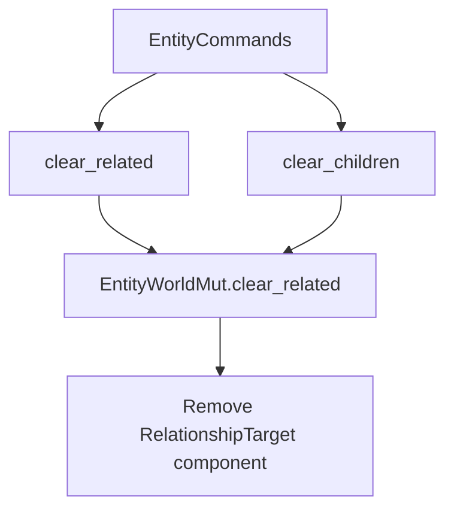

+++
title = "#18907 Add a method to clear all related entity to `EntityCommands` and friends"
date = "2025-04-30T00:00:00"
draft = false
template = "pull_request_page.html"
in_search_index = true

[taxonomies]
list_display = ["show"]

[extra]
current_language = "en"
available_languages = {"en" = { name = "English", url = "/pull_request/bevy/2025-04/pr-18907-en-20250430" }, "zh-cn" = { name = "中文", url = "/pull_request/bevy/2025-04/pr-18907-zh-cn-20250430" }}
labels = ["A-ECS", "C-Usability", "D-Straightforward"]
+++

# Add a method to clear all related entity to `EntityCommands` and friends

## Basic Information
- **Title**: Add a method to clear all related entity to `EntityCommands` and friends
- **PR Link**: https://github.com/bevyengine/bevy/pull/18907
- **Author**: Brezak
- **Status**: MERGED
- **Labels**: A-ECS, C-Usability, S-Ready-For-Final-Review, X-Uncontroversial, D-Straightforward
- **Created**: 2025-04-23T16:33:24Z
- **Merged**: 2025-04-30T21:20:49Z
- **Merged By**: mockersf

## Description Translation
# Objective

We have methods to:
- Add related entities
- Replace related entities
- Remove specific related entities

We don't have a method the remove all related entities so.

## Solution

Add a method to remove all related entities.

## Testing

A new test case.


## The Story of This Pull Request

The PR addresses a gap in Bevy's Entity Component System (ECS) API for managing entity relationships. While existing methods allowed adding, replacing, and removing specific related entities, there was no straightforward way to clear all relationships at once. This missing functionality forced developers to manually track and remove individual relationships, creating potential for errors and inefficiency in systems managing complex entity hierarchies.

The solution introduces a `clear_related` method that works with Bevy's relationship system through two primary components:

1. **Core Implementation** in `related_methods.rs`:
```rust
// EntityWorldMut implementation
pub fn clear_related<R: Relationship>(&mut self) -> &mut Self {
    self.remove::<R::RelationshipTarget>()
}

// EntityCommands implementation
pub fn clear_related<R: Relationship>(&mut self) -> &mut Self {
    self.queue(|mut entity: EntityWorldMut| {
        entity.clear_related::<R>();
    })
}
```
This generic approach removes the relationship target component entirely, effectively clearing all related entities in one operation. The implementation follows Bevy's established pattern for relationship management, ensuring consistency with existing APIs.

2. **Hierarchy Specialization** in `hierarchy.rs`:
```rust
// Added to both EntityWorldMut and EntityCommands
pub fn clear_children(&mut self) -> &mut Self {
    self.clear_related::<ChildOf>()
}
```
This child-specific method provides a more discoverable API for common parent-child relationships while leveraging the underlying generic implementation.

The test case verifies the complete removal of relationship components:
```rust
#[test]
fn remove_all_related() {
    let mut world = World::new();
    let a = world.spawn_empty().id();
    let b = world.spawn(ChildOf(a)).id();
    let c = world.spawn(ChildOf(a)).id();

    world.entity_mut(a).clear_related::<ChildOf>();

    assert_eq!(world.entity(a).get::<Children>(), None);
    assert_eq!(world.entity(b).get::<ChildOf>(), None);
    assert_eq!(world.entity(c).get::<ChildOf>(), None);
}
```
This test confirms that clearing relationships removes both the parent's `Children` component and the children's `ChildOf` components, ensuring complete relationship dissolution.

The implementation maintains Bevy's ECS performance characteristics by using component removal rather than iterative deletion. This approach leverages the engine's existing infrastructure for bulk component operations, making it efficient even for entities with large numbers of relationships.

## Visual Representation



## Key Files Changed

1. **crates/bevy_ecs/src/relationship/related_methods.rs** (+27/-0)
- Added `clear_related` method to both `EntityWorldMut` and `EntityCommands`
- Implements core relationship clearing logic through component removal
- Follows existing pattern from other relationship methods

2. **crates/bevy_ecs/src/hierarchy.rs** (+12/-0)
- Added `clear_children` convenience methods
- Specializes the generic `clear_related` for parent-child relationships
- Maintains API consistency with existing hierarchy methods

## Further Reading

- Bevy ECS Relationships Guide: [https://bevyengine.org/learn/book/ecs-relationships/]
- Component Removal Documentation: `bevy_ecs::world::EntityMut::remove`
- EntityCommands Pattern: `bevy_ecs::system::EntityCommands`