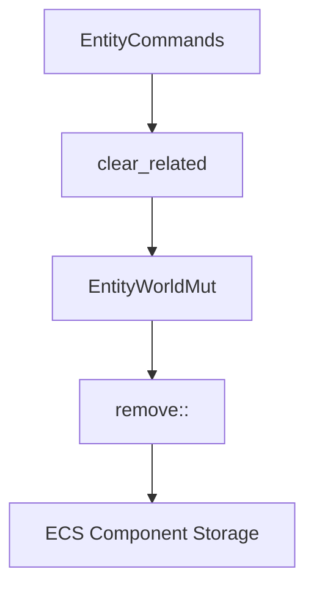

+++
title = "#18907 Add a method to clear all related entity to `EntityCommands` and friends"
date = "2025-04-30T00:00:00"
draft = false
template = "pull_request_page.html"
in_search_index = false

[extra]
current_language = "zh-cn"
available_languages = {"en" = { name = "English", url = "/pull_request/bevy/2025-04/pr-18907-en-20250430" }, "zh-cn" = { name = "中文", url = "/pull_request/bevy/2025-04/pr-18907-zh-cn-20250430" }}
labels = ["A-ECS", "C-Usability", "D-Straightforward"]
+++

# Add a method to clear all related entity to `EntityCommands` and friends

## Basic Information
- **Title**: Add a method to clear all related entity to `EntityCommands` and friends  
- **PR Link**: https://github.com/bevyengine/bevy/pull/18907  
- **Author**: Brezak  
- **Status**: MERGED  
- **Labels**: A-ECS, C-Usability, S-Ready-For-Final-Review, X-Uncontroversial, D-Straightforward  
- **Created**: 2025-04-23T16:33:24Z  
- **Merged**: 2025-04-30T21:20:49Z  
- **Merged By**: mockersf  

## Description Translation
### 目标  
我们已有以下方法：  
- 添加关联实体  
- 替换关联实体  
- 移除特定关联实体  

但缺少移除所有关联实体的方法。  

### 解决方案  
新增移除所有关联实体的方法。  

### 测试  
新增测试用例验证功能。  

## The Story of This Pull Request

### 问题背景与上下文
在Bevy引擎的ECS（Entity Component System）架构中，`EntityCommands`及其相关结构提供管理实体关系的核心操作。现有API包含添加（`add_related`）、替换（`replace_related`）和移除特定（`remove_related`）关联实体的方法，但缺乏批量清除所有关联实体的能力。开发者在处理需要完全重置实体关系的场景时（如动态场景重构或状态重置），需要手动遍历并移除每个关联实体，这既低效又容易出错。

### 解决方案设计
核心思路是在关系型组件（Relationship）的处理逻辑中增加清除操作。利用现有ECS的关系管理机制，通过移除实体上的关系组件来批量断开所有关联。这种方法保持与现有API的一致性，同时避免引入新的数据结构。

在`related_methods.rs`中新增`clear_related`方法，其实现直接移除目标实体上的关系组件：
```rust
pub fn clear_related<R: Relationship>(&mut self) -> &mut Self {
    self.remove::<R::RelationshipTarget>()
}
```
这种实现方式充分利用Bevy ECS的组件系统特性，通过组件的移除操作自动清理所有关联关系。

### 具体实现细节
1. **核心方法扩展**：
   在`EntityWorldMut`和`EntityCommands`中同时添加`clear_related`方法，保持API接口的一致性。以`ChildOf`关系为例，新增专门方法：
   ```rust
   // hierarchy.rs
   pub fn clear_children(&mut self) -> &mut Self {
       self.clear_related::<ChildOf>()
   }
   ```
   这种设计模式允许不同类型的实体关系（如父子层级、空间关系等）复用相同的清除逻辑。

2. **测试验证**：
   新增测试用例验证清除操作的原子性和正确性：
   ```rust
   #[test]
   fn remove_all_related() {
       let mut world = World::new();
       // 初始化测试实体和关联关系
       world.entity_mut(a).clear_related::<ChildOf>();
       // 验证关系组件是否被正确移除
   }
   ```
   测试覆盖了关系组件在父实体和子实体两端的清理情况，确保不会残留无效关联。

### 技术洞察
- **组件驱动设计**：利用ECS的组件特性，通过移除`R::RelationshipTarget`组件实现关系清除，保持内存管理的效率
- **泛型抽象**：使用`R: Relationship`泛型约束，使方法可适用于不同类型的关系组件
- **API一致性**：遵循现有方法命名规范（`clear_*`模式），降低学习成本

### 影响与改进
1. **开发效率提升**：减少手动遍历移除关联实体的样板代码
2. **内存管理优化**：批量清除操作比逐个移除更高效
3. **错误预防**：消除手动操作可能导致的关联关系残留风险
4. **API完善**：补全关系操作的方法链，使`EntityCommands`的接口更完备

## Visual Representation



## Key Files Changed

### crates/bevy_ecs/src/relationship/related_methods.rs (+27/-0)
```rust
// 新增核心清除方法
pub fn clear_related<R: Relationship>(&mut self) -> &mut Self {
    self.remove::<R::RelationshipTarget>()
}

// 命令队列版本
pub fn clear_related<R: Relationship>(&mut self) -> &mut Self {
    self.queue(|mut entity: EntityWorldMut| {
        entity.clear_related::<R>();
    })
}
```
通过组件移除操作实现关系清理，保持与现有ECS架构的一致性。

### crates/bevy_ecs/src/hierarchy.rs (+12/-0)
```rust
// 子关系特化方法
pub fn clear_children(&mut self) -> &mut Self {
    self.clear_related::<ChildOf>()
}
```
为常用的父子层级关系提供快捷方法，提升API易用性。

## Further Reading
1. [Bevy ECS 设计文档](https://bevyengine.org/learn/book/ecs/)  
2. [实体关系模式实践](https://www.gamedeveloper.com/programming/entity-component-system-architecture)  
3. [Rust 泛型编程指南](https://doc.rust-lang.org/book/ch10-00-generics.html)