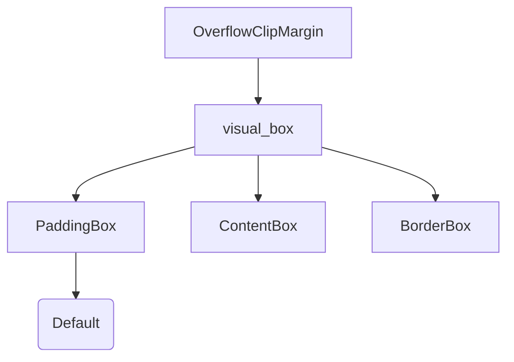

+++
title = "#18935 Change the default visual box for `OverflowClipMargin` to `PaddingBox`"
date = "2025-04-30T00:00:00"
draft = false
template = "pull_request_page.html"
in_search_index = false

[extra]
current_language = "zh-cn"
available_languages = {"en" = { name = "English", url = "/pull_request/bevy/2025-04/pr-18935-en-20250430" }, "zh-cn" = { name = "中文", url = "/pull_request/bevy/2025-04/pr-18935-zh-cn-20250430" }}
labels = ["C-Bug", "D-Trivial", "A-UI"]
+++

# Change the default visual box for `OverflowClipMargin` to `PaddingBox`

## Basic Information
- **Title**: Change the default visual box for `OverflowClipMargin` to `PaddingBox`
- **PR Link**: https://github.com/bevyengine/bevy/pull/18935
- **Author**: ickshonpe
- **Status**: MERGED
- **Labels**: C-Bug, D-Trivial, A-UI, S-Ready-For-Final-Review, M-Needs-Migration-Guide
- **Created**: 2025-04-25T17:49:09Z
- **Merged**: 2025-04-30T21:23:46Z
- **Merged By**: mockersf

## Description Translation
### 目标

将默认值从 `OverflowClipBox::ContentBox` 改为 `OverflowClipBox::PaddingBox`

`padding-box` 是 CSS 中的默认值。

### 解决方案

将默认值设置为 `PaddingBox`。

### 测试验证

对比 main 分支和本 PR 的 `overflow` UI 示例。在 main 分支上可以看到内部节点的轮廓被裁剪，而使用本 PR 后默认裁剪起始于边框的内边缘（`padding-box`），轮廓保持可见。

修复 #18934

## The Story of This Pull Request

### 问题背景与发现
在 Bevy 的 UI 系统中，`OverflowClipMargin` 的默认裁剪框（visual box）原本设置为 `ContentBox`。这与 Web 标准的 CSS `overflow` 行为存在差异，CSS 默认使用 `padding-box` 作为裁剪边界。这种不一致会导致开发者从 Web 开发转向 Bevy 时遇到意外的布局表现，特别是在处理带有边框（border）和内边距（padding）的 UI 元素时，内容可能会被过早裁剪。

具体问题表现为：当 UI 元素的轮廓（outline）超出内容区域但仍在 padding 区域时，在 main 分支上会被错误地裁剪，而正确的行为应该保留 padding 区域内的可见性。

### 技术方案与实现
核心修改分为两个部分：

1. **默认值调整**：将 `OverflowClipMargin::DEFAULT` 的 `visual_box` 从 `ContentBox` 改为 `PaddingBox`
2. **枚举标注迁移**：将 `#[default]` 属性从 `OverflowClipBox::ContentBox` 移动到 `OverflowClipBox::PaddingBox`

代码修改集中在 `ui_node.rs` 文件：
```rust
// Before:
pub struct OverflowClipMargin {
    pub visual_box: OverflowClipBox,
    pub margin: f32,
}

impl OverflowClipMargin {
    pub const DEFAULT: Self = Self {
        visual_box: OverflowClipBox::ContentBox,
        margin: 0.,
    };
}

// After:
impl OverflowClipMargin {
    pub const DEFAULT: Self = Self {
        visual_box: OverflowClipBox::PaddingBox,  // 关键修改点
        margin: 0.,
    };
}

// 枚举定义调整
#[derive(Component, Debug, Clone, Reflect)]
pub enum OverflowClipBox {
    ContentBox,
    #[default]  // 默认标注位置变更
    PaddingBox,
    BorderBox,
}
```

### 技术考量与影响
1. **标准对齐**：保持与 CSS 规范的一致性，降低 Web 开发者的学习成本
2. **向后兼容**：通过添加 migration guide 明确变更影响，指导现有项目进行必要调整
3. **行为可观测性**：在 `overflow` 示例中通过轮廓可见性直观验证修改效果

### 迁移指导
新增的 migration guide 明确说明：
```markdown
The default variant for `OverflowClipBox` is now `PaddingBox`.
The default value for `OverflowClipMargin::visual_box` is now `OverflowClipBox::PaddingBox`.
```

这帮助开发者理解：
- 需要检查现有项目中显式依赖 `ContentBox` 默认值的代码
- 可视化表现可能发生变化的位置需要重新验证
- 显式指定值的场景不受影响

## Visual Representation



## Key Files Changed

### `crates/bevy_ui/src/ui_node.rs`
```rust
// 修改前
visual_box: OverflowClipBox::ContentBox,

// 修改后
visual_box: OverflowClipBox::PaddingBox,

// 枚举默认值标注迁移
#[default]
ContentBox, → #[default]
PaddingBox,
```

### `release-content/migration-guides/overflowclipbox_default_is_now_paddingbox.md`
新增迁移指南文档，明确版本变更带来的默认值调整。

## Further Reading
1. [CSS Box Model - MDN Web Docs](https://developer.mozilla.org/en-US/docs/Web/CSS/CSS_box_model)
2. [Bevy UI Components Documentation](https://docs.rs/bevy_ui/latest/bevy_ui/)
3. [CSS overflow-clip-margin 规范](https://drafts.csswg.org/css-overflow-4/#overflow-clip-margin)