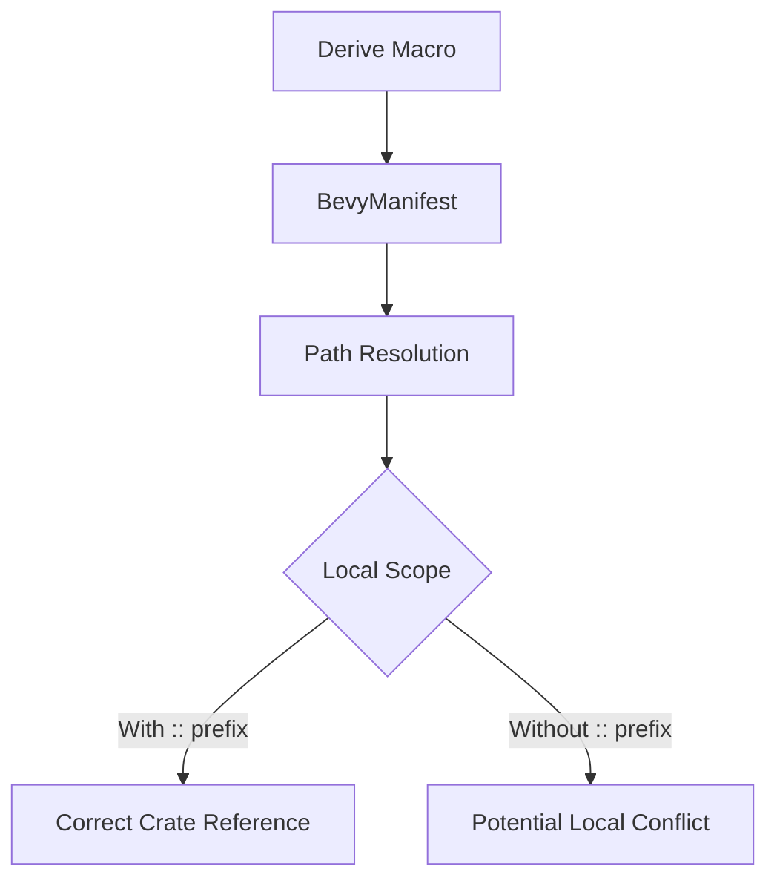

+++
title = "#18938 Fully qualify crate paths in `BevyManifest`"
date = "2025-04-28T00:00:00"
draft = false
template = "pull_request_page.html"
in_search_index = true

[taxonomies]
list_display = ["show"]

[extra]
current_language = "en"
available_languages = {"en" = { name = "English", url = "/pull_request/bevy/2025-04/pr-18938-en-20250428" }, "zh-cn" = { name = "中文", url = "/pull_request/bevy/2025-04/pr-18938-zh-cn-20250428" }}
labels = ["C-Bug", "A-Utils"]
+++

# Title: Fully qualify crate paths in `BevyManifest`

## Basic Information
- **Title**: Fully qualify crate paths in `BevyManifest`
- **PR Link**: https://github.com/bevyengine/bevy/pull/18938
- **Author**: jnhyatt
- **Status**: MERGED
- **Labels**: C-Bug, S-Ready-For-Final-Review, A-Utils
- **Created**: 2025-04-25T20:35:43Z
- **Merged**: 2025-04-28T22:04:16Z
- **Merged By**: mockersf

## Description Translation

# Objective

Subtle, very minor issue. The following code fails to compile on main:
```rs
struct bevy;
#[derive(::bevy::ecs::component::Component)]
struct MyComponent;
```
The derive proc macro is pasting in essentially:
```rs
impl bevy::ecs::component::Component for MyComponent
```
...which normally works, but I've added `struct bevy`, which makes the proc macro spit out incorrect code.

Very cursed, but to my knowledge has never been encountered in practice. All the same, it's technically incorrect and should be fixed.

## Solution

The solution is simply to prepend `::` to crate names. Specifically, all (all?) Bevy's derive macros determine the root crate name using `BevyManifest`, which does some toml-parsing witchcraft to figure out whether to qualify names using the umbrella `bevy` crate or individual `bevy_xxx` crates. I just added a `::` to the spot where we parse the `syn::Path`. The above example compiles properly after that.

## Testing

- CI should catch any errors since this change should cause compile errors if for some reason they're being used in a cursed way somewhere that would make this break something.

## Note

If this does break something for someone, this *really* needs a comment in `BevyManifest::maybe_get_path` explaining why we can't make this change.

## The Story of This Pull Request

The PR addresses a subtle namespace collision issue in Bevy's derive macro implementation. The core problem emerged when a user-defined type named `bevy` would conflict with Bevy's proc macro-generated code paths. While rare in practice, this edge case exposed a technical flaw in how the framework resolved crate paths during macro expansion.

Bevy's derive macros use the `BevyManifest` utility to determine correct crate paths. The original implementation constructed paths using relative identifiers, which worked under normal circumstances but failed when local symbols shadowed crate names. The key issue manifested in code generation where `impl bevy::ecs...` would incorrectly reference a local `bevy` struct instead of the actual Bevy crate.

The solution focused on making path resolution unambiguous through absolute crate paths. By modifying the path construction in `BevyManifest` to prefix crate names with `::`, the macro-generated code now explicitly references the root-level crate. This change required precisely one character addition in the path formatting logic but fundamentally altered the path resolution semantics.

The implementation change demonstrates several important Rust concepts:
1. **Absolute vs Relative Paths**: The `::` prefix ensures path resolution starts from the crate root
2. **Macro Hygiene**: While procedural macros can't be fully hygienic, this change improves resilience against local symbol collisions
3. **Crate Resolution**: Highlights how Bevy's modular architecture handles umbrella crate vs individual subcrate usage

The primary code modification occurs in `bevy_manifest.rs` where the crate path generation now includes an absolute path qualifier. This change propagates through all Bevy's derive macros (Component, Resource, etc.), making their generated code more robust against namespace collisions.

## Visual Representation



## Key Files Changed

- `crates/bevy_macro_utils/src/bevy_manifest.rs` (+1/-1)

```rust
// Before:
let mut path = Self::parse_str::<syn::Path>(package);

// After:
let mut path = Self::parse_str::<syn::Path>(&format!("::{}", package));
```

This change modifies how Bevy's macro system constructs crate paths. By formatting the package name with a leading `::`, the generated paths become absolute rather than relative. This prevents namespace collisions with locally defined items that might shadow crate names.

## Further Reading

1. Rust Reference on Paths: https://doc.rust-lang.org/reference/paths.html
2. Bevy's Macro Utilities Documentation: https://docs.rs/bevy_macro_utils/latest/bevy_macro_utils/
3. Rust Proc Macro Workshop: https://github.com/dtolnay/proc-macro-workshop
4. Bevy Engine Architecture Guide: https://bevyengine.org/learn/book/introduction/architecture/

# Full Code Diff
```diff
diff --git a/crates/bevy_macro_utils/src/bevy_manifest.rs b/crates/bevy_macro_utils/src/bevy_manifest.rs
index b0d321ba2215c..8d327810695a9 100644
--- a/crates/bevy_macro_utils/src/bevy_manifest.rs
+++ b/crates/bevy_macro_utils/src/bevy_manifest.rs
@@ -95,7 +95,7 @@ impl BevyManifest {
                 return None;
             };
 
-            let mut path = Self::parse_str::<syn::Path>(package);
+            let mut path = Self::parse_str::<syn::Path>(&format!("::{}", package));
             if let Some(module) = name.strip_prefix("bevy_") {
                 path.segments.push(Self::parse_str(module));
             }
```