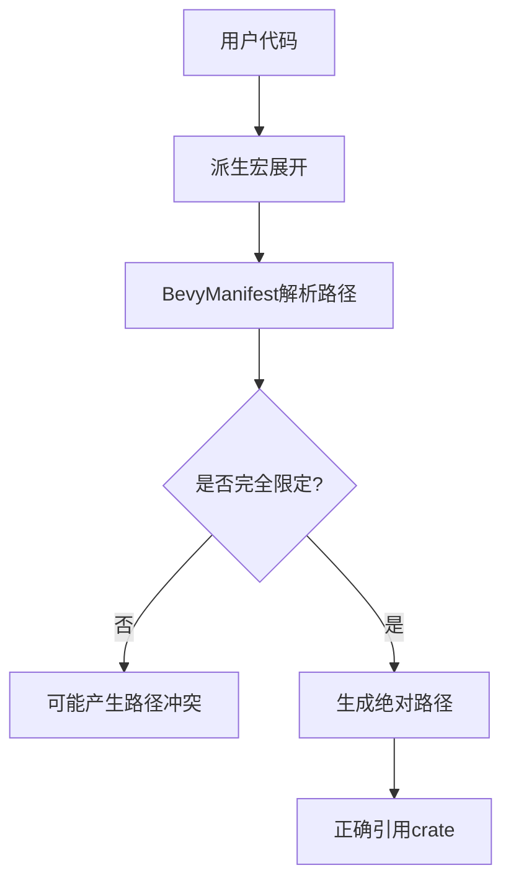

+++
title = "#18938 Fully qualify crate paths in `BevyManifest`"
date = "2025-04-28T00:00:00"
draft = false
template = "pull_request_page.html"
in_search_index = false

[extra]
current_language = "zh-cn"
available_languages = {"en" = { name = "English", url = "/pull_request/bevy/2025-04/pr-18938-en-20250428" }, "zh-cn" = { name = "中文", url = "/pull_request/bevy/2025-04/pr-18938-zh-cn-20250428" }}
labels = ["C-Bug", "A-Utils"]
+++

# Title

## Basic Information
- **Title**: Fully qualify crate paths in `BevyManifest`
- **PR Link**: https://github.com/bevyengine/bevy/pull/18938
- **Author**: jnhyatt
- **Status**: MERGED
- **Labels**: C-Bug, S-Ready-For-Final-Review, A-Utils
- **Created**: 2025-04-25T20:35:43Z
- **Merged**: 2025-04-28T22:04:16Z
- **Merged By**: mockersf

## Description Translation
# 目标

非常细微的小问题。当前主分支上以下代码无法编译：
```rs
struct bevy;
#[derive(::bevy::ecs::component::Component)]
struct MyComponent;
```
derive过程宏生成的代码本质上是：
```rs
impl bevy::ecs::component::Component for MyComponent
```
...这在正常情况下是可行的，但如果用户定义了`struct bevy`就会导致生成的代码错误。

虽然这种情况非常罕见，但理论上存在隐患需要修复。

## 解决方案

在crate名称前添加`::`进行完全限定。Bevy的派生宏通过`BevyManifest`确定根crate名称，该模块通过解析toml文件判断应该使用`bevy`聚合crate还是单独的`bevy_xxx`子crate。我们在解析`syn::Path`的位置添加了`::`前缀，使得上述示例能正确编译。

## 测试
- 通过CI检测潜在编译错误

## 注意事项
如果该修改导致问题，需要在`BevyManifest::maybe_get_path`中添加注释说明原因

## The Story of This Pull Request

该PR解决了一个潜在的宏展开路径冲突问题。当用户代码中定义了与Bevy crate同名的本地类型时（如`struct bevy`），现有的派生宏生成代码会错误地引用本地类型而非Bevy crate。问题的根源在于`BevyManifest`生成的crate路径没有完全限定。

问题的发现源于一个极端但合法的代码场景：
```rust
struct bevy; // 本地定义与crate同名的类型
#[derive(Component)] // 使用Bevy的派生宏
struct MyComponent;
```
此时宏展开生成的`impl bevy::ecs::component::Component`中的`bevy`会错误地指向本地定义的结构体而非Bevy crate。

解决方案的关键在于`BevyManifest`生成路径的方式。该模块负责解析项目的依赖配置，判断应该使用聚合crate（`bevy`）还是独立子crate（`bevy_ecs`等）。修改前的路径生成逻辑使用相对路径，而修改后通过添加`::`前缀强制使用绝对路径：

```rust
// 修改前
let mut path = Self::parse_str::<syn::Path>(package);

// 修改后
let mut path = Self::parse_str::<syn::Path>(&format!("::{}", package));
```

这个改动使得生成的路径从`bevy::ecs`变为`::bevy::ecs`，确保始终引用crate根路径，避免了本地作用域的命名冲突。对于使用独立子crate的情况（如`bevy_ecs`），路径构建逻辑保持不变，仍然会生成`::bevy_ecs`。

技术实现上的注意点：
1. **路径解析机制**：使用syn库解析Rust语法树中的路径结构
2. **向后兼容**：保持现有依赖配置的解析逻辑不变，仅修改路径前缀
3. **边际影响**：由于绝对路径在Rust中是标准实践，该修改不会影响正常使用场景

潜在风险点在于如果有代码依赖原先的相对路径解析方式，但这个可能性极低，因为Bevy的宏系统本身就被设计为使用绝对路径。作者也特别指出，如果确实出现兼容问题，需要在`maybe_get_path`方法中添加注释说明强制使用绝对路径的原因。

## Visual Representation



## Key Files Changed

### `crates/bevy_macro_utils/src/bevy_manifest.rs` (+1/-1)
```rust
// 修改前
let mut path = Self::parse_str::<syn::Path>(package);

// 修改后
let mut path = Self::parse_str::<syn::Path>(&format!("::{}", package));
```
这个改动在解析crate名称时添加了`::`前缀，将相对路径转换为绝对路径。核心修改仅涉及1行代码，但解决了潜在的命名空间冲突问题。

## Further Reading
1. [Rust参考手册 - 路径限定](https://doc.rust-lang.org/reference/paths.html#qualified-paths)
2. [syn库文档 - 解析语法树](https://docs.rs/syn/latest/syn/parse/index.html)
3. [Bevy宏系统设计文档](https://bevyengine.org/learn/book/macros/)