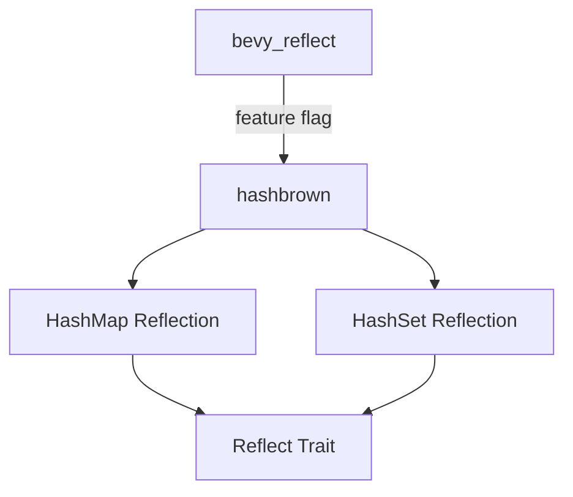

+++
title = "#18944 bevy_reflect: Re-reflect `hashbrown` types"
date = "2025-04-28T00:00:00"
draft = false
template = "pull_request_page.html"
in_search_index = true

[taxonomies]
list_display = ["show"]

[extra]
current_language = "en"
available_languages = {"en" = { name = "English", url = "/pull_request/bevy/2025-04/pr-18944-en-20250428" }, "zh-cn" = { name = "中文", url = "/pull_request/bevy/2025-04/pr-18944-zh-cn-20250428" }}
labels = ["C-Bug", "C-Usability", "P-Regression", "A-Reflection"]
+++

# Title

## Basic Information
- **Title**: bevy_reflect: Re-reflect `hashbrown` types
- **PR Link**: https://github.com/bevyengine/bevy/pull/18944
- **Author**: MrGVSV
- **Status**: MERGED
- **Labels**: C-Bug, C-Usability, S-Ready-For-Final-Review, P-Regression, A-Reflection
- **Created**: 2025-04-26T06:38:47Z
- **Merged**: 2025-04-28T19:48:10Z
- **Merged By**: mockersf

## Description Translation

# Objective

Fixes #18943

## Solution

Reintroduces support for `hashbrown`'s `HashMap` and `HashSet` types. These were inadvertently removed when `bevy_platform` newtyped the `hashbrown` types.

Since we removed our `hashbrown` dependency, I gated these impls behind a `hashbrown` feature. Not entirely sure if this is necessary since we enabled it for `bevy_reflect` through `bevy_platform` anyways. (Complex features still confuse me a bit so let me know if I can just remove it!)

I also went ahead and preemptively implemented `TypePath` for `PassHash` while I was here.

## Testing

You can test that it works by adding the following to a Bevy example based on this PR (you'll also need to include `hashbrown` of course):

```rust
#[derive(Reflect)]
struct Foo(hashbrown::HashMap<String, String>);
```

Then check it compiles with:

```bash
cargo check --example hello_world --no-default-features --features=bevy_reflect/hashbrown
```

## The Story of This Pull Request

The PR addresses a regression in Bevy's reflection system where support for `hashbrown`'s collection types was accidentally removed during architectural changes. This broke existing code that relied on reflecting `hashbrown::HashMap` and `hashbrown::HashSet` instances.

The root cause traces back to when Bevy introduced `bevy_platform` as a newtype wrapper around `hashbrown` types. While this abstraction improved internal consistency, it inadvertently removed the reflection implementations for the original `hashbrown` types. This created a compatibility break for users directly using `hashbrown` collections in their reflected types.

The solution reintroduces reflection support through conditional compilation. The implementation:

1. Adds a new `hashbrown` feature flag in `bevy_reflect`
2. Conditionally includes reflection implementations when the feature is active
3. Maintains compatibility through careful dependency management

Key technical decisions included:
- Gating implementations behind a feature flag despite existing platform dependencies
- Mirroring the existing reflection patterns used for standard library collections
- Adding missing `TypePath` implementation for `PassHash` to ensure full reflection support

The implementation follows Bevy's established patterns for collection reflection. For `HashMap`, it uses the `impl_reflect_for_hashmap!` macro with type constraints similar to those used for standard library collections:

```rust
#[cfg(feature = "hashbrown")]
impl_reflect_for_hashmap!(hashbrown::hash_map::HashMap<K, V, S>);
```

Testing was enhanced with a dedicated unit test verifying reflection support across different HashMap implementations, including a conditional check for the hashbrown version:

```rust
#[cfg(feature = "hashbrown")]
assert_impl_all!(hashbrown::HashMap<u32, f32, foldhash::fast::RandomState>: Reflect);
```

The feature gating approach allows users to opt-in to `hashbrown` support while maintaining a clean dependency graph. This balances compatibility needs with Bevy's ongoing efforts to reduce default dependencies.

## Visual Representation



## Key Files Changed

1. **crates/bevy_reflect/Cargo.toml**
```toml
## Added feature flag
hashbrown = ["dep:hashbrown"]

## Added dependency
hashbrown = { version = "0.15.1", optional = true, default-features = false }
```

2. **crates/bevy_reflect/src/impls/std.rs**
```rust
// Added hashbrown HashMap support
#[cfg(feature = "hashbrown")]
impl_reflect_for_hashmap!(hashbrown::hash_map::HashMap<K, V, S>);

// Added hashbrown HashSet support
#[cfg(feature = "hashbrown")]
impl_reflect_for_hashset!(::hashbrown::hash_set::HashSet<V,S>);

// Added PassHash TypePath
impl_type_path!(::bevy_platform::hash::PassHash);
```

## Further Reading

1. [Bevy Reflection Documentation](https://docs.rs/bevy_reflect/latest/bevy_reflect/)
2. [hashbrown Crate Documentation](https://docs.rs/hashbrown/latest/hashbrown/)
3. [Rust Feature Flags Guide](https://doc.rust-lang.org/cargo/reference/features.html)