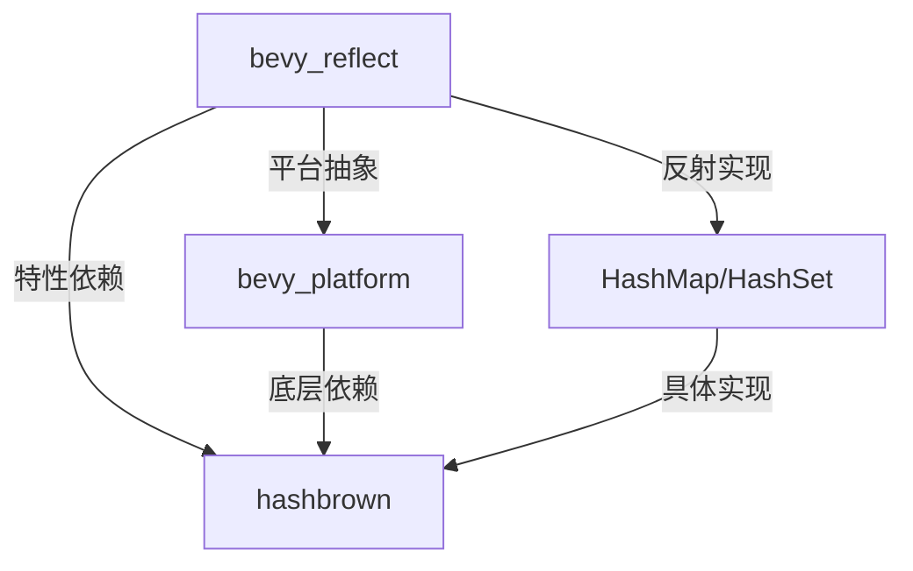

+++
title = "#18944 bevy_reflect: Re-reflect `hashbrown` types"
date = "2025-04-28T00:00:00"
draft = false
template = "pull_request_page.html"
in_search_index = false

[extra]
current_language = "zh-cn"
available_languages = {"en" = { name = "English", url = "/pull_request/bevy/2025-04/pr-18944-en-20250428" }, "zh-cn" = { name = "中文", url = "/pull_request/bevy/2025-04/pr-18944-zh-cn-20250428" }}
+++

# bevy_reflect: Re-reflect `hashbrown` types

## Basic Information
- **标题**: bevy_reflect: Re-reflect `hashbrown` types
- **PR链接**: https://github.com/bevyengine/bevy/pull/18944
- **作者**: MrGVSV
- **状态**: 已合并
- **标签**: C-Bug, C-Usability, S-Ready-For-Final-Review, P-Regression, A-Reflection
- **创建时间**: 2025-04-26T06:38:47Z
- **合并时间**: 2025-04-28T19:48:10Z
- **合并者**: mockersf

## 问题描述与解决过程

### 问题背景与影响
在Bevy引擎的架构调整中，`bevy_platform`模块对`hashbrown`集合类型进行了newtype封装，导致原有的反射支持意外丢失。这个回归性问题（P-Regression）直接影响了使用`hashbrown::HashMap`和`hashbrown::HashSet`类型的用户代码，表现为无法通过反射系统正确处理这些集合类型。

### 技术实现分析
修复方案采用模块化反射实现策略，主要涉及两个关键文件：

1. **特性门控配置（Cargo.toml）**
```toml
## 添加hashbrown特性支持
hashbrown = ["dep:hashbrown"]

# 依赖声明
hashbrown = { version = "0.15.1", optional = true, default-features = false }
```
通过optional依赖声明和特性开关，实现了按需加载hashbrown支持，保持核心库的轻量化。

2. **反射实现扩展（std.rs）**
```rust
#[cfg(feature = "hashbrown")]
impl_reflect_for_hashmap!(hashbrown::hash_map::HashMap<K, V, S>);
#[cfg(feature = "hashbrown")]
impl_type_path!(::hashbrown::hash_map::HashMap<K, V, S>);
```
使用宏系统为hashbrown类型生成反射实现，保持代码DRY原则。特性门控确保实现仅在使用hashbrown特性时编译。

### 技术决策考量
- **特性隔离**：虽然bevy_platform已依赖hashbrown，但显式声明特性可避免隐式依赖带来的版本冲突
- **类型路径补全**：新增`impl_type_path!(::bevy_platform::hash::PassHash)`确保类型系统完整性
- **测试覆盖**：新增专项测试验证不同HashMap实现的反射支持
```rust
#[cfg(feature = "hashbrown")]
assert_impl_all!(hashbrown::HashMap<u32, f32, foldhash::fast::RandomState>: Reflect);
```

## 核心代码变更

### crates/bevy_reflect/Cargo.toml
```toml
## 添加特性声明
hashbrown = ["dep:hashbrown"]

## 添加可选依赖
hashbrown = { version = "0.15.1", optional = true, default-features = false }
```
通过特性开关控制hashbrown的编译包含，保持基础编译的轻量性。

### crates/bevy_reflect/src/impls/std.rs
```rust
// 新增hashbrown::HashMap反射实现
#[cfg(feature = "hashbrown")]
impl_reflect_for_hashmap!(hashbrown::hash_map::HashMap<K, V, S>);

// 新增hashbrown::HashSet反射实现
#[cfg(feature = "hashbrown")]
impl_reflect_for_hashset!(::hashbrown::hash_set::HashSet<V,S>);

// 补全类型路径实现
impl_type_path!(::bevy_platform::hash::PassHash);

// 新增测试用例
#[test]
fn should_reflect_hashmaps() {
    #[cfg(feature = "hashbrown")]
    assert_impl_all!(hashbrown::HashMap<u32, f32, foldhash::fast::RandomState>: Reflect);
}
```

## 技术影响与最佳实践
1. **回归预防**：新增专项测试确保未来架构变更不会破坏现有反射支持
2. **模块化设计**：通过宏系统实现反射逻辑复用，减少代码冗余
3. **依赖管理**：显式特性声明提升代码可维护性，避免隐式依赖导致的版本冲突
4. **类型系统完整性**：补全PassHash的类型路径实现，完善类型元数据

## 架构关系示意



## 扩展阅读建议
1. Rust宏编程指南（https://doc.rust-lang.org/book/ch19-06-macros.html）
2. Bevy反射系统文档（https://bevyengine.org/learn/book/reflection/）
3. 条件编译与特性门控最佳实践（https://doc.rust-lang.org/cargo/reference/features.html）