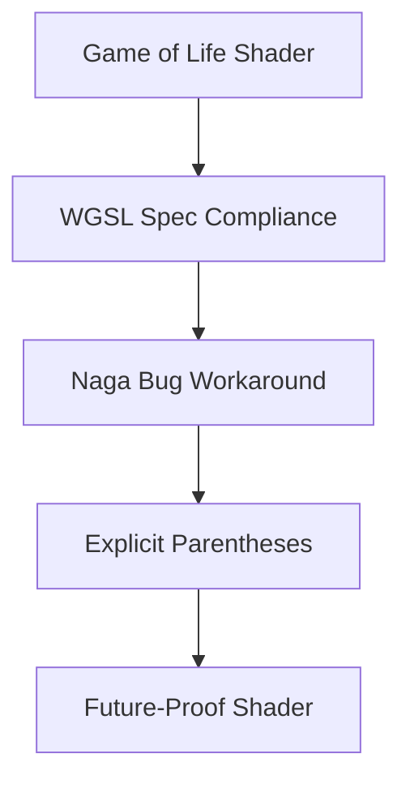

+++
title = "#18951 Fix game_of_life shader relying on Naga bug"
date = "2025-04-27T00:00:00"
draft = false
template = "pull_request_page.html"
in_search_index = true

[taxonomies]
list_display = ["show"]

[extra]
current_language = "en"
available_languages = {"en" = { name = "English", url = "/pull_request/bevy/2025-04/pr-18951-en-20250427" }, "zh-cn" = { name = "中文", url = "/pull_request/bevy/2025-04/pr-18951-zh-cn-20250427" }}
labels = ["C-Bug", "A-Rendering"]
+++

# Fix game_of_life shader relying on Naga bug

## Basic Information
- **Title**: Fix game_of_life shader relying on Naga bug  
- **PR Link**: https://github.com/bevyengine/bevy/pull/18951  
- **Author**: k2d222  
- **Status**: MERGED  
- **Labels**: C-Bug, A-Rendering, S-Needs-Review  
- **Created**: 2025-04-26T21:13:05Z  
- **Merged**: 2025-04-26T21:55:48Z  
- **Merged By**: mockersf  

## Description Translation
# Objective

The game of life example shader relies on a Naga bug ([6397](https://github.com/gfx-rs/wgpu/issues/6397) / [4536](https://github.com/gfx-rs/wgpu/issues/4536)). In WGSL certain arithmetic operations must be explicitly parenthesized ([reference](https://www.w3.org/TR/WGSL/#operator-precedence-associativity)). Naga doesn't enforce that (and also the precedence order is [messed up](https://github.com/gfx-rs/wgpu/issues/4536#issuecomment-1780113990)). 

So this example may break soon. This is the only sample shader having this issue.

## Solution

added parentheses

## Testing

ran the example before and after the fix with `cargo run --example compute_shader_game_of_life`

## The Story of This Pull Request

The compute_shader_game_of_life example contained a subtle timing bomb in its WGSL shader code due to reliance on incorrect operator precedence handling in Naga. The root issue stemmed from WGSL's specification requiring explicit parentheses for certain arithmetic operations, combined with Naga's known bugs in operator precedence enforcement ([wgpu#4536](https://github.com/gfx-rs/wgpu/issues/4536)).

The problematic code patterns appeared in three locations:
1. Bitwise shift-right operations in the hash function
2. Bitwise OR operation when generating random numbers

In WGSL, shift operators have higher precedence than bitwise XOR (^) and OR (|) operations. However, Naga's incorrect precedence handling allowed the original code to work despite missing parentheses. The developer identified this fragility through code review and WGSL specification analysis.

The fix involved adding explicit parentheses to enforce correct evaluation order:
```wgsl
// Original risky code
state = state ^ state >> 16u;
// Fixed version
state = state ^ (state >> 16u);
```
This change ensures proper operation regardless of Naga's operator precedence implementation, making the shader compliant with WGSL specifications and future-proof against engine updates.

The solution demonstrates defensive coding practices for shader development:
1. Explicit precedence declaration through parentheses
2. Adherence to language specifications over implementation-specific behaviors
3. Proactive addressing of potential breakpoints before dependency updates

## Visual Representation



## Key Files Changed

### `assets/shaders/game_of_life.wgsl` (+3/-3)
**Purpose**: Fix operator precedence ambiguity in hash function and random number generation

Code changes:
```wgsl
// Before (line 15):
state = state ^ state >> 16u;
// After:
state = state ^ (state >> 16u);

// Before (line 17):
state = state ^ state >> 16u;
// After:
state = state ^ (state >> 16u);

// Before (line 30):
let randomNumber = randomFloat(invocation_id.y << 16u | invocation_id.x);
// After:
let randomNumber = randomFloat((invocation_id.y << 16u) | invocation_id.x);
```

These changes ensure:
1. Bitwise shifts execute before XOR/OR operations
2. Evaluation order matches WGSL specification requirements
3. Consistent behavior across current and future Naga versions

## Further Reading
- [WGSL Operator Precedence Table](https://www.w3.org/TR/WGSL/#operator-precedence)
- [Naga Operator Precedence Tracking Issue](https://github.com/gfx-rs/wgpu/issues/4536)
- [WebGPU Shader Validation Best Practices](https://gpuweb.github.io/gpuweb/wgsl/#validation)

## Full Code Diff
```diff
diff --git a/assets/shaders/game_of_life.wgsl b/assets/shaders/game_of_life.wgsl
index c5b94533e5688..0eb5e32e6ec56 100644
--- a/assets/shaders/game_of_life.wgsl
+++ b/assets/shaders/game_of_life.wgsl
@@ -12,9 +12,9 @@ fn hash(value: u32) -> u32 {
     var state = value;
     state = state ^ 2747636419u;
     state = state * 2654435769u;
-    state = state ^ state >> 16u;
+    state = state ^ (state >> 16u);
     state = state * 2654435769u;
-    state = state ^ state >> 16u;
+    state = state ^ (state >> 16u);
     state = state * 2654435769u;
     return state;
 }
@@ -27,7 +27,7 @@ fn randomFloat(value: u32) -> f32 {
 fn init(@builtin(global_invocation_id) invocation_id: vec3<u32>, @builtin(num_workgroups) num_workgroups: vec3<u32>) {
     let location = vec2<i32>(i32(invocation_id.x), i32(invocation_id.y));
 
-    let randomNumber = randomFloat(invocation_id.y << 16u | invocation_id.x);
+    let randomNumber = randomFloat((invocation_id.y << 16u) | invocation_id.x);
     let alive = randomNumber > 0.9;
     let color = vec4<f32>(f32(alive));
 
```