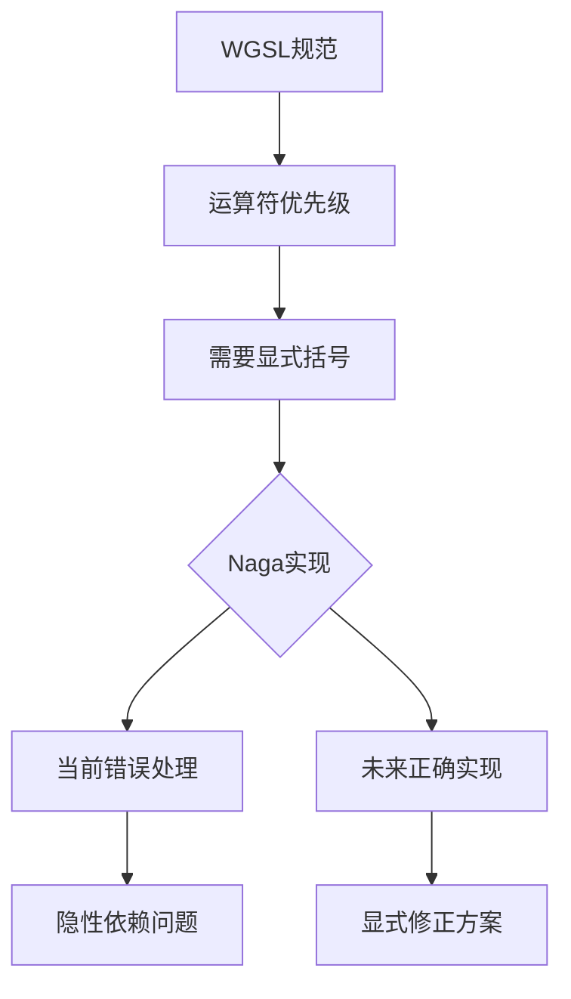

+++
title = "#18951 Fix game_of_life shader relying on Naga bug"
date = "2025-04-27T00:00:00"
draft = false
template = "pull_request_page.html"
in_search_index = false

[extra]
current_language = "zh-cn"
available_languages = {"en" = { name = "English", url = "/pull_request/bevy/2025-04/pr-18951-en-20250427" }, "zh-cn" = { name = "中文", url = "/pull_request/bevy/2025-04/pr-18951-zh-cn-20250427" }}
labels = ["C-Bug", "A-Rendering"]
+++

# Fix game_of_lashader relying on Naga bug 技术分析报告

## Basic Information
- **Title**: Fix game_of_life shader relying on Naga bug
- **PR Link**: https://github.com/bevyengine/bevy/pull/18951
- **Author**: k2d222
- **Status**: MERGED
- **Labels**: C-Bug, A-Rendering, S-Needs-Review
- **Created**: 2025-04-26T21:13:05Z
- **Merged**: 2025-04-26T21:55:48Z
- **Merged By**: mockersf

## Description Translation
### 目标

生命游戏示例着色器依赖Naga的一个bug（[6397](https://github.com/gfx-rs/wgpu/issues/6397) / [4536](https://github.com/gfx-rs/wgpu/issues/4536)）。在WGSL中某些算术运算必须显式添加括号（[参考](https://www.w3.org/TR/WGSL/#operator-precedence-associativity)）。Naga没有强制执行此规则（且运算符优先级顺序也存在[问题](https://github.com/gfx-rs/wgpu/issues/4536#issuecomment-1780113990)）。

该示例可能在近期失效。这是唯一存在此问题的示例着色器。

### 解决方案

添加括号

### 测试验证

使用`cargo run --example compute_shader_game_of_life`命令在修复前后运行示例

## The Story of This Pull Request

### 问题背景
该PR的核心问题是解决WGSL着色器代码对Naga编译器错误实现的隐性依赖。在WGSL规范中，位运算符的优先级需要显式使用括号来明确运算顺序。但Naga当前实现存在两个问题：
1. 未正确执行运算符优先级规则（如位移运算符>>优先级低于位异或^）
2. 未强制要求显式括号化

这使得原本不符合规范的代码（`state ^ state >> 16u`）能意外正常工作。随着wgpu/naga修复这些bug（#4536和#6397），现有代码将出现行为异常。

### 技术分析
问题出现在三个关键位置：
1. hash函数中的位移与异或运算
2. 随机数生成时的位组合运算

原代码`invocation_id.y << 16u | invocation_id.x`存在运算符优先级误解。根据WGSL规范：
- 位移运算符（<<, >>）优先级低于位或（|）
- 但实际应按位或的低优先级处理，需要显式括号

### 解决方案实现
通过添加三组括号明确运算顺序：
```wgsl
// 修改前
state = state ^ state >> 16u;
// 修改后
state = state ^ (state >> 16u);

// 修改前
randomFloat(invocation_id.y << 16u | invocation_id.x)
// 修改后
randomFloat((invocation_id.y << 16u) | invocation_id.x)
```
这些修改确保：
1. 位移运算先于位异或执行
2. 位组合运算按预期顺序处理

### 技术影响
1. **规范符合性**：使代码严格遵循WGSL标准
2. **未来兼容性**：预防Naga修复bug后出现运行时错误
3. **代码健壮性**：消除对编译器实现的隐性依赖

### 工程实践启示
1. **显式优于隐式**：即使当前编译器允许，也应遵循语言规范
2. **防御性编程**：对可能引起歧义的运算符主动添加括号
3. **跨版本兼容**：考虑依赖库的潜在更新对现有代码的影响

## Visual Representation



## Key Files Changed

### `assets/shaders/game_of_life.wgsl` (+3/-3)
**修改说明**：添加三处关键括号确保运算顺序符合WGSL规范

```wgsl
// 修改前：
state = state ^ state >> 16u;
// 修改后：
state = state ^ (state >> 16u);

// 修改前：
randomFloat(invocation_id.y << 16u | invocation_id.x)
// 修改后：
randomFloat((invocation_id.y << 16u) | invocation_id.x)
```

## Further Reading
1. [WGSL运算符优先级官方文档](https://www.w3.org/TR/WGSL/#operator-precedence-associativity)
2. [Naga位移运算bug讨论](https://github.com/gfx-rs/wgpu/issues/4536)
3. [WGSL位运算最佳实践](https://github.com/bevyengine/bevy/wiki/WGSL-Shader-Coding-Conventions)