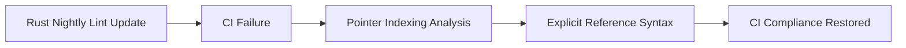

+++
title = "#18988 fix new nightly lint on mikktspace"
date = "2025-04-30T00:00:00"
draft = false
template = "pull_request_page.html"
in_search_index = true

[taxonomies]
list_display = ["show"]

[extra]
current_language = "en"
available_languages = {"en" = { name = "English", url = "/pull_request/bevy/2025-04/pr-18988-en-20250430" }, "zh-cn" = { name = "中文", url = "/pull_request/bevy/2025-04/pr-18988-zh-cn-20250430" }}
labels = ["D-Trivial", "C-Code-Quality"]
+++

# Title  
PR #18988: fix new nightly lint on mikktspace  

## Basic Information  
- **Title**: fix new nightly lint on mikktspace  
- **PR Link**: https://github.com/bevyengine/bevy/pull/18988  
- **Author**: mockersf  
- **Status**: MERGED  
- **Labels**: D-Trivial, C-Code-Quality, S-Ready-For-Review  
- **Created**: 2025-04-29T23:31:59Z  
- **Merged**: 2025-04-30T05:39:30Z  
- **Merged By**: alice-i-cecile  

## Description Translation  
# Objective  

- New nightly lint makes CI fail  

## Solution  

- Follow the lint: https://github.com/rust-lang/rust/pull/123239  

---

## The Story of This Pull Request  

The PR addresses a breaking change introduced by a new Rust nightly compiler lint related to raw pointer indexing syntax. The Bevy engine's CI pipeline began failing due to this lint being enforced in newer Rust versions, specifically impacting the `bevy_mikktspace` crate's auto-generated bindings.  

The core issue stemmed from how raw pointers were being indexed in unsafe code. In the `CompareSubGroups` function, the original code directly accessed array elements through nested raw pointers using `(*pg1).pTriMembers[i]`. The new Rust compiler lint (from https://github.com/rust-lang/rust/pull/123239) flagged this pattern as non-compliant with updated safety recommendations for pointer arithmetic.  

The solution involved explicitly referencing the pointer before indexing, changing:  
```rust  
(*pg1).pTriMembers[i]  
```  
to:  
```rust  
(&(*pg1).pTriMembers)[i]  
```  
This adjustment aligns with Rust's stricter requirements for explicitness when performing pointer arithmetic in unsafe blocks. The change ensures the code complies with the updated lint rules while preserving the original logic.  

The fix is localized to a single line in `generated.rs`, which contains auto-generated bindings for the mikktspace geometry library. Since this file is derived from C code, the modification demonstrates how Rust's safety features sometimes require minor syntactic adjustments even in mechanically translated code.  

---

## Visual Representation  



---

## Key Files Changed  

### `crates/bevy_mikktspace/src/generated.rs` (+1/-1)  
**Change**: Adjusted raw pointer indexing syntax to satisfy new Rust nightly lint requirements.  

**Before**:  
```rust  
bStillSame = if (*pg1).pTriMembers[i] == (*pg2).pTriMembers[i] {  
```  

**After**:  
```rust  
bStillSame = if (&(*pg1).pTriMembers)[i] == (&(*pg2).pTriMembers)[i] {  
```  

**Impact**: Ensures compatibility with updated Rust compiler checks while maintaining identical runtime behavior. The explicit reference syntax clarifies the pointer arithmetic operation for both the compiler and developers.  

---

## Further Reading  
- [Rust PR #123239](https://github.com/rust-lang/rust/pull/123239) - Details the lint change  
- [Rustonomicon - Raw Pointers](https://doc.rust-lang.org/nomicon/raw-pointers.html) - Essential guide to unsafe Rust pointer operations  
- [Bevy Engine](https://bevyengine.org/) - Overview of the game engine's architecture