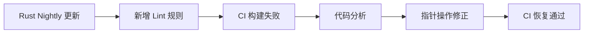

+++
title = "#18988 fix new nightly lint on mikktspace"
date = "2025-04-30T00:00:00"
draft = false
template = "pull_request_page.html"
in_search_index = false

[extra]
current_language = "zh-cn"
available_languages = {"en" = { name = "English", url = "/pull_request/bevy/2025-04/pr-18988-en-20250430" }, "zh-cn" = { name = "中文", url = "/pull_request/bevy/2025-04/pr-18988-zh-cn-20250430" }}
labels = ["D-Trivial", "C-Code-Quality"]
+++

# fix new nightly lint on mikktspace

## Basic Information
- **Title**: fix new nightly lint on mikktspace
- **PR Link**: https://github.com/bevyengine/bevy/pull/18988
- **Author**: mockersf
- **Status**: MERGED
- **Labels**: D-Trivial, C-Code-Quality, S-Ready-For-Final-Review
- **Created**: 2025-04-29T23:31:59Z
- **Merged**: 2025-04-30T05:39:30Z
- **Merged By**: alice-i-cecile

## Description Translation
### 目标
- 新的 nightly lint 导致 CI 失败

### 解决方案
- 遵循 lint 规则调整代码: https://github.com/rust-lang/rust/pull/123239

## The Story of This Pull Request

### 问题与背景
Rust nightly 版本在 PR #123239 中引入新的 lint 规则，该规则针对指针解引用操作提出了更严格的代码风格要求。Bevy 引擎的 mikktspace 模块自动生成的代码触发了这个新的编译警告，导致持续集成（CI）流程失败。由于 Bevy 项目遵循严格的 CI 质量门禁，任何编译警告都会被视为构建失败，因此必须及时修复。

### 解决方案与实现
核心问题出现在 `generated.rs` 文件的 `CompareSubGroups` 函数中。原始代码使用直接指针解引用方式访问数组元素：
```rust
(*pg1).pTriMembers[i]
```
新 lint 要求使用更明确的引用语法来改善代码可读性和安全性。修改后的代码通过显式创建引用后执行数组访问：
```rust
(&(*pg1).pTriMembers)[i]
```
这个改动在语义上与原有代码等价，但通过：
1. 先通过 `&*` 操作符显式获取结构体引用
2. 再进行数组成员访问
的方式，使代码更符合 Rust 的安全指针操作规范。

### 技术洞察
该修改展示了处理 unsafe 代码时的两个重要实践：
1. **显式指针操作**：通过 `&(*pg1)` 明确表达"获取指向结构体的引用"的意图，避免隐式解引用可能带来的理解成本
2. **数组访问安全**：将指针访问拆分为先获取引用再进行索引操作，更符合 Rust 的安全访问模式

尽管改动仅涉及单行代码，但体现了对 Rust 所有权系统的深刻理解——在 unsafe 块中保持最大程度的安全编码实践。

### 影响与启示
此次修复：
- 确保项目在最新 Rust nightly 版本中通过编译
- 提升自动生成代码的质量标准
- 为后续处理类似编译器警告提供参考模式

给开发者的启示：
- 需要持续关注 Rust 编译器的规则演进
- 自动生成的代码仍需进行编译时校验
- 简单的语法调整可能解决深层次的代码规范问题

## Visual Representation



## Key Files Changed

### `crates/bevy_mikktspace/src/generated.rs` (+1/-1)
**修改背景**：自动生成的 mikktspace 实现代码需要适配新的 Rust 编译器规范

**代码对比**：
```rust
// 修改前
bStillSame = if (*pg1).pTriMembers[i] == (*pg2).pTriMembers[i] {

// 修改后
bStillSame = if (&(*pg1).pTriMembers)[i] == (&(*pg2).pTriMembers)[i] {
```

**关联性**：通过调整指针解引用方式，在不改变算法逻辑的前提下满足新的编译器要求

## Further Reading
1. [Rust PR #123239](https://github.com/rust-lang/rust/pull/123239) - 引入新 lint 规则的原始提交
2. [Rust Unsafe Code Guidelines](https://rust-lang.github.io/unsafe-code-guidelines/) - 不安全代码编写规范
3. [Bevy CI 规范](https://bevyengine.org/learn/book/contributing/ci/) - Bevy 的持续集成标准

# Full Code Diff
```diff
diff --git a/crates/bevy_mikktspace/src/generated.rs b/crates/bevy_mikktspace/src/generated.rs
index a726eb5bc89d6..b246b9668d00b 100644
--- a/crates/bevy_mikktspace/src/generated.rs
+++ b/crates/bevy_mikktspace/src/generated.rs
@@ -756,7 +756,7 @@ unsafe fn CompareSubGroups(mut pg1: *const SSubGroup, mut pg2: *const SSubGroup)
         return false;
     }
     while i < (*pg1).iNrFaces as usize && bStillSame {
-        bStillSame = if (*pg1).pTriMembers[i] == (*pg2).pTriMembers[i] {
+        bStillSame = if (&(*pg1).pTriMembers)[i] == (&(*pg2).pTriMembers)[i] {
             true
         } else {
             false
```