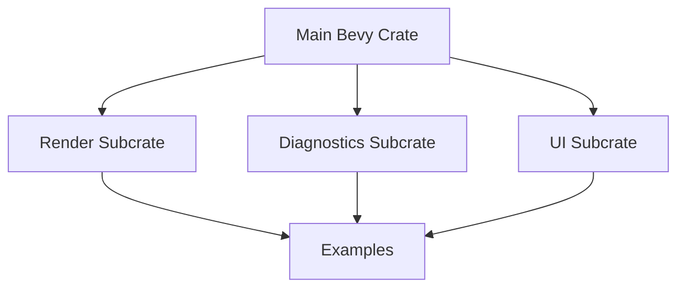

+++
title = "#19002 Fix a few subcrate import paths in examples"
date = "2025-04-30T00:00:00"
draft = false
template = "pull_request_page.html"
in_search_index = true

[taxonomies]
list_display = ["show"]

[extra]
current_language = "en"
available_languages = {"en" = { name = "English", url = "/pull_request/bevy/2025-04/pr-19002-en-20250430" }, "zh-cn" = { name = "中文", url = "/pull_request/bevy/2025-04/pr-19002-zh-cn-20250430" }}
labels = ["C-Examples", "C-Code-Quality"]
+++

# Fix a few subcrate import paths in examples

## Basic Information
- **Title**: Fix a few subcrate import paths in examples
- **PR Link**: https://github.com/bevyengine/bevy/pull/19002
- **Author**: rparrett
- **Status**: MERGED
- **Labels**: C-Examples, C-Code-Quality, S-Ready-For-Final-Review
- **Created**: 2025-04-30T18:21:57Z
- **Merged**: 2025-04-30T19:02:52Z
- **Merged By**: alice-i-cecile

## Description Translation
# Objective

Tripped over the `directional_navigation` one recently while playing around with that example.

Examples should import items from `bevy` rather than the sub-crates directly.

## Solution

Use paths re-exported by `bevy`.

## Testing

```
cargo run --example log_diagnostics
cargo run --example directional_navigation
cargo run --example custom_projection
```

## The Story of This Pull Request

This PR addresses a consistency issue in Bevy's example code where some modules were importing directly from subcrates instead of using the canonical paths re-exported through the main `bevy` crate. The problem surfaced when the author encountered unexpected import paths while working with the `directional_navigation` example.

The core issue stemmed from examples using paths like `bevy_render::camera::SubCameraView` instead of the preferred `bevy::render::camera::SubCameraView`. While functionally equivalent, these direct subcrate imports violate Bevy's established conventions for public API usage. The main `bevy` crate serves as the official interface, providing stability guarantees and simplified dependency management that subcrate imports bypass.

The solution involved systematically updating import paths in three affected examples:
1. `custom_projection.rs` fixed a camera component reference
2. `log_diagnostics.rs` corrected render diagnostics plugin usage
3. `directional_navigation.rs` adjusted render target specification

Each change followed the same pattern of replacing subcrate paths with their re-exported equivalents through the main crate. For example, in `directional_navigation.rs`:

```rust
// Before:
bevy_render::camera::ImageRenderTarget

// After: 
bevy::render::camera::ImageRenderTarget
```

These changes improve code quality by:
1. Ensuring examples demonstrate recommended API usage patterns
2. Reducing potential confusion for developers copying example code
3. Future-proofing against internal restructuring of subcrates
4. Maintaining consistency across the example ecosystem

The technical impact is minimal in terms of functionality but significant for code hygiene. By enforcing the use of re-exported paths, the Bevy team maintains better control over public API surfaces and reduces hidden dependencies on internal crate structure.

## Visual Representation



## Key Files Changed

1. `examples/camera/custom_projection.rs` (+1/-1)
- Updated `SubCameraView` import to use `bevy::render::camera` path
```rust
// Before:
bevy_render::camera::SubCameraView

// After:
bevy::render::camera::SubCameraView
```

2. `examples/diagnostics/log_diagnostics.rs` (+1/-1)
- Corrected `RenderDiagnosticsPlugin` import path
```rust
// Before:
bevy_render::diagnostic::RenderDiagnosticsPlugin

// After:
bevy::render::diagnostic::RenderDiagnosticsPlugin
```

3. `examples/ui/directional_navigation.rs` (+1/-1)
- Fixed `ImageRenderTarget` reference path
```rust
// Before:
bevy_render::camera::ImageRenderTarget

// After:
bevy::render::camera::ImageRenderTarget
```

## Further Reading

- Bevy's API Guidelines on Re-exports: https://bevyengine.org/learn/book/contributing/api-guidelines/#re-exports
- Rust Module System Explained: https://doc.rust-lang.org/book/ch07-02-defining-modules-to-control-scope-and-privacy.html
- Bevy's Dependency Graph Documentation: https://bevyengine.org/learn/book/getting-started/resources/#dependency-graph