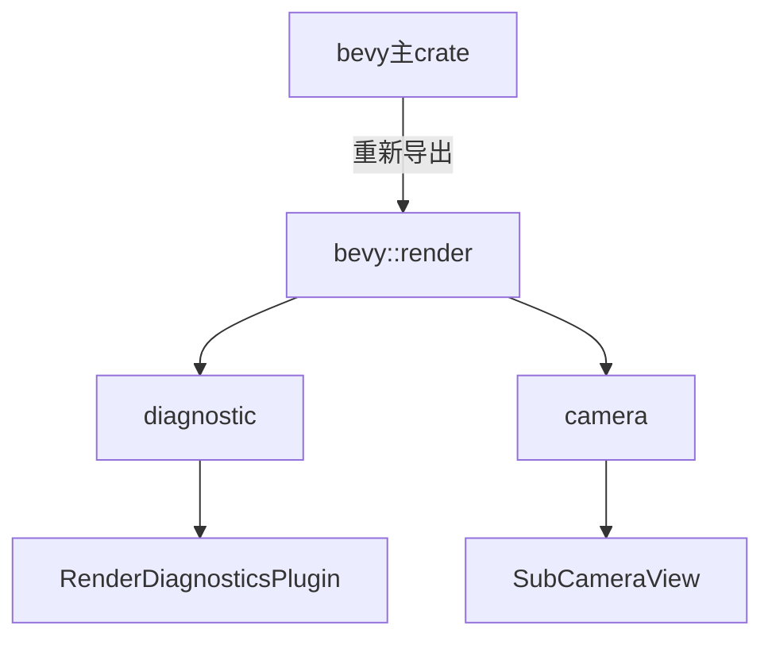

+++
title = "#19002 Fix a few subcrate import paths in examples"
date = "2025-04-30T00:00:00"
draft = false
template = "pull_request_page.html"
in_search_index = false

[extra]
current_language = "zh-cn"
available_languages = {"en" = { name = "English", url = "/pull_request/bevy/2025-04/pr-19002-en-20250430" }, "zh-cn" = { name = "中文", url = "/pull_request/bevy/2025-04/pr-19002-zh-cn-20250430" }}
labels = ["C-Examples", "C-Code-Quality"]
+++

# Fix a few subcrate import paths in examples

## Basic Information
- **Title**: Fix a few subcrate import paths in examples
- **PR Link**: https://github.com/bevyengine/bevy/pull/19002
- **Author**: rparrett
- **Status**: MERGED
- **Labels**: C-Examples, C-Code-Quality, S-Ready-For-Final-Review
- **Created**: 2025-04-30T18:21:57Z
- **Merged**: 2025-04-30T19:02:52Z
- **Merged By**: alice-i-cecile

## Description Translation
### 目标

最近在使用`directional_navigation`示例时发现此问题。

示例应该从`bevy`主包导入项目而非直接引用子crate。

### 解决方案

改用通过`bevy`重新导出的路径。

### 测试

```
cargo run --example log_diagnostics
cargo run --example directional_navigation
cargo run --example custom_projection
```

## The Story of This Pull Request

### 问题背景
在Bevy引擎的示例代码中，存在直接引用子crate（如`bevy_render`）而非通过主crate`bevy`重新导出的路径的情况。这种实践会导致两个主要问题：

1. **维护性问题**：当子crate结构发生变化时，需要逐个修改所有直接引用
2. **一致性缺失**：与Bevy官方推荐的导入方式不符，可能误导开发者

作者rparrett在使用`directional_navigation`示例时实际遇到了这个问题，促使他系统性地检查并修复相关案例。

### 解决方案
核心策略是将所有直接子crate引用转换为通过`bevy`主包的重新导出路径。具体实施包含三个关键修改：

1. **路径替换模式**：将`bevy_render::xxx`统一改为`bevy::render::xxx`
2. **最小改动原则**：仅修改必要路径，保持其他代码结构不变
3. **跨示例验证**：在三个不同领域的示例（相机、诊断、UI）中实施修复

这种改造符合Rust的最佳实践——通过主crate的重新导出（re-export）来封装内部模块结构的变化，使得未来架构调整时能减少破坏性变更的影响。

### 技术实现细节
以`custom_projection.rs`的修改为例：
```rust
// Before:
use bevy_render::camera::SubCameraView;

// After:
use bevy::render::camera::SubCameraView;
```
这种修改保留了完整的类型路径，但通过主crate的重新导出层来访问。即使未来`bevy_render`的内部结构发生变化，只要主crate保持兼容的重新导出，示例代码就无需修改。

在`log_diagnostics.rs`中，插件引用的调整体现了架构分层：
```rust
// Before:
bevy_render::diagnostic::RenderDiagnosticsPlugin

// After: 
bevy::render::diagnostic::RenderDiagnosticsPlugin
```
这里保持插件功能的完整性，只是改变了引用路径的入口点。

### 影响与价值
1. **代码质量提升**：统一导入风格，符合项目规范
2. **维护成本降低**：减少未来子crate重构时的连带修改
3. **开发者体验优化**：示例代码展示最佳实践，指导正确使用方式
4. **编译稳定性**：避免潜在的多版本冲突风险

## Visual Representation



## Key Files Changed

### 1. examples/camera/custom_projection.rs
**修改原因**：相机投影实现直接引用了渲染子crate的类型  
**代码变更**：
```rust
// 修改前
bevy_render::camera::SubCameraView

// 修改后 
bevy::render::camera::SubCameraView
```

### 2. examples/diagnostics/log_diagnostics.rs
**修改原因**：诊断插件需要保持与主crate的引用一致性  
**代码变更**：
```rust
// 修改前
bevy_render::diagnostic::RenderDiagnosticsPlugin

// 修改后
bevy::render::diagnostic::RenderDiagnosticsPlugin
```

### 3. examples/ui/directional_navigation.rs 
**修改原因**：UI导航示例需要规范渲染目标引用  
**代码变更**：
```rust
// 修改前
bevy_render::camera::ImageRenderTarget

// 修改后
bevy::render::camera::ImageRenderTarget
```

## Further Reading
1. [Rust模块系统最佳实践](https://doc.rust-lang.org/book/ch07-04-bringing-paths-into-scope.html)
2. [Bevy架构设计指南](https://bevyengine.org/learn/book/getting-started/resources/)
3. [Crate重新导出模式](https://github.com/rust-unofficial/patterns/blob/master/patterns/reexport.md)