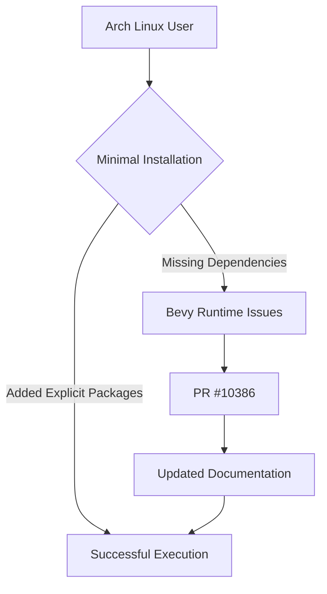

+++
title = "#10386 PR #10386 Analysis: Enhancing Arch Linux Dependency Documentation for Bevy"
date = "2025-05-26T00:00:00"
draft = false
template = "pull_request_page.html"
in_search_index = true

[taxonomies]
list_display = ["show"]

[extra]
current_language = "en"
available_languages = {"en" = { name = "English", url = "/pull_request/bevy/2025-05/pr-10386-en-20250526" }, "zh-cn" = { name = "中文", url = "/pull_request/bevy/2025-05/pr-10386-zh-cn-20250526" }}
labels = ["C-Docs", "D-Trivial", "O-Linux"]
+++

# Title: PR #10386 Analysis: Enhancing Arch Linux Dependency Documentation for Bevy

## Basic Information
- **Title**: Added explicit dependencies for Arch Linux
- **PR Link**: https://github.com/bevyengine/bevy/pull/10386
- **Author**: SaladinAyyub
- **Status**: MERGED
- **Labels**: C-Docs, D-Trivial, O-Linux, S-Ready-For-Final-Review
- **Created**: 2023-11-05T13:23:02Z
- **Merged**: 2025-05-26T15:53:04Z
- **Merged By**: alice-i-cecile

## Description Translation
As I run bevy in a apx container, the default dependencies are bare minimum.. because of which I was able to find the explicit dependencies required for bevy. :+1: the same shall also be applicable for the other distributions but I will have to figure out explicit ones for them and might open a PR for them later.

# Objective

- Have explicit dependencies listed for a bare minimum system / container

## Solution

- Running bevy in a bare minimum apx / distrobox container.

---

## Changelog

- Added explicit dependency instructions for Arch Linux

## The Story of This Pull Request

### The Problem and Context
When attempting to run Bevy game engine in minimal APX containers (Arch Linux Package eXtended), the author encountered missing dependencies despite following existing documentation. The original dependency list for Arch Linux (`libx11 pkgconf alsa-lib`) proved insufficient for a barebones environment, causing potential build failures or runtime issues. This problem particularly affects developers working with containerized environments or minimal installations where default package sets are stripped down.

### The Solution Approach
Through practical experimentation in a minimal container environment, the author identified three additional X11-related dependencies required for proper Bevy functionality:
1. `libxcursor` - Handles cursor theme support
2. `libxrandr` - Manages screen resolution and rotation
3. `libxi` - Provides X Input extension for input devices

These packages are implicitly pulled in standard desktop installations through meta-packages but become explicitly required in minimal setups. The solution focused on documentation improvement rather than code changes, directly addressing the root cause of missing dependencies in constrained environments.

### The Implementation
The changes were implemented through a single-line modification to the Linux dependencies documentation file:

```bash
# File: docs/linux_dependencies.md
# Before:
sudo pacman -S libx11 pkgconf alsa-lib

# After:
sudo pacman -S libx11 pkgconf alsa-lib libxcursor libxrandr libxi
```

This update ensures that users following the Arch Linux installation instructions receive all necessary dependencies for Bevy's window management and input handling subsystems. The change maintains backward compatibility with existing installations while improving support for minimal environments.

### Technical Insights
The added dependencies map directly to Bevy's platform requirements:
- `libxcursor`: Required for `winit`'s cursor customization features
- `libxrandr`: Enables resolution changes through Bevy's window settings
- `libxi`: Mandatory for proper input device handling in X11 environments

These libraries are standard components of the X Window System but are often omitted from minimal container installations. The explicit listing prevents subtle runtime failures that could occur when these dependencies are missing, such as inability to change window resolution or handle mouse input.

### The Impact
This documentation update:
1. Reduces setup friction for Arch Linux users in containerized environments
2. Prevents cryptic build/runtime errors in minimal installations
3. Aligns Arch documentation with other distros' explicit dependency lists
4. Maintains compatibility with existing systems through pacman's dependency resolution

The change demonstrates the importance of testing installation procedures in clean environments and the value of explicit dependency declarations for cross-environment compatibility.

## Visual Representation



## Key Files Changed

### `docs/linux_dependencies.md` (+1/-1)
**Change Purpose**: Ensure complete dependency listing for Arch Linux installations

**Code Comparison**:
```bash
# Before:
sudo pacman -S libx11 pkgconf alsa-lib

# After:
sudo pacman -S libx11 pkgconf alsa-lib libxcursor libxrandr libxi
```

**Relation to PR**: Directly implements the solution by adding three critical X11 extension libraries to the package installation command.

## Further Reading
1. Arch Linux Package Management: https://wiki.archlinux.org/title/Pacman
2. X Window System Architecture: https://www.x.org/wiki/
3. Bevy's Window Management: https://bevyengine.org/learn/book/getting-started/window-settings/
4. APX Container Documentation: https://github.com/Vanilla-OS/apx