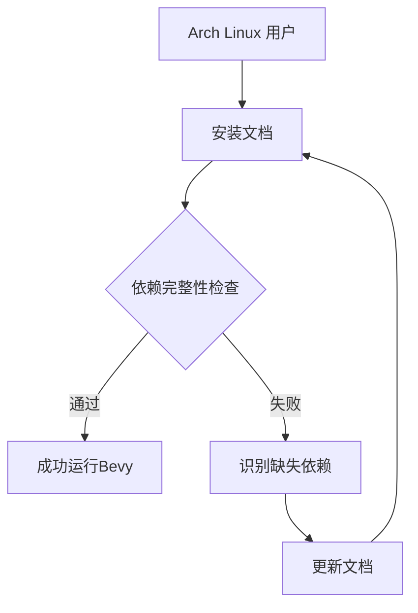

+++
title = "#10386 Added explicit dependencies for Arch Linux"
date = "2025-05-26T00:00:00"
draft = false
template = "pull_request_page.html"
in_search_index = false

[extra]
current_language = "zh-cn"
available_languages = {"en" = { name = "English", url = "/pull_request/bevy/2025-05/pr-10386-en-20250526" }, "zh-cn" = { name = "中文", url = "/pull_request/bevy/2025-05/pr-10386-zh-cn-20250526" }}
labels = ["C-Docs", "D-Trivial", "O-Linux"]
+++

# Arch Linux 显式依赖文档更新分析报告

## Basic Information
- **Title**: Added explicit dependencies for Arch Linux
- **PR Link**: https://github.com/bevyengine/bevy/pull/10386
- **Author**: SaladinAyyub
- **Status**: MERGED
- **Labels**: C-Docs, D-Trivial, O-Linux, S-Ready-For-Final-Review
- **Created**: 2023-11-05T13:23:02Z
- **Merged**: 2025-05-26T15:53:04Z
- **Merged By**: alice-i-cecile

## Description Translation
在 apx 容器中运行 bevy 时，默认依赖项是最小化的。因此我发现了运行 bevy 需要显式添加的依赖项。👍 同样的原则也适用于其他发行版，但需要确定具体的依赖项，后续可能会为此提交新的 PR。

# 目标
- 为最小化系统/容器列出明确的依赖项

## 解决方案
- 在最小化的 apx/distrobox 容器中运行 bevy

---
## 更新日志
- 添加 Arch Linux 的显式依赖安装说明

## The Story of This Pull Request

### 问题背景与识别
开发者在基于 apx 容器的最小化 Arch Linux 环境中运行 Bevy 游戏引擎时，发现现有的依赖安装说明（仅包含 libx11、pkgconf 和 alsa-lib）无法满足实际运行需求。这个问题在容器化部署场景中尤为突出，因为容器环境通常采用最小化安装策略，缺少图形子系统相关的可选依赖。

### 技术调研与解决方案
通过在实际容器环境中运行测试，开发者识别出三个缺失的关键 X11 库依赖：
1. **libxcursor** - 处理光标图标渲染
2. **libxrandr** - 管理屏幕分辨率与旋转
3. **libxi** - 处理输入设备集成

这些库属于 X Window System 的扩展组件，在典型桌面环境中通常作为隐式依赖存在。但在最小化安装场景下，必须显式声明依赖才能保证 Bevy 的窗口管理和输入系统正常工作。

### 实现细节
修改集中在文档文件 `linux_dependencies.md` 的 Arch Linux 部分，将安装命令从：
```bash
sudo pacman -S libx11 pkgconf alsa-lib
```
更新为：
```bash
sudo pacman -S libx11 pkgconf alsa-lib libxcursor libxrandr libxi
```
这个改动确保用户在使用 pacman 包管理器安装依赖时，能完整获取 Bevy 运行所需的全部底层库。

### 技术影响
1. **容器兼容性**：使 Bevy 能直接在最小化容器环境（如 distrobox/apx）中运行
2. **依赖透明化**：明确声明所有必要依赖，减少用户遇到动态链接错误的可能性
3. **跨发行版示范**：为其他 Linux 发行版的依赖管理提供参考模式

### 工程考量
- **最小化原则**：仅添加确实需要的依赖，避免引入不必要的包
- **向后兼容**：修改不影响现有用户的正常安装流程
- **文档维护**：保持不同发行版依赖说明的结构一致性

## Visual Representation



## Key Files Changed

### `docs/linux_dependencies.md`
**修改说明**：补充 Arch Linux 的显式依赖列表

```diff
## Arch / Manjaro

```bash
-sudo pacman -S libx11 pkgconf alsa-lib
+sudo pacman -S libx11 pkgconf alsa-lib libxcursor libxrandr libxi
```

**关联性分析**：
- 直接解决最小化环境下的依赖缺失问题
- 保持与其他发行版依赖说明的格式统一
- 明确区分必要依赖与可选组件（如声音服务器选择）

## Further Reading
1. [Arch Linux 官方文档 - Xorg 组件说明](https://wiki.archlinux.org/title/Xorg)
2. [Bevy 窗口系统架构](https://bevyengine.org/learn/book/getting-started/setup/#linux-dependencies)
3. [Linux 动态链接原理](https://tldp.org/HOWTO/Program-Library-HOWTO/shared-libraries.html)

# Full Code Diff
```diff
diff --git a/docs/linux_dependencies.md b/docs/linux_dependencies.md
index 53ad5257e8000..a09bd629ffc84 100644
--- a/docs/linux_dependencies.md
+++ b/docs/linux_dependencies.md
@@ -94,7 +94,7 @@ export PKG_CONFIG_PATH="/usr/lib/x86_64-linux-gnu/pkgconfig/"
 ## Arch / Manjaro
 
 ```bash
-sudo pacman -S libx11 pkgconf alsa-lib
+sudo pacman -S libx11 pkgconf alsa-lib libxcursor libxrandr libxi
 ```
 
 Install `pipewire-alsa` or `pulseaudio-alsa` depending on the sound server you are using.
```