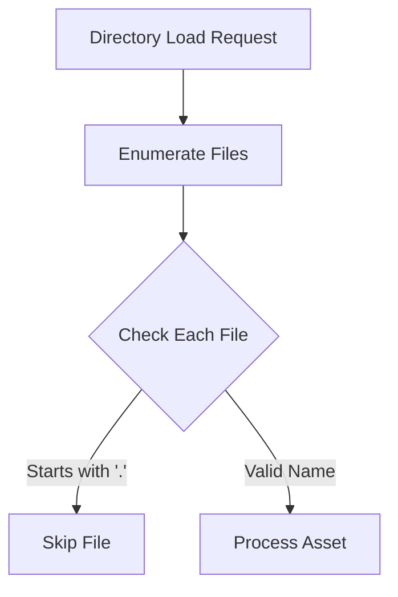

+++
title = "#11214 Fix Asset Loading Crash by Ignoring Hidden Files"
date = "2025-05-05T00:00:00"
draft = false
template = "pull_request_page.html"
in_search_index = true

[taxonomies]
list_display = ["show"]

[extra]
current_language = "en"
available_languages = {"en" = { name = "English", url = "/pull_request/bevy/2025-05/pr-11214-en-20250505" }, "zh-cn" = { name = "中文", url = "/pull_request/bevy/2025-05/pr-11214-zh-cn-20250505" }}
labels = ["C-Bug", "A-Assets", "O-MacOS", "O-iOS", "X-Contentious", "D-Straightforward"]
+++

# Title: Fix Asset Loading Crash by Ignoring Hidden Files

## Basic Information
- **Title**: ignore files starting with . when loading folders
- **PR Link**: https://github.com/bevyengine/bevy/pull/11214
- **Author**: mockersf
- **Status**: MERGED
- **Labels**: C-Bug, A-Assets, O-MacOS, O-iOS, S-Ready-For-Final-Review, X-Contentious, D-Straightforward
- **Created**: 2024-01-04T12:17:42Z
- **Merged**: 2025-05-05T23:02:41Z
- **Merged By**: alice-i-cecile

## Description Translation
# Objective

- When loading a folder with dot files inside, Bevy crashes:
```
thread 'IO Task Pool (1)' panicked at crates/bevy_asset/src/io/mod.rs:260:10:
asset paths must have extensions
note: run with `RUST_BACKTRACE=1` environment variable to display a backtrace
```
- those files are common for other tools to store their settings/metadata

## Solution

- Ignore files starting with a dot when loading folders

## The Story of This Pull Request

### The Problem and Context
Bevy's asset system encountered a critical failure when processing directories containing hidden files (those starting with '.'). This manifested as a panic in the IO task pool due to missing file extensions, common in macOS metadata files (.DS_Store) and configuration files (.gitignore). The root cause lay in Bevy's directory traversal logic attempting to process these non-asset files as valid resources.

### The Solution Approach
The fix focused on filtering out hidden files during directory enumeration. The implementation adds a filename check before constructing asset paths, skipping any entries that:
1. Start with '.' character
2. Could be converted to a valid string (UTF-8 check)
3. Pass basic file type checks

This approach maintains compatibility with existing asset loading patterns while preventing invalid file processing. The solution was applied consistently to both synchronous and asynchronous file readers.

### The Implementation
The core changes occur in the directory iteration logic of Bevy's file asset readers. Here's the critical addition in `sync_file_asset.rs`:

```rust
// filter out hidden files. they are not listed by default but are directly targetable
if path
    .file_name()
    .and_then(|file_name| file_name.to_str())
    .map(|file_name| file_name.starts_with('.'))
    .unwrap_or_default()
{
    return None;
}
```

This code:
1. Extracts the filename component from the path
2. Converts it to a string slice
3. Checks for leading '.' character
4. Uses `unwrap_or_default()` to safely handle conversion failures

The same logic was added to the asynchronous implementation in `file_asset.rs`, ensuring consistent behavior across both IO strategies.

### Technical Insights
Key implementation details:
1. **Path Safety**: Uses `std::path` components rather than string manipulation for platform-agnostic handling
2. **Error Resilience**: `unwrap_or_default()` ensures failed conversions don't panic, treating them as non-hidden files
3. **Early Filtering**: The check occurs before path stripping and extension validation, optimizing performance
4. **System Compatibility**: Addresses macOS/iOS-specific issues while maintaining Windows/Linux functionality

### The Impact
This change:
- Prevents runtime crashes in asset-heavy projects
- Reduces error logging noise from non-asset files
- Maintains direct access to hidden files when explicitly requested
- Aligns Bevy's behavior with common OS file browser conventions

The fix demonstrates defensive programming practices when dealing with filesystem operations, particularly important in cross-platform game engines.

## Visual Representation



## Key Files Changed

### crates/bevy_asset/src/io/file/file_asset.rs (+9/-0)
Added hidden file filtering to asynchronous asset loader:
```rust
// Filter added to directory iteration logic
if path
    .file_name()
    .and_then(|file_name| file_name.to_str())
    .map(|file_name| file_name.starts_with('.'))
    .unwrap_or_default()
{
    return None;
}
```

### crates/bevy_asset/src/io/file/sync_file_asset.rs (+10/-0)
Synchronous loader received identical filtering logic:
```rust
// Mirror implementation for sync loader
if path
    .file_name()
    .and_then(|file_name| file_name.to_str())
    .map(|file_name| file_name.starts_with('.'))
    .unwrap_or_default()
{
    return None;
}
```

Both changes implement the same filtering strategy across Bevy's IO systems, ensuring consistent asset loading behavior regardless of execution model.

## Further Reading
1. [Rust Path Handling](https://doc.rust-lang.org/std/path/struct.Path.html)
2. [Cross-platform File System Considerations](https://bevy-cheatbook.github.io/features/assets.html)
3. [Unix Hidden File Convention](https://www.gnu.org/software/libc/manual/html_node/File-Name-Portability.html)