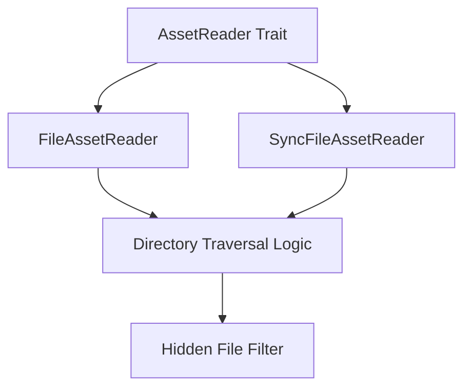

+++
title = "#11214 ignore files starting with . when loading folders"
date = "2025-05-05T00:00:00"
draft = false
template = "pull_request_page.html"
in_search_index = false

[extra]
current_language = "zh-cn"
available_languages = {"en" = { name = "English", url = "/pull_request/bevy/2025-05/pr-11214-en-20250505" }, "zh-cn" = { name = "中文", url = "/pull_request/bevy/2025-05/pr-11214-zh-cn-20250505" }}
labels = ["C-Bug", "A-Assets", "O-MacOS", "O-iOS", "X-Contentious", "D-Straightforward"]
+++

# Title

## Basic Information
- **Title**: ignore files starting with . when loading folders
- **PR Link**: https://github.com/bevyengine/bevy/pull/11214
- **Author**: mockersf
- **Status**: MERGED
- **Labels**: C-Bug, A-Assets, O-MacOS, O-iOS, S-Ready-For-Final-Review, X-Contentious, D-Straightforward
- **Created**: 2024-01-04T12:17:42Z
- **Merged**: 2025-05-05T23:02:41Z
- **Merged By**: alice-i-cecile

## Description Translation
### 目标

- 当加载包含点文件（dot files）的文件夹时，Bevy 会崩溃：
```
thread 'IO Task Pool (1)' panicked at crates/bevy_asset/src/io/mod.rs:260:10:
asset paths must have extensions
note: run with `RUST_BACKTRACE=1` environment variable to display a backtrace
```
- 这些文件通常是其他工具用来存储设置/元数据的

### 解决方案

- 在加载文件夹时忽略以点开头的文件

## The Story of This Pull Request

### 问题背景
在 Bevy 的资产加载系统中，当尝试加载包含隐藏文件（以`.`开头的文件）的文件夹时，会触发 panic。这个问题主要影响 macOS 和 iOS 系统，因为这些系统常见使用`.DS_Store`等隐藏文件。崩溃的根本原因在于资产系统强制要求所有文件必须包含扩展名，而许多隐藏文件并不符合这个要求。

### 技术实现
解决方案在文件遍历阶段添加了文件名过滤逻辑。具体修改位于两个实现 AssetReader trait 的文件中：

1. **文件过滤逻辑**：在遍历目录条目时，新增对文件名是否以`.`开头的检查
2. **路径处理**：通过`file_name()`提取文件名，使用`starts_with('.')`进行判断
3. **兼容性处理**：使用`unwrap_or_default()`处理可能的 None 情况，保证程序稳定性

关键代码修改示例：
```rust
// 在遍历目录条目时新增过滤条件
if path
    .file_name()
    .and_then(|file_name| file_name.to_str())
    .map(|file_name| file_name.starts_with('.'))
    .unwrap_or_default()
{
    return None;
}
```

### 技术考量
1. **跨平台一致性**：遵循 UNIX-like 系统隐藏文件惯例，同时不影响 Windows 平台表现
2. **直接访问保留**：过滤仅作用于自动加载，仍支持通过完整路径直接访问隐藏文件
3. **错误预防**：在文件遍历阶段提前过滤，避免后续处理流程中的潜在错误

### 影响分析
1. **稳定性提升**：消除因隐藏文件导致的崩溃问题
2. **行为一致性**：资产加载行为现在与操作系统默认文件浏览器表现一致
3. **向后兼容**：不影响现有合法资产文件的加载逻辑

## Visual Representation



## Key Files Changed

### `crates/bevy_asset/src/io/file/file_asset.rs`
**修改说明**：
- 在异步文件资产读取器中添加隐藏文件过滤
- 关键代码段：
```rust
// 新增的过滤逻辑
if path
    .file_name()
    .and_then(|file_name| file_name.to_str())
    .map(|file_name| file_name.starts_with('.'))
    .unwrap_or_default()
{
    return None;
}
```

### `crates/bevy_asset/src/io/file/sync_file_asset.rs`
**修改说明**：
- 在同步文件资产读取器中实现相同过滤逻辑
- 代码结构与异步版本保持严格一致，保证行为统一

## Further Reading

1. Bevy 资产系统文档：[Assets - Bevy Engine](https://bevyengine.org/learn/book/assets/)
2. UNIX 隐藏文件规范：[Hidden Files and Directories - POSIX](https://pubs.opengroup.org/onlinepubs/9699919799/basedefs/V1_chap03.html#tag_03_293)
3. Rust 路径处理标准库文档：[std::path - Rust Docs](https://doc.rust-lang.org/std/path/index.html)

# Full Code Diff
（完整代码差异见原始PR链接）