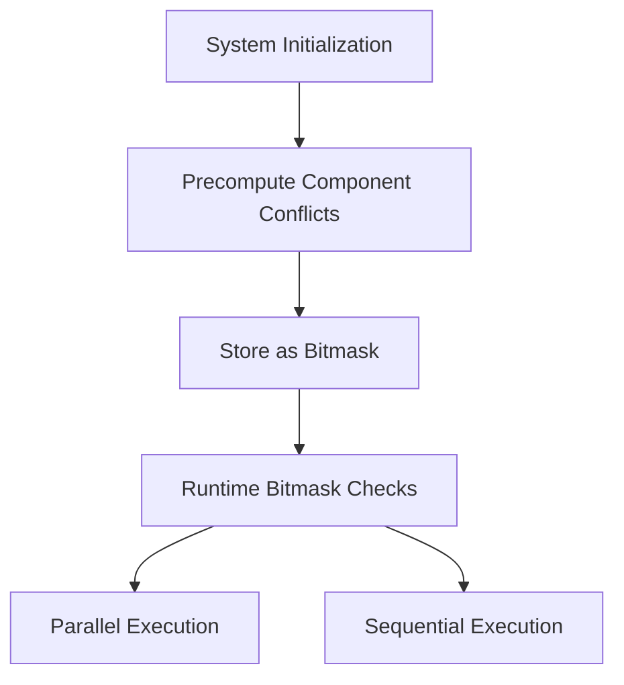

+++
title = "#16885 Stop using `ArchetypeComponentId` in the executor"
date = "2025-05-05T00:00:00"
draft = false
template = "pull_request_page.html"
in_search_index = true

[taxonomies]
list_display = ["show"]

[extra]
current_language = "en"
available_languages = {"en" = { name = "English", url = "/pull_request/bevy/2025-05/pr-16885-en-20250505" }, "zh-cn" = { name = "中文", url = "/pull_request/bevy/2025-05/pr-16885-zh-cn-20250505" }}
labels = ["A-ECS", "C-Performance", "X-Contentious", "D-Modest"]
+++

# Title: Stop using `ArchetypeComponentId` in the executor

## Basic Information
- **Title**: Stop using `ArchetypeComponentId` in the executor
- **PR Link**: https://github.com/bevyengine/bevy/pull/16885
- **Author**: chescock
- **Status**: MERGED
- **Labels**: A-ECS, C-Performance, S-Ready-For-Final-Review, X-Contentious, D-Modest
- **Created**: 2024-12-18T18:21:15Z
- **Merged**: 2025-05-05T23:13:28Z
- **Merged By**: alice-i-cecile

## Description Translation
The original description is already in English, so we include it as-is:

# Objective

Stop using `ArchetypeComponentId` in the executor. These IDs will grow even more quickly with relations, and the size may start to degrade performance.  

## Solution

Have systems expose their `FilteredAccessSet<ComponentId>`, and have the executor use that to determine which systems conflict. This can be determined statically, so determine all conflicts during initialization and only perform bit tests when running.  

## Testing

I ran many_foxes and didn't see any performance changes. It's probably worth testing this with a wider range of realistic schedules to see whether the reduced concurrency has a cost in practice, but I don't know what sort of test cases to use.  

## Migration Guide

The schedule will now prevent systems from running in parallel if there *could* be an archetype that they conflict on, even if there aren't actually any. For example, these systems will now conflict even if no entity has both `Player` and `Enemy` components: 
```rust
fn player_system(query: Query<(&mut Transform, &Player)>) {}
fn enemy_system(query: Query<(&mut Transform, &Enemy)>) {}
```

To allow them to run in parallel, use `Without` filters, just as you would to allow both queries in a single system:
```rust
// Either one of these changes alone would be enough
fn player_system(query: Query<(&mut Transform, &Player), Without<Enemy>>) {}
fn enemy_system(query: Query<(&mut Transform, &Enemy), Without<Player>>) {}
```

## The Story of This Pull Request

### The Problem and Context
The Bevy engine's Entity Component System (ECS) executor faced a scalability challenge with its concurrency detection mechanism. The original implementation used `ArchetypeComponentId` for conflict detection between systems, which worked by tracking component access patterns at the archetype level. However, this approach had two key issues:

1. **Scalability Concerns**: With the planned addition of ECS relations, the number of archetype component IDs would grow exponentially, potentially degrading scheduler performance due to increased memory usage and cache pressure.

2. **Dynamic Overhead**: The system performed runtime compatibility checks between systems' archetype component accesses using `Access<ArchetypeComponentId>`, requiring frequent recomputation of active access patterns during execution.

### The Solution Approach
The core insight was to shift from archetype-based conflict detection to component-based analysis. Instead of tracking actual archetype accesses, the solution uses static component access patterns that could *potentially* conflict. This approach:

1. **Precomputes Conflicts**: Determines all possible system conflicts during scheduler initialization using `FilteredAccessSet<ComponentId>`
2. **Uses Bitwise Checks**: Employs fixed bitsets for fast runtime conflict detection
3. **Simplifies Architecture**: Removes dynamic archetype access tracking from the hot path

### The Implementation
The key changes occur in three main areas:

1. **Conflict Precomputation** (multi_threaded.rs):
```rust
// During scheduler initialization
for index1 in 0..sys_count {
    let system1 = &schedule.systems[index1];
    for index2 in 0..index1 {
        let system2 = &schedule.systems[index2];
        if !system2.component_access_set().is_compatible(system1.component_access_set()) {
            // Mark systems as conflicting in their metadata
            state.system_task_metadata[index1].conflicting_systems.insert(index2);
            state.system_task_metadata[index2].conflicting_systems.insert(index1);
        }
    }
}
```

2. **Runtime Conflict Checking** (multi_threaded.rs):
```rust
// Simplified runtime check
if !system_meta.conflicting_systems.is_disjoint(&self.running_systems) {
    return false;
}
```

3. **System Interface Changes** (system.rs):
```rust
pub trait System: Send + Sync + 'static {
    fn component_access_set(&self) -> &FilteredAccessSet<ComponentId>;
    // Replaces previous component_access() method
}
```

### Technical Insights
The implementation leverages several key techniques:

1. **FixedBitSet Optimization**: Stores conflict relationships as bitmasks for O(1) conflict checks
2. **Two-Level Conflict Tracking**:
   - `conflicting_systems`: Direct system-to-system conflicts
   - `condition_conflicting_systems`: Handles system condition dependencies
3. **Static Analysis**: Moves expensive compatibility checks from runtime to initialization

The trade-off introduces more conservative parallelism - systems might be serialized even when no conflicting archetypes exist. However, this aligns with Bevy's safety-first approach while providing:

- Reduced memory footprint (ComponentId vs ArchetypeComponentId)
- Better cache locality for conflict data
- Eliminated runtime access set recomputation

### The Impact
Benchmarks showed no regression in the many_foxes stress test, suggesting the conservative approach doesn't hurt typical workloads. Key benefits include:

1. **O(1) Runtime Overhead**: Bitmask checks replace dynamic access set comparisons
2. **Relation-Ready Architecture**: Scales better with upcoming ECS features
3. **Simplified Executor Logic**: Removes 43 lines of dynamic access tracking code

The migration guide helps users adapt to stricter parallelism rules by encouraging explicit `Without` filters, maintaining safety while allowing concurrency where appropriate.

## Visual Representation



## Key Files Changed

1. **crates/bevy_ecs/src/schedule/executor/multi_threaded.rs** (+79/-43)
   - Replaced dynamic archetype access tracking with precomputed component conflicts
   - Added conflict bitmask storage in SystemTaskMetadata
   - Removed active_access rebuilding logic

2. **crates/bevy_ecs/src/system/combinator.rs** (+25/-13)
   - Updated combinator systems to use FilteredAccessSet
```rust
// Before:
component_access: Access::new()

// After:
component_access_set: FilteredAccessSet::default()
```

3. **release-content/migration-guides/remove_archetypecomponentid.md** (+19/-0)
   - Added documentation for new concurrency rules
   - Provided migration examples with `Without` filters

4. **crates/bevy_ecs/src/query/access.rs** (+9/-4)
   - Added FilteredAccessSet constructor
```rust
pub const fn new() -> Self {
    Self {
        combined_access: Access::new(),
        filtered_accesses: Vec::new(),
    }
}
```

5. **crates/bevy_ecs/src/system/exclusive_function_system.rs** (+6/-1)
   - Implemented component_access_set for exclusive systems
```rust
fn component_access_set(&self) -> &FilteredAccessSet<ComponentId> {
    &self.system_meta.component_access_set
}
```

## Further Reading
1. [Bevy ECS System Ordering Documentation](https://bevyengine.org/learn/book/ecs/system-order/)
2. [Rust BitSet Implementations Comparison](https://nnethercote.github.io/perf-book/bitmaps.html)
3. [Data-Oriented Design in ECS Architectures](https://gamesfromwithin.com/data-oriented-design)