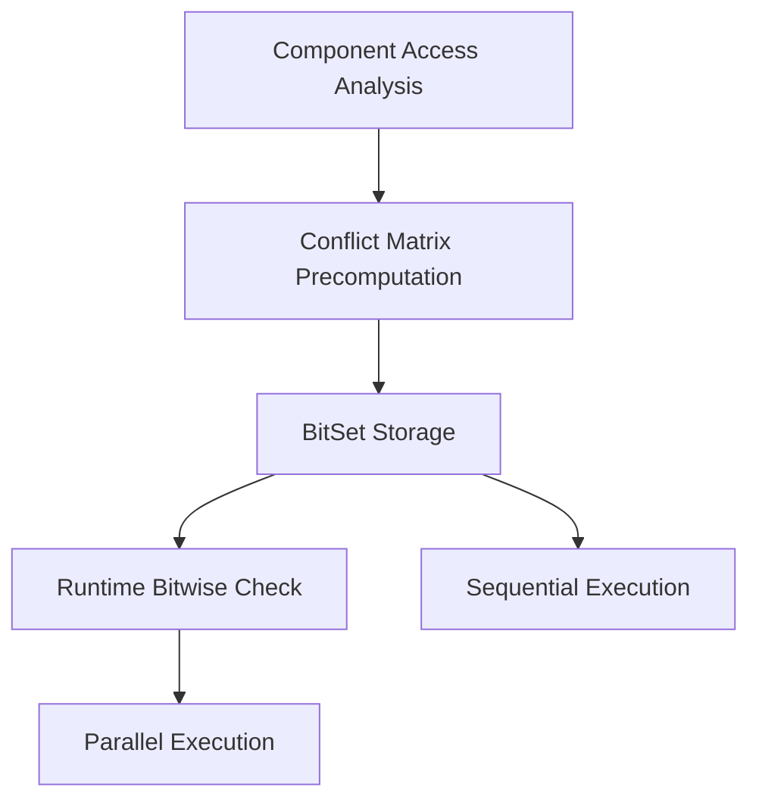

+++
title = "#16885 Stop using `ArchetypeComponentId` in the executor"
date = "2025-05-05T00:00:00"
draft = false
template = "pull_request_page.html"
in_search_index = false

[extra]
current_language = "zh-cn"
available_languages = {"en" = { name = "English", url = "/pull_request/bevy/2025-05/pr-16885-en-20250505" }, "zh-cn" = { name = "中文", url = "/pull_request/bevy/2025-05/pr-16885-zh-cn-20250505" }}
labels = ["A-ECS", "C-Performance", "X-Contentious", "D-Modest"]
+++

# Stop using `ArchetypeComponentId` in the executor

## Basic Information
- **Title**: Stop using `ArchetypeComponentId` in the executor
- **PR Link**: https://github.com/bevyengine/bevy/pull/16885
- **Author**: chescock
- **Status**: MERGED
- **Labels**: A-ECS, C-Performance, S-Ready-For-Final-Review, X-Contentious, D-Modest
- **Created**: 2024-12-18T18:21:15Z
- **Merged**: 2025-05-05T23:13:28Z
- **Merged By**: alice-i-cecile

## Description Translation
### 目标

停止在调度器中使用 `ArchetypeComponentId`。随着 relations 的引入，这些 ID 的增长速度会更快，可能影响性能。

### 解决方案

让系统暴露它们的 `FilteredAccessSet<ComponentId>`，调度器使用这个信息静态确定系统冲突。在初始化阶段完成所有冲突检测，运行时只进行位测试。

### 测试

运行 many_foxes 未观察到性能变化。建议使用更真实的场景测试并发性能影响。

### 迁移指南

现在当系统*可能*存在 archetype 冲突时就会被阻止并行运行，即使实际没有实体包含冲突组件。例如以下系统即使没有同时包含 `Player` 和 `Enemy` 的实体也会冲突：
```rust
fn player_system(query: Query<(&mut Transform, &Player)>) {}
fn enemy_system(query: Query<(&mut Transform, &Enemy)>) {}
```

要允许并行，需使用 `Without` 过滤器：
```rust
// 任意一个修改即可
fn player_system(query: Query<(&mut Transform, &Player), Without<Enemy>>) {}
fn enemy_system(query: Query<(&mut Transform, &Enemy), Without<Player>>) {}
```

## The Story of This Pull Request

### 问题与背景
Bevy 的 ECS 调度器需要确保不会同时运行存在数据竞争的 system。原有实现使用 `ArchetypeComponentId` 进行运行时冲突检测，但随着 relations 功能的引入，archetype 数量会指数级增长，导致：
1. `ArchetypeComponentId` 的内存占用增加
2. 运行时访问检查开销变大
3. 并发度可能降低

### 解决方案
核心思路是将冲突检测从运行时转移到初始化阶段：
1. 改用 `ComponentId` 作为冲突判断依据
2. 预计算所有 system 之间的冲突关系
3. 运行时使用位运算快速判断

技术关键点：
- 引入 `FilteredAccessSet<ComponentId>` 表达系统的组件访问模式
- 在 `MultiThreadedExecutor` 初始化阶段构建冲突矩阵
- 使用 `FixedBitSet` 高效存储和查询冲突关系

### 实现细节
在 `multi_threaded.rs` 中重构冲突检测逻辑：
```rust
// 系统元数据改为存储冲突系统位集合
struct SystemTaskMetadata {
    conflicting_systems: FixedBitSet,
    condition_conflicting_systems: FixedBitSet,
    // ...其他字段
}

// 初始化阶段预计算冲突
for index1 in 0..sys_count {
    for index2 in 0..index1 {
        if !system2.component_access_set().is_compatible(system1.component_access_set()) {
            // 标记互斥关系
            metadata[index1].conflicting_systems.insert(index2);
            metadata[index2].conflicting_systems.insert(index1);
        }
    }
}
```

运行时检查简化为位运算：
```rust
if !system_meta.conflicting_systems.is_disjoint(&self.running_systems) {
    return false; // 存在冲突
}
```

### 技术洞察
1. **静态分析优势**：通过预计算将 O(n²) 的运行时开销转为 O(1) 的位检查
2. **组件粒度优化**：`ComponentId` 的数量远小于 `ArchetypeComponentId`，减少内存占用
3. **保守检测策略**：可能阻止实际不冲突的并行执行，但保证安全性

### 影响
- **性能提升**：减少运行时计算，位操作比集合运算更快
- **内存优化**：`FixedBitSet` 比 `HashSet` 更紧凑
- **开发约束**：需要更谨慎设计查询条件来保证并发度

## Visual Representation



## Key Files Changed

### `crates/bevy_ecs/src/schedule/executor/multi_threaded.rs` (+79/-43)
1. **系统元数据重构**：用位集合替代 ArchetypeComponentId 访问记录
```rust
// Before:
struct SystemTaskMetadata {
    archetype_component_access: Access<ArchetypeComponentId>
}

// After: 
struct SystemTaskMetadata {
    conflicting_systems: FixedBitSet,
    condition_conflicting_systems: FixedBitSet
}
```

2. **冲突预计算**：初始化阶段构建系统间的冲突关系

### `crates/bevy_ecs/src/system/combinator.rs` (+25/-13)
1. **组合系统改造**：使用 `FilteredAccessSet` 替代简单 `Access`
```rust
// Before:
component_access: Access<ComponentId>

// After:
component_access_set: FilteredAccessSet<ComponentId>
```

### `release-content/migration-guides/remove_archetypecomponentid.md` (+19/-0)
新增迁移指南，指导开发者使用 `Without` 过滤器保证系统并行能力

## Further Reading
1. [Bevy ECS 架构文档](https://bevyengine.org/learn/book/ecs/)
2. [位集合性能优化模式](https://doc.rust-lang.org/std/collections/struct.BitSet.html)
3. [数据竞争静态检测技术](https://en.wikipedia.org/wiki/Static_program_analysis)