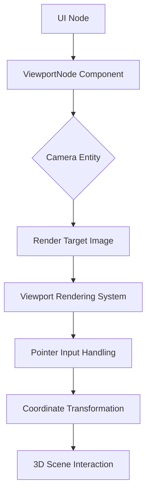

+++
title = "#17253 Add a viewport UI widget"
date = "2025-05-05T00:00:00"
draft = false
template = "pull_request_page.html"
in_search_index = true

[taxonomies]
list_display = ["show"]

[extra]
current_language = "en"
available_languages = {"en" = { name = "English", url = "/pull_request/bevy/2025-05/pr-17253-en-20250505" }, "zh-cn" = { name = "中文", url = "/pull_request/bevy/2025-05/pr-17253-zh-cn-20250505" }}
labels = ["C-Feature", "A-UI", "A-Editor", "D-Modest", "A-Picking"]
+++

# Add a viewport UI widget

## Basic Information
- **Title**: Add a viewport UI widget
- **PR Link**: https://github.com/bevyengine/bevy/pull/17253
- **Author**: chompaa
- **Status**: MERGED
- **Labels**: C-Feature, A-UI, S-Ready-For-Final-Review, A-Editor, M-Needs-Release-Note, D-Modest, A-Picking
- **Created**: 2025-01-09T04:34:57Z
- **Merged**: 2025-05-05T23:18:37Z
- **Merged By**: alice-i-cecile

## Description Translation
The original PR description is already in English and preserved as-is.

## The Story of This Pull Request

### The Problem and Context
Modern game engines often require embedded viewports for features like level editors, picture-in-picture displays, or in-game surveillance systems. Bevy lacked a native solution for rendering camera outputs directly within UI elements while maintaining proper input handling. Developers previously needed custom implementations that didn't integrate cleanly with Bevy's existing UI and picking systems.

### The Solution Approach
The implementation introduces three core components:
1. **ViewportNode Component**: Links UI nodes to camera outputs
2. **Input Forwarding System**: Handles pointer events through viewports
3. **Dynamic Resolution Handling**: Maintains render target size synchronization

The architecture preserves Bevy's existing ECS patterns while extending the UI system's capabilities. Key design decisions included:
- Using dedicated pointer IDs for viewports to prevent input conflicts
- Feature-gating picking functionality behind `bevy_ui_picking_backend`
- Implementing automatic render target resizing through a dedicated system

### The Implementation
The core implementation spans several systems:

**Viewport Node Definition** (crates/bevy_ui/src/widget/viewport.rs):
```rust
#[derive(Component, Debug, Clone, Copy, Reflect)]
pub struct ViewportNode {
    pub camera: Entity,
}
```

**Input Handling** (partial):
```rust
fn viewport_picking(...) {
    // Calculate viewport boundaries
    let node_rect = Rect::from_center_size(
        global_transform.translation().truncate(),
        computed_node.size(),
    );
    
    // Transform pointer coordinates
    let local_position = (input.location.position - top_left) / logical_size;
    let position = local_position * cam_viewport_size;
    
    // Forward transformed events
    commands.send_event(PointerInput {
        location,
        pointer_id: viewport_pointer_id,
        action: input.action,
    });
}
```

**Render Target Resizing**:
```rust
fn update_viewport_render_target_size(...) {
    let size = Extent3d {
        width: u32::max(1, size.x as u32),
        height: u32::max(1, size.y as u32),
        ..default()
    };
    images.get_mut(image_handle).unwrap().resize(size);
}
```

### Technical Insights
Key technical considerations included:
- **Coordinate Transformation**: Maintaining proper mapping between UI space and viewport camera space
- **Input Propagation**: Handling drag operations that start inside and continue outside viewports
- **Performance**: Minimizing overhead through conditional systems and efficient query filters
- **Extensibility**: Designing the ViewportNode to work with any Camera entity using image targets

### The Impact
This implementation enables several new use cases:
1. In-game editors with embedded 3D viewports
2. Security camera displays within UI
3. Picture-in-picture gameplay features
4. Multi-view rendering setups

The system maintains compatibility with existing Bevy UI components and picking backends while adding approximately 300 lines of focused functionality.

## Visual Representation



## Key Files Changed

1. **crates/bevy_ui/src/widget/viewport.rs** (+176/-0)
```rust
#[derive(Component, Debug, Clone, Copy, Reflect)]
#[reflect(Component, Debug)]
pub struct ViewportNode {
    pub camera: Entity,
}
```
- Introduces core component linking UI nodes to cameras

2. **examples/ui/viewport_node.rs** (+148/-0)
```rust
commands.spawn((
    Node { /* Position/size */ },
    ViewportNode::new(camera)
)).observe(on_drag_viewport);
```
- Demonstrates viewport creation and interaction handling

3. **crates/bevy_ui/src/render/mod.rs** (+66/-1)
```rust
pub fn extract_viewport_nodes(...) {
    // Extracts viewport data for rendering
    extracted_uinodes.uinodes.push(ExtractedUiNode {
        image: image.id(),
        extracted_camera_entity,
        // ...
    });
}
```
- Integrates viewports into Bevy's render pipeline

4. **release-content/release-notes/viewport-node.md** (+22/-0)
```markdown
Bevy UI now has a `ViewportNode` component...
```
- Documents the new feature for end users

5. **crates/bevy_ui/src/lib.rs** (+17/-4)
```rust
.add_systems(First, widget::viewport_picking.in_set(PickSet::PostInput))
```
- Integrates viewport systems into Bevy's main UI plugin

## Further Reading
- [Bevy UI Documentation](https://bevyengine.org/learn/book/features/ui/)
- [Bevy Picking System Overview](https://github.com/bevyengine/bevy/tree/main/crates/bevy_picking)
- [Render Targets in Bevy](https://bevyengine.org/learn/book/features/rendering/render-targets/)