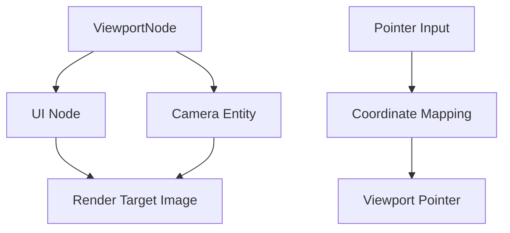

+++
title = "#17253 Add a viewport UI widget"
date = "2025-05-05T00:00:00"
draft = false
template = "pull_request_page.html"
in_search_index = false

[extra]
current_language = "zh-cn"
available_languages = {"en" = { name = "English", url = "/pull_request/bevy/2025-05/pr-17253-en-20250505" }, "zh-cn" = { name = "中文", url = "/pull_request/bevy/2025-05/pr-17253-zh-cn-20250505" }}
labels = ["C-Feature", "A-UI", "A-Editor", "D-Modest", "A-Picking"]
+++

# Add a viewport UI widget

## Basic Information
- **Title**: Add a viewport UI widget  
- **PR Link**: https://github.com/bevyengine/bevy/pull/17253  
- **Author**: chompaa  
- **Status**: MERGED  
- **Labels**: C-Feature, A-UI, S-Ready-For-Final-Review, A-Editor, M-Needs-Release-Note, D-Modest, A-Picking  
- **Created**: 2025-01-09T04:34:57Z  
- **Merged**: 2025-05-05T23:18:37Z  
- **Merged By**: alice-i-cecile  

## Description Translation
目标：  
添加视口（viewport）UI 组件

解决方案：  
- 新增 `ViewportNode` 组件将 UI 节点转换为视口  
- 添加 `viewport_picking` 将其他指针的输入传递到视口的指针  
  - 与编辑器原型中的实现不同，视口组件拥有独立的指针处理逻辑  
  - 特别处理拖入/拖出视口的边界情况  
- 添加 `update_viewport_render_target_size` 根据节点尺寸更新渲染目标大小  
- 通过 `bevy_ui_picking_backend` 特性门控拾取相关功能  

测试：  
新增 `viewport_node` 示例演示：  
- 创建带白色边框的 200x200 视口  
- 右键拖拽移动视口位置  
- 左键拖拽旋转立方体  
- 显示命中点的法线指示箭头  

展示视频：  
https://github.com/user-attachments/assets/39f44eac-2c2a-4fd9-a606-04171f806dc1  

## The Story of This Pull Request

### 问题背景
在游戏编辑器和复杂UI场景中，经常需要将3D场景渲染到UI面板并实现交互。传统方案需要手动处理渲染目标与UI的坐标映射，缺乏标准化实现。Bevy引擎需要一种原生支持将任意摄像机输出嵌入UI，并能正确处理输入事件的基础设施。

### 技术方案
核心思路是将UI节点与摄像机渲染目标绑定，建立两套坐标系间的映射：

1. **组件设计**  
新增 `ViewportNode` 组件关联摄像机实体，通过`camera`字段指定渲染源：
```rust
#[derive(Component)]
pub struct ViewportNode {
    pub camera: Entity,
}
```

2. **渲染目标管理**  
`update_viewport_render_target_size` 系统监听节点尺寸变化，动态调整关联的Image资源：
```rust
images.get_mut(image_handle).unwrap().resize(Extent3d {
    width: u32::max(1, size.x as u32),
    height: u32::max(1, size.y as u32),
    ..default()
});
```

3. **输入事件转发**  
`viewport_picking` 系统处理指针事件映射：
- 计算UI节点在屏幕中的物理坐标边界
- 将全局指针位置转换为视口本地坐标
- 转发事件到视口专属指针（使用UUID生成唯一标识）

### 实现难点
**坐标系转换** 需要处理多级变换：
1. 屏幕物理坐标 → UI节点逻辑坐标
2. UI节点逻辑坐标 → 视口物理坐标
3. 视口物理坐标 → 摄像机投影空间

关键转换代码：
```rust
let local_position = (input.location.position - top_left) / logical_size;
let position = local_position * cam_viewport_size;
```

**事件冒泡管理** 需要处理：
- 悬停状态保持（HoverMap）
- 拖拽状态延续（PointerState）
- 多指针竞争处理（HashMap跟踪激活指针）

### 架构影响
1. **渲染管线扩展**  
新增 `extract_viewport_nodes` 阶段提取视口节点数据到渲染上下文

2. **系统调度调整**  
在UI系统组中插入新的处理阶段：
```rust
.add_systems(First, widget::viewport_picking.in_set(PickSet::PostInput))
```

3. **特性门控设计**  
通过 `bevy_ui_picking_backend` 特性隔离拾取功能，保持核心模块轻量：
```toml
bevy_ui_picking_backend = ["bevy_picking", "dep:uuid"]
```

## Visual Representation


## Key Files Changed

### `crates/bevy_ui/src/widget/viewport.rs` (+176/-0)
新增视口组件的核心实现：
```rust
// 视口指针事件处理
for input in pointer_inputs.read() {
    let local_position = (input.location.position - top_left) / logical_size;
    let position = local_position * cam_viewport_size;
    commands.send_event(PointerInput {
        location: Location { position, target },
        pointer_id: viewport_pointer_id,
        action: input.action,
    });
}
```

### `examples/ui/viewport_node.rs` (+148/-0)
演示用例实现：
```rust
// 创建视口节点
commands.spawn((
    Node {
        width: Val::Px(200.0),
        height: Val::Px(200.0),
        border: UiRect::all(Val::Px(5.0)),
        ..default()
    },
    ViewportNode::new(camera)
));
```

### `crates/bevy_ui/src/render/mod.rs` (+66/-1)
渲染管线扩展：
```rust
// 提取视口节点数据
extracted_uinodes.uinodes.push(ExtractedUiNode {
    image: image.id(),
    extracted_camera_entity,
    item: ExtractedUiItem::Node { /* ... */ },
});
```

## Further Reading
1. [Bevy UI 坐标系系统](https://bevyengine.org/learn/book/features/ui/#coordinates)
2. [Render Target 工作原理](https://docs.rs/bevy/latest/bevy/render/camera/struct.Camera.html#method.target)
3. [ECS 事件处理机制](https://bevyengine.org/learn/book/programming/events/)