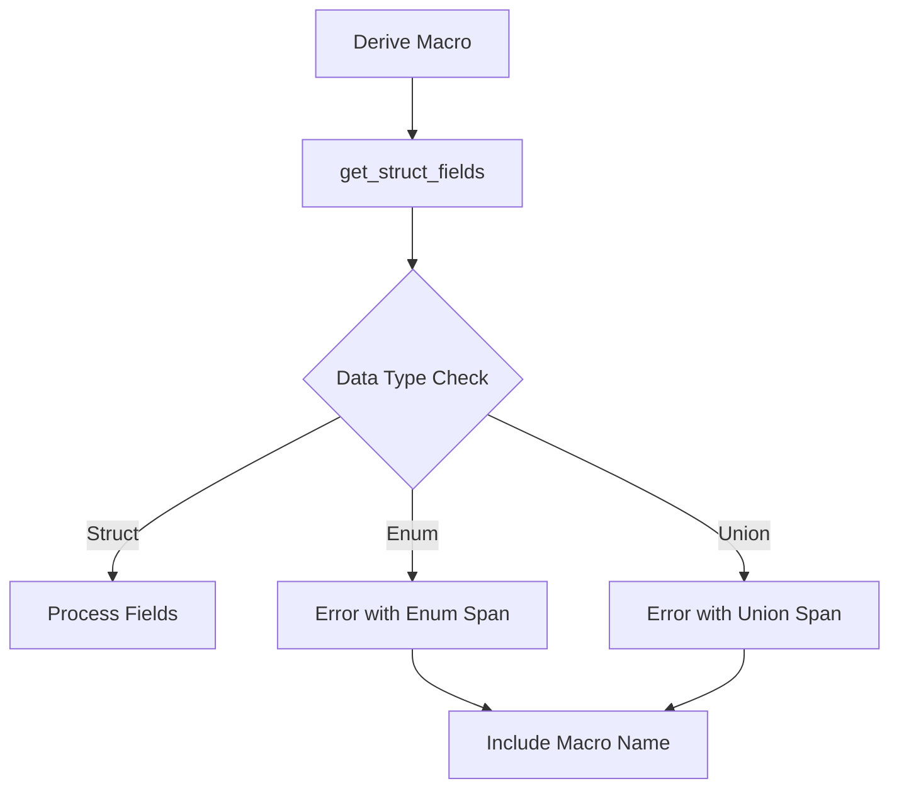

+++
title = "#17639 Better macro errors for get_struct_fields"
date = "2025-05-26T00:00:00"
draft = false
template = "pull_request_page.html"
in_search_index = true

[taxonomies]
list_display = ["show"]

[extra]
current_language = "en"
available_languages = {"en" = { name = "English", url = "/pull_request/bevy/2025-05/pr-17639-en-20250526" }, "zh-cn" = { name = "中文", url = "/pull_request/bevy/2025-05/pr-17639-zh-cn-20250526" }}
labels = ["C-Usability", "A-Utils", "D-Straightforward", "D-Macros"]
+++

# Better macro errors for get_struct_fields

## Basic Information
- **Title**: Better macro errors for get_struct_fields
- **PR Link**: https://github.com/bevyengine/bevy/pull/17639
- **Author**: ecoskey
- **Status**: MERGED
- **Labels**: C-Usability, S-Ready-For-Final-Review, A-Utils, D-Straightforward, D-Macros
- **Created**: 2025-02-02T01:45:52Z
- **Merged**: 2025-05-26T17:17:53Z
- **Merged By**: alice-i-cecile

## Description Translation
The original description is in English and preserved as-is:

# Objective

- Currently, the error span for `get_struct_field` when encountering an enum or union points to the macro invocation, rather than the `enum` or `union` token. It also doesn't mention which macro reported the error.

## Solution

- Report the correct error span
- Add parameter for passing in the name of the macro invocation

## Testing

Bevy compiles fine with this change

## Migration Guide

```rs
// before
let fields = get_struct_fields(&ast.data);

// after
let fields = get_struct_fields(&ast.data, "derive(Bundle)");
```

## The Story of This Pull Request

### The Problem and Context
The Bevy engine's macro system faced a developer experience issue with error reporting in the `get_struct_fields` utility. When developers used derive macros like `Bundle` on non-struct types (enums or unions), the compiler errors were misleading in two key ways:

1. The error span pointed to the macro invocation site rather than the actual `enum` or `union` keyword
2. Error messages didn't specify which macro generated the error

This made debugging difficult, particularly in projects with multiple derive macros. The root cause lay in how error spans were generated and the lack of context about the calling macro.

### The Solution Approach
The author addressed these issues through two coordinated changes:

1. **Error Span Correction**: Instead of using the macro invocation span, the solution captures the span from the actual `enum` or `union` token
2. **Error Contextualization**: Added a `meta` parameter to pass the calling macro's name for inclusion in error messages

This approach maintains backward compatibility while significantly improving error diagnostics. The solution required modifying both the utility function and its call sites.

### The Implementation
The core changes occurred in two files:

**1. bevy_macro_utils/src/shape.rs**
```rust
// Before
pub fn get_struct_fields(data: &Data) -> syn::Result<&Punctuated<Field, Comma>> {
    match data {
        Data::Struct(/* ... */) => Ok(/* ... */),
        _ => Err(Error::new(
            Span::call_site().into(),
            "Only structs are supported",
        )),
    }
}

// After
pub fn get_struct_fields<'a>(
    data: &'a Data,
    meta: &str,
) -> syn::Result<&'a Punctuated<Field, Comma>> {
    match data {
        Data::Struct(/* ... */) => Ok(/* ... */),
        Data::Enum(DataEnum { enum_token, .. }) => Err(Error::new(
            enum_token.span(), // Correct span
            format!("#[{meta}] only supports structs, not enums"), // Context
        )),
        Data::Union(DataUnion { union_token, .. }) => Err(Error::new(
            union_token.span(), // Correct span
            format!("#[{meta}] only supports structs, not unions"), // Context
        )),
    }
}
```

**2. bevy_ecs/macros/src/lib.rs**
```rust
// Before
let named_fields = match get_struct_fields(&ast.data) { /* ... */ }

// After
let named_fields = match get_struct_fields(&ast.data, "derive(Bundle)") { /* ... */ }
```

Key technical aspects:
- Uses `syn::spanned::Spanned` trait to get proper token spans
- Formats error messages with macro name using Rust's string formatting
- Maintains existing struct field handling while adding enum/union cases
- Updates all call sites to provide context strings

### Technical Insights
The implementation demonstrates several important macro development patterns:

1. **Precise Error Spans**: By using the actual token's span (`enum_token.span()`), errors highlight the problematic type definition rather than the macro call
2. **Contextual Errors**: Including the macro name helps developers quickly identify which derive is causing issues
3. **Backward-Compatible API**: The added `meta` parameter doesn't break existing code when properly migrated

### The Impact
These changes significantly improve developer experience when working with Bevy's ECS macros:

1. **Faster Debugging**: Errors now point directly to non-struct types rather than macro calls
2. **Clearer Diagnostics**: Messages explicitly state which macro rejects non-struct types
3. **Consistent Pattern**: Establishes a template for better error reporting in other macros

The migration path is straightforward, requiring callers to add a simple string parameter when using `get_struct_fields`.

## Visual Representation



## Key Files Changed

1. **crates/bevy_macro_utils/src/shape.rs** (+22/-17)
```rust
// Key changes:
// Before: Generic error with call site span
_ => Err(Error::new(
    Span::call_site().into(),
    "Only structs are supported",
)),

// After: Specific errors with proper spans and context
Data::Enum(DataEnum { enum_token, .. }) => Err(Error::new(
    enum_token.span(),
    format!("#[{meta}] only supports structs, not enums"),
)),
```

2. **crates/bevy_ecs/macros/src/lib.rs** (+3/-1)
```rust
// Before:
let named_fields = match get_struct_fields(&ast.data) {

// After:
let named_fields = match get_struct_fields(&ast.data, "derive(Bundle)") {
```

## Further Reading

1. [Syn crate documentation](https://docs.rs/syn/latest/syn/) - For understanding procedural macro parsing
2. [Rust Procedural Macros: Error Reporting](https://blog.turbo.fish/proc-macro-error-reporting/) - Best practices for macro diagnostics
3. [Bevy ECS Macros Guide](https://bevyengine.org/learn/book/ecs/macros/) - Official documentation on Bevy's macro system