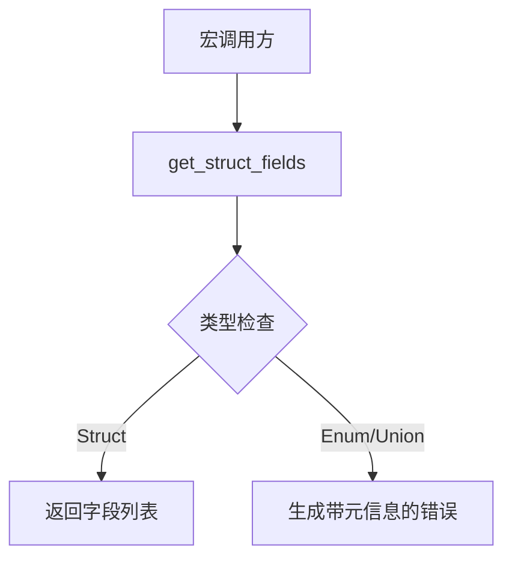

+++
title = "#17639 Better macro errors for get_struct_fields"
date = "2025-05-26T00:00:00"
draft = false
template = "pull_request_page.html"
in_search_index = false

[extra]
current_language = "zh-cn"
available_languages = {"en" = { name = "English", url = "/pull_request/bevy/2025-05/pr-17639-en-20250526" }, "zh-cn" = { name = "中文", url = "/pull_request/bevy/2025-05/pr-17639-zh-cn-20250526" }}
labels = ["C-Usability", "A-Utils", "D-Straightforward", "D-Macros"]
+++

# Better macro errors for get_struct_fields

## Basic Information
- **Title**: Better macro errors for get_struct_fields
- **PR Link**: https://github.com/bevyengine/bevy/pull/17639
- **Author**: ecoskey
- **Status**: MERGED
- **Labels**: C-Usability, S-Ready-For-Final-Review, A-Utils, D-Straightforward, D-Macros
- **Created**: 2025-02-02T01:45:52Z
- **Merged**: 2025-05-26T17:17:53Z
- **Merged By**: alice-i-cecile

## Description Translation
该PR的目标是改进`get_struct_fields`宏的错误处理：
- 当前当遇到enum或union类型时，错误提示的代码位置指向宏调用处而非具体类型定义
- 错误信息未明确指示具体是哪个宏报告的错误

解决方案：
- 修正错误提示的代码位置指向实际类型定义处
- 新增参数用于传递调用宏的名称

迁移指南：
```rs
// 修改前
let fields = get_struct_fields(&ast.data);

// 修改后
let fields = get_struct_fields(&ast.data, "derive(Bundle)");
```

## The Story of This Pull Request

### 问题背景与上下文
在Bevy引擎的宏系统中，当开发者错误地将`derive(Bundle)`等宏应用于枚举（enum）或联合体（union）时，原有的错误提示存在两个主要问题：

1. **错误定位不准确**：错误提示的代码位置（span）指向宏调用处（如`#[derive(Bundle)]`），而不是实际的问题类型定义位置
2. **信息不明确**：错误信息未指明具体是哪个宏报告的错误，增加调试难度

这对开发者体验造成显著影响，特别是在处理复杂类型时难以快速定位问题根源。

### 解决方案与技术实现
PR通过以下关键修改解决上述问题：

1. **错误定位优化**：
   - 从使用`Span::call_site()`改为获取具体类型token的span
   - 针对enum使用`enum_token.span()`
   - 针对union使用`union_token.span()`

2. **错误信息增强**：
   - 新增`meta`参数传递宏名称
   - 生成包含具体宏名称的错误信息模板

```rust
// 修改后的错误生成逻辑
Data::Enum(DataEnum { enum_token, .. }) => Err(Error::new(
    enum_token.span(),  // 正确的错误位置
    format!("#[{meta}] only supports structs, not enums")  // 明确标注宏名称
)),
```

### 代码变更分析
**关键文件修改**：

1. `crates/bevy_macro_utils/src/shape.rs` (+22/-17)
```rust
// 修改前
pub fn get_struct_fields(data: &Data) -> syn::Result<&Punctuated<Field, Comma>> {
    // ...
    _ => Err(Error::new(
        Span::call_site().into(),
        "Only structs are supported",
    )),
}

// 修改后
pub fn get_struct_fields<'a>(
    data: &'a Data,
    meta: &str,
) -> syn::Result<&'a Punctuated<Field, Comma>> {
    // ...
    Data::Enum(DataEnum { enum_token, .. }) => Err(Error::new(
        enum_token.span(),
        format!("#[{meta}] only supports structs, not enums"),
    )),
}
```

2. `crates/bevy_ecs/macros/src/lib.rs` (+3/-1)
```rust
// 调用方修改示例
let named_fields = match get_struct_fields(&ast.data, "derive(Bundle)") {
    Ok(fields) => fields,
    Err(e) => return e.into_compile_error().into(),
};
```

### 技术洞察与工程决策
1. **Span处理策略**：
   - 选择直接使用类型定义token的span而非宏调用位置
   - 权衡：更准确的错误定位 vs 维护span信息的额外成本

2. **API设计考量**：
   - 保持向后兼容性：通过新增参数而非修改现有参数顺序
   - 强制调用方显式传递宏名称，确保错误信息的准确性

3. **错误信息模板化**：
   - 使用format!动态生成包含具体宏名称的错误信息
   - 平衡编译时性能与开发体验

### 影响与改进
该修改带来的直接改善：
1. 错误定位准确率提升：开发者可直接跳转到问题类型定义
2. 调试效率提高：明确的宏名称信息减少上下文切换
3. 代码质量提升：统一错误处理模式，为后续宏开发建立最佳实践

迁移成本较低，仅需在调用处添加字符串参数，且不破坏现有接口。

## Visual Representation



## Key Files Changed

1. `crates/bevy_macro_utils/src/shape.rs`
```rust
// 核心修改：错误生成逻辑
-            Span::call_site().into(),
-            "Only structs are supported",
+            enum_token.span(),
+            format!("#[{meta}] only supports structs, not enums"),
```

2. `crates/bevy_ecs/macros/src/lib.rs`
```rust
// 调用方适配示例
-    let named_fields = match get_struct_fields(&ast.data) {
+    let named_fields = match get_struct_fields(&ast.data, "derive(Bundle)") {
```

## Further Reading
1. [Syn crate文档 - Span处理](https://docs.rs/syn/latest/syn/struct.Span.html)
2. [Rust过程宏错误处理最佳实践](https://blog.rust-lang.org/2024/02/15/proc-macro-error-handling.html)
3. [Bevy引擎宏系统设计指南](https://bevyengine.org/learn/macro-design/)