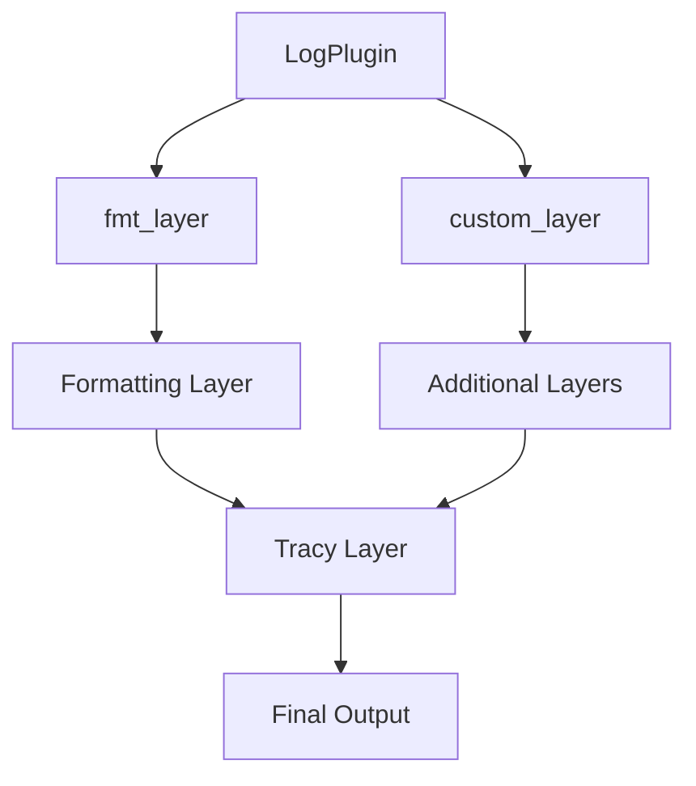

+++
title = "#17722 feat(log): support customizing default log formatting"
date = "2025-05-05T00:00:00"
draft = false
template = "pull_request_page.html"
in_search_index = true

[taxonomies]
list_display = ["show"]

[extra]
current_language = "en"
available_languages = {"en" = { name = "English", url = "/pull_request/bevy/2025-05/pr-17722-en-20250505" }, "zh-cn" = { name = "中文", url = "/pull_request/bevy/2025-05/pr-17722-zh-cn-20250505" }}
labels = ["C-Feature", "A-Diagnostics"]
+++

# feat(log): support customizing default log formatting

## Basic Information
- **Title**: feat(log): support customizing default log formatting
- **PR Link**: https://github.com/bevyengine/bevy/pull/17722
- **Author**: JeanMertz
- **Status**: MERGED
- **Labels**: C-Feature, S-Ready-For-Final-Review, A-Diagnostics
- **Created**: 2025-02-07T11:51:38Z
- **Merged**: 2025-05-05T23:22:36Z
- **Merged By**: alice-i-cecile

## Description Translation
The LogPlugin now allows overriding the default
`tracing_subscriber::fmt::Layer` through a new `fmt_layer` option. This enables customization of the default log output format without having to replace the entire logging system.

For example, to disable timestamps in the log output:

```rust
fn fmt_layer(_app: &mut App) -> Option<bevy::log::BoxedFmtLayer> {
    Some(Box::new(
        bevy::log::tracing_subscriber::fmt::Layer::default()
            .without_time()
            .with_writer(std::io::stderr),
    ))
}

fn main() {
    App::new()
        .add_plugins(DefaultPlugins.set(bevy::log::LogPlugin {
            fmt_layer,
            ..default()
        }))
        .run();
}
```

This is different from the existing `custom_layer` option, because that option _adds_ additional layers to the subscriber, but can't modify the default formatter layer (at least, not to my knowledge).

I almost always disable timestamps in my Bevy logs, and usually also tweak other default log formatting (such as `with_span_events`), which made it so that I always had to disable the default logger. This allows me to use everything the Bevy logger supports (including tracy support), while still formatting the default logs the way I like them.

## The Story of This Pull Request

### The Problem and Context
The Bevy engine's logging system used a fixed formatting layer through `tracing_subscriber::fmt::Layer`, with limited customization options. While the existing `custom_layer` parameter in `LogPlugin` allowed adding supplemental logging layers, it couldn't modify the core formatting layer responsible for output structure like timestamps and event formatting. This forced developers to either accept default formatting or completely replace the logging infrastructure, losing integrated features like Tracy profiling support.

### The Solution Approach
The PR introduces a new `fmt_layer` option in `LogPlugin` that allows overriding the default formatting layer while preserving other logging infrastructure components. This approach:
1. Maintains backward compatibility through optional parameter
2. Uses Rust's trait system to ensure type safety
3. Preserves existing Tracy integration and filtering capabilities
4. Provides a clear separation between formatting customization (`fmt_layer`) and additional layers (`custom_layer`)

### The Implementation
The core changes center around extending `LogPlugin` with new configuration options and type definitions:

```rust
// Added to LogPlugin struct
pub fmt_layer: fn(app: &mut App) -> Option<BoxedFmtLayer>,

// New type definition
pub type BoxedFmtLayer = Box<dyn Layer<PreFmtSubscriber> + Send + Sync + 'static>;
```

The plugin initialization was modified to use the custom formatter when provided:

```rust
let fmt_layer = (self.fmt_layer)(app).unwrap_or_else(|| {
    Box::new(tracing_subscriber::fmt::Layer::default().with_writer(std::io::stderr))
});
```

This implementation allows developers to override the default formatter while maintaining the existing layer stacking order and Tracy integration.

### Technical Insights
Key technical aspects include:
1. **Layer Typing**: The `BoxedFmtLayer` uses `PreFmtSubscriber` to ensure proper layer composition
2. **Default Preservation**: The `unwrap_or_else` pattern maintains default behavior when no custom formatter is provided
3. **Tracy Integration**: The tracy layer remains separate from formatting concerns, ensuring profiling data isn't affected by formatting changes

### The Impact
This change:
- Enables fine-grained control over log formatting without losing Bevy's logging features
- Reduces boilerplate for common formatting customizations
- Maintains performance characteristics of the logging system
- Provides a clear pattern for extending other plugin configurations

## Visual Representation



## Key Files Changed

### `crates/bevy_log/src/lib.rs` (+37/-5)
1. Added `fmt_layer` field to `LogPlugin` struct
2. Defined new `BoxedFmtLayer` type and subscriber types
3. Modified layer initialization to use custom formatter

Key code snippet:
```rust
pub struct LogPlugin {
    // ...
    pub fmt_layer: fn(app: &mut App) -> Option<BoxedFmtLayer>,
}

type BoxedFmtLayer = Box<dyn Layer<PreFmtSubscriber> + Send + Sync + 'static;

let fmt_layer = (self.fmt_layer)(app).unwrap_or_else(|| {
    Box::new(tracing_subscriber::fmt::Layer::default().with_writer(std::io::stderr))
});
```

### `examples/app/log_layers.rs` (+15/-1)
1. Added demonstration of timestamp removal
2. Showcased `fmt_layer` usage pattern

Before:
```rust
fn custom_layer(_app: &mut App) -> Option<BoxedLayer> {
    // Only additional layers could be added
}
```

After:
```rust
fn fmt_layer(_app: &mut App) -> Option<BoxedFmtLayer> {
    Some(Box::new(
        bevy::log::tracing_subscriber::fmt::Layer::default()
            .without_time()
    ))
}
```

### `examples/app/log_layers_ecs.rs` (+1/-0)
1. Added default fallback to maintain example functionality

```rust
LogPlugin {
    // ...
    ..default()
}
```

## Further Reading
- Tracing Subscriber documentation: https://docs.rs/tracing-subscriber/latest/tracing_subscriber/
- Bevy Logging Guide: https://bevyengine.org/learn/book/getting-started/logging/
- Rust Trait Objects: https://doc.rust-lang.org/book/ch17-02-trait-objects.html