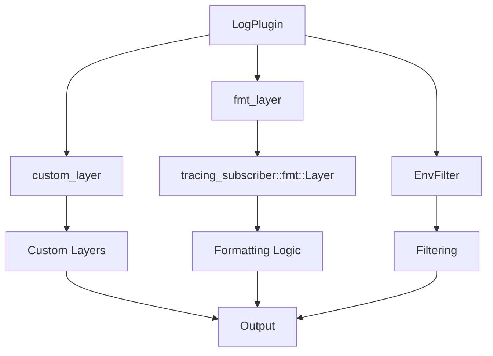

+++
title = "#17722 feat(log): support customizing default log formatting"
date = "2025-05-05T00:00:00"
draft = false
template = "pull_request_page.html"
in_search_index = false

[extra]
current_language = "zh-cn"
available_languages = {"en" = { name = "English", url = "/pull_request/bevy/2025-05/pr-17722-en-20250505" }, "zh-cn" = { name = "中文", url = "/pull_request/bevy/2025-05/pr-17722-zh-cn-20250505" }}
labels = ["C-Feature", "A-Diagnostics"]
+++

# feat(log): support customizing default log formatting

## Basic Information
- **Title**: feat(log): support customizing default log formatting  
- **PR Link**: https://github.com/bevyengine/bevy/pull/17722  
- **Author**: JeanMertz  
- **Status**: MERGED  
- **Labels**: C-Feature, S-Ready-For-Final-Review, A-Diagnostics  
- **Created**: 2025-02-07T11:51:38Z  
- **Merged**: 2025-05-05T23:22:36Z  
- **Merged By**: alice-i-cecile  

## Description Translation
LogPlugin 新增 `fmt_layer` 选项，允许覆盖默认的 `tracing_subscriber::fmt::Layer`。这使得开发者可以自定义默认日志输出格式，而无需替换整个日志系统。

例如，禁用日志中的时间戳：

```rust
fn fmt_layer(_app: &mut App) -> Option<bevy::log::BoxedFmtLayer> {
    Some(Box::new(
        bevy::log::tracing_subscriber::fmt::Layer::default()
            .without_time()
            .with_writer(std::io::stderr),
    ))
}

fn main() {
    App::new()
        .add_plugins(DefaultPlugins.set(bevy::log::LogPlugin {
            fmt_layer,
            ..default()
        }))
        .run();
}
```

与现有 `custom_layer` 的区别在于：`custom_layer` 用于添加额外日志层，而 `fmt_layer` 可以直接修改默认的格式化层。作者本人经常需要禁用时间戳和调整日志格式，之前必须完全禁用默认 logger，现在可以保留 Bevy logger 的全部功能（包括 Tracy 支持）的同时自定义格式。

## The Story of This Pull Request

### 问题背景与需求
Bevy 原有的日志系统通过 `LogPlugin::custom_layer` 允许添加自定义的 tracing layer，但在实际使用中存在局限性。当开发者需要修改默认的日志格式化行为（如移除时间戳、调整事件格式）时，必须完全替换默认的日志层，这会丢失 Bevy 内置的 Tracy 集成等重要功能。

核心矛盾点在于：
1. `tracing_subscriber::fmt::Layer` 是默认日志输出的核心组件
2. 现有架构中该 layer 是硬编码实现的
3. 开发者无法在不重写整个日志系统的情况下修改默认格式

### 技术方案选择
PR 作者选择扩展 `LogPlugin` 的配置选项，新增 `fmt_layer` 字段来允许覆盖默认的格式化层。这个方案的优势在于：

1. **保持向后兼容**：原有 `custom_layer` 继续用于添加额外层
2. **精准控制**：可以修改默认 formatter 而不影响其他日志功能
3. **最小改动**：通过类型系统保证 layer 的兼容性

关键决策点：
- 使用 `BoxedFmtLayer` 类型别名来简化类型声明
- 通过闭包函数延迟初始化 layer（允许访问 App 上下文）
- 保持默认的 ANSI 颜色和 stderr 输出行为

### 实现细节分析
在 `crates/bevy_log/src/lib.rs` 中主要修改了三个部分：

1. **类型系统重构**：
```rust
#[cfg(feature = "trace")]
type BaseSubscriber = Layered<EnvFilter, Layered<Option<BoxedLayer>, Registry>>;

#[cfg(feature = "trace")]
type PreFmtSubscriber = Layered<tracing_error::ErrorLayer<BaseSubscriber>, BaseSubscriber>;
```
通过类型别名明确层级结构，确保自定义的 fmt_layer 能正确插入到日志处理管道中。

2. **插件配置扩展**：
```rust
pub struct LogPlugin {
    pub fmt_layer: fn(app: &mut App) -> Option<BoxedFmtLayer>,
    // ...其他字段
}
```
新增的闭包函数参数允许开发者基于 App 上下文动态构建 layer。

3. **初始化逻辑调整**：
```rust
let fmt_layer = (self.fmt_layer)(app).unwrap_or_else(|| {
    Box::new(tracing_subscriber::fmt::Layer::default().with_writer(std::io::stderr)
});
```
优先使用自定义 layer，保留默认实现作为 fallback。

### 技术洞察
1. **Layer 组合模式**：  
   tracing-subscriber 使用分层结构处理日志事件，本 PR 通过精确控制 layer 的插入位置，确保自定义格式化层不会影响错误处理、过滤等其他功能。

2. **特征对象与类型擦除**：  
   使用 `Box<dyn Layer<PreFmtSubscriber>>` 实现运行时的多态，平衡类型安全与灵活性。

3. **条件编译处理**：  
   通过 `#[cfg(feature = "trace")]` 条件编译，确保 Tracy 支持等特性与自定义格式化层兼容。

### 影响与启示
1. **用户侧收益**：
   - 无需重写日志系统即可调整默认格式
   - 保留所有 Bevy 内置日志功能（如 Tracy 集成）
   - 典型用例：移除时间戳、修改日志样式、更换输出目标

2. **架构改进**：
   - 增强 LogPlugin 的扩展性
   - 明确区分附加层（custom_layer）与核心格式化层（fmt_layer）
   - 为未来更多日志定制需求奠定基础

3. **最佳实践示例**：
   更新后的 `examples/app/log_layers.rs` 展示了如何：
   - 同时使用 custom_layer 添加额外日志处理
   - 使用 fmt_layer 修改核心格式
   - 保持与 ECS 系统的集成

## Visual Representation



## Key Files Changed

### `crates/bevy_log/src/lib.rs` (+37/-5)
1. **新增类型定义**：
```rust
pub type BoxedFmtLayer = Box<dyn Layer<PreFmtSubscriber> + Send + Sync + 'static;
```
明确格式化层的类型约束，确保与 tracing 生态兼容。

2. **插件结构扩展**：
```rust
pub struct LogPlugin {
    pub fmt_layer: fn(app: &mut App) -> Option<BoxedFmtLayer>,
    // ...
}
```
允许用户传入自定义的格式化层构造函数。

### `examples/app/log_layers.rs` (+15/-1)
**示例增强**：
```rust
fn fmt_layer(_app: &mut App) -> Option<BoxedFmtLayer> {
    Some(Box::new(
        bevy::log::tracing_subscriber::fmt::Layer::default()
            .without_time()  // 禁用时间戳
            .with_writer(std::io::stderr),
    ))
}
```
展示如何使用 `without_time()` 等标准方法定制格式。

## Further Reading
1. [tracing-subscriber 官方文档](https://docs.rs/tracing-subscriber/latest/tracing_subscriber/)
2. [Bevy 日志系统设计理念](https://bevyengine.org/learn/book/getting-started/logging/)
3. [Rust 日志最佳实践](https://www.lpalmieri.com/posts/2020-09-27-zero-to-production-4-are-we-observable-yet/)