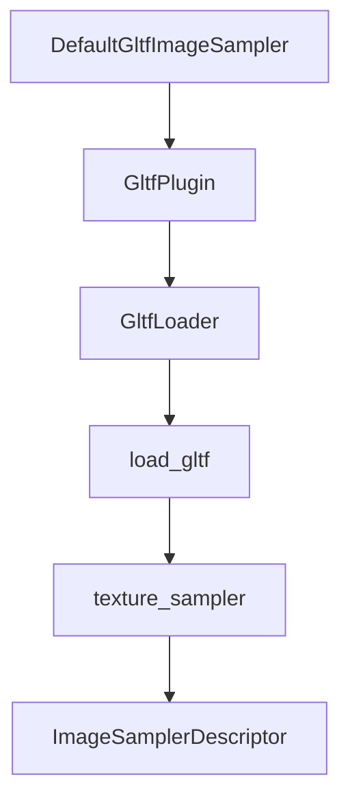

+++
title = "#17875 Add image sampler configuration in GLTF loader"
date = "2025-05-06T00:00:00"
draft = false
template = "pull_request_page.html"
in_search_index = true

[taxonomies]
list_display = ["show"]

[extra]
current_language = "en"
available_languages = {"en" = { name = "English", url = "/pull_request/bevy/2025-05/pr-17875-en-20250506" }, "zh-cn" = { name = "中文", url = "/pull_request/bevy/2025-05/pr-17875-zh-cn-20250506" }}
labels = ["C-Feature", "A-Assets", "D-Modest", "A-glTF"]
+++

# Title: Add image sampler configuration in GLTF loader

## Basic Information
- **Title**: Add image sampler configuration in GLTF loader
- **PR Link**: https://github.com/bevyengine/bevy/pull/17875
- **Author**: axlitEels
- **Status**: MERGED
- **Labels**: C-Feature, A-Assets, S-Ready-For-Final-Review, X-Uncontroversial, D-Modest, A-glTF
- **Created**: 2025-02-15T22:47:07Z
- **Merged**: 2025-05-06T06:08:50Z
- **Merged By**: alice-i-cecile

## Description Translation
I can't underrate anisotropic filtering.

# Objective

- Allow easily enabling anisotropic filtering on glTF assets.
- Allow selecting `ImageFilterMode` for glTF assets at runtime.

## Solution

- Added a Resource `DefaultGltfImageSampler`: it stores `Arc<Mutex<ImageSamplerDescriptor>>` and the same `Arc` is stored in `GltfLoader`. The default is independent from provided to `ImagePlugin` and is set in the same way but with `GltfPlugin`. It can then be modified at runtime with `DefaultGltfImageSampler::set`.
- Added two fields to `GltfLoaderSettings`: `default_sampler: Option<ImageSamplerDescriptor>` to override aforementioned global default descriptor and `override_sampler: bool` to ignore glTF sampler data.

## Showcase

Enabling anisotropic filtering as easy as:
```rust
app.add_plugins(DefaultPlugins.set(GltfPlugin{
    default_sampler: ImageSamplerDescriptor {
        min_filter: ImageFilterMode::Linear,
        mag_filter: ImageFilterMode::Linear,
        mipmap_filter: ImageFilterMode::Linear,
        anisotropy_clamp: 16,
        ..default()
    },
    ..default()
}))
```

Use code below to ignore both the global default sampler and glTF data, having `your_shiny_sampler` used directly for all textures instead:
```rust
commands.spawn(SceneRoot(asset_server.load_with_settings(
    GltfAssetLabel::Scene(0).from_asset("models/test-scene.gltf"),
    |settings: &mut GltfLoaderSettings| {
        settings.default_sampler = Some(your_shiny_sampler);
        settings.override_sampler = true;
    }
)));
```
Remove either setting to get different result! They don't come in pair!

Scene rendered with trillinear texture filtering:

Scene rendered with 16x anisotropic texture filtering:


## Migration Guide

- The new fields in `GltfLoaderSettings` have their default values replicate previous behavior.

## The Story of This Pull Request

The GLTF loader in Bevy needed enhanced control over texture sampling configuration. While existing functionality parsed sampler data from GLTF files, there was no straightforward way to:

1. Apply global default sampler settings
2. Override sampler parameters at runtime
3. Enable anisotropic filtering through standard workflows

The implementation addresses these needs through three key architectural changes:

1. **Global Default Management**  
Introduced `DefaultGltfImageSampler` resource storing an `Arc<Mutex<ImageSamplerDescriptor>>`. This allows:
```rust
// Global configuration
app.insert_resource(DefaultGltfImageSampler::new(custom_sampler))

// Runtime modification
default_sampler.set(&new_descriptor);
```
The mutex ensures thread-safe updates while maintaining Bevy's ECS constraints.

2. **Loader Configuration Hierarchy**  
`GltfLoaderSettings` gained two new parameters:
```rust
pub struct GltfLoaderSettings {
    pub default_sampler: Option<ImageSamplerDescriptor>, // Override global default
    pub override_sampler: bool, // Ignore GLTF sampler data
}
```
This creates a priority chain:
1. If `override_sampler = true`, use `default_sampler` directly
2. Else combine GLTF data with either `default_sampler` or global default

3. **Sampler Merging Logic**  
The `texture_sampler` function was reworked to layer GLTF sampler data on top of defaults:
```rust
// Before: Hardcoded defaults
ImageSamplerDescriptor::default()

// After: Layered approach
let mut sampler = default_sampler.clone();
if needs_gltf_data {
    apply_gltf_sampler(&gltf_sampler, &mut sampler);
}
```
Special handling maintains WebGPU compatibility when using anisotropic filtering by enforcing trilinear filtering requirements.

The implementation maintains backward compatibility through careful default initialization in `GltfPlugin`:
```rust
impl Default for GltfPlugin {
    fn default() -> Self {
        GltfPlugin {
            default_sampler: ImageSamplerDescriptor::linear(),
            // ... other defaults unchanged
        }
    }
}
```

## Visual Representation



## Key Files Changed

1. `crates/bevy_gltf/src/lib.rs` (+58/-3)
- Added `DefaultGltfImageSampler` resource with thread-safe operations
- Modified `GltfPlugin` to store default sampler configuration
```rust
#[derive(Resource)]
pub struct DefaultGltfImageSampler(Arc<Mutex<ImageSamplerDescriptor>>);

impl GltfPlugin {
    pub default_sampler: ImageSamplerDescriptor,
    // ...
}
```

2. `crates/bevy_gltf/src/loader/gltf_ext/texture.rs` (+38/-38)
- Rewrote sampler creation logic to layer GLTF data on defaults
```rust
pub(crate) fn texture_sampler(
    texture: &Texture<'_>,
    default_sampler: &ImageSamplerDescriptor,
) -> ImageSamplerDescriptor {
    let mut sampler = default_sampler.clone();
    // Apply GLTF-specific modifications
    // ...
}
```

3. `crates/bevy_gltf/src/loader/mod.rs` (+29/-6)
- Integrated new sampler configuration into loading pipeline
```rust
pub struct GltfLoader {
    pub default_sampler: Arc<Mutex<ImageSamplerDescriptor>>,
    // ...
}

async fn load_image(
    // ...
    default_sampler: &ImageSamplerDescriptor,
    settings: &GltfLoaderSettings,
) {
    // Select sampler based on override flags
}
```

## Further Reading

- WebGPU Sampler Documentation: https://gpuweb.github.io/gpuweb/#sampler
- GLTF Sampler Specification: https://registry.khronos.org/glTF/specs/2.0/glTF-2.0.html#samplers
- Bevy Asset System Guide: https://bevyengine.org/learn/book/assets/