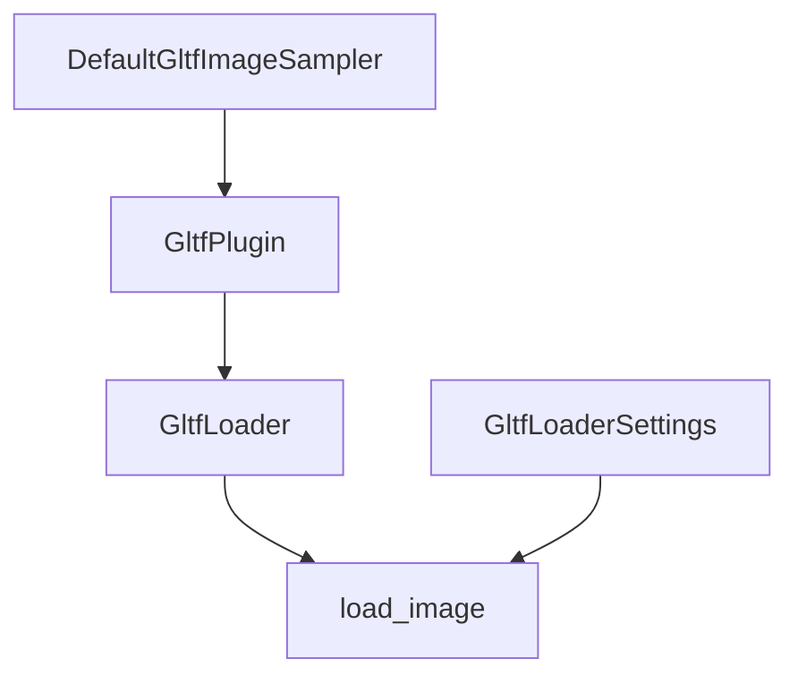

+++
title = "#17875 Add image sampler configuration in GLTF loader"
date = "2025-05-06T00:00:00"
draft = false
template = "pull_request_page.html"
in_search_index = false

[extra]
current_language = "zh-cn"
available_languages = {"en" = { name = "English", url = "/pull_request/bevy/2025-05/pr-17875-en-20250506" }, "zh-cn" = { name = "中文", url = "/pull_request/bevy/2025-05/pr-17875-zh-cn-20250506" }}
labels = ["C-Feature", "A-Assets", "D-Modest", "A-glTF"]
+++

# Add image sampler configuration in GLTF loader

## Basic Information
- **Title**: Add image sampler configuration in GLTF loader
- **PR Link**: https://github.com/bevyengine/bevy/pull/17875
- **Author**: axlitEels
- **Status**: MERGED
- **Labels**: C-Feature, A-Assets, S-Ready-For-Review, X-Uncontroversial, D-Modest, A-glTF
- **Created**: 2025-02-15T22:47:07Z
- **Merged**: 2025-05-06T06:08:50Z
- **Merged By**: alice-i-cecile

## Description Translation
这个PR的目标是为glTF资源提供运行时图像采样器配置能力，主要解决两个问题：
1. 允许轻松启用各向异性过滤（anisotropic filtering）
2. 支持在运行时选择glTF资源的`ImageFilterMode`

解决方案包含：
- 新增`DefaultGltfImageSampler`资源，存储`Arc<Mutex<ImageSamplerDescriptor>>`
- 在`GltfLoaderSettings`中添加两个新字段：
  - `default_sampler`: 可覆盖全局默认采样器
  - `override_sampler`: 忽略glTF自带的采样器数据

使用示例：
```rust
// 启用16x各向异性过滤
app.add_plugins(DefaultPlugins.set(GltfPlugin{
    default_sampler: ImageSamplerDescriptor {
        anisotropy_clamp: 16,
        ..default()
    },
    ..default()
}));

// 完全自定义采样器
commands.spawn(SceneRoot(asset_server.load_with_settings(
    GltfAssetLabel::Scene(0).from_asset("models/test-scene.gltf"),
    |settings: &mut GltfLoaderSettings| {
        settings.default_sampler = Some(your_shiny_sampler);
        settings.override_sampler = true;
    }
));
```

效果对比：
- 三线性过滤：
- 16x各向异性过滤：

## The Story of This Pull Request

### 问题背景与挑战
在3D渲染中，纹理采样质量直接影响最终视觉效果。glTF标准允许在资源中定义纹理采样参数，但存在两个主要限制：
1. 无法在运行时动态调整采样参数（如启用各向异性过滤）
2. 现有实现无法覆盖glTF内建的采样器配置

开发者需要一种统一的方式来：
- 全局配置默认采样器
- 按需覆盖特定资源的采样设置
- 保持与现有工作流的兼容性

### 解决方案设计
核心思路是建立分层的采样器配置系统：
1. **全局默认层**：通过`DefaultGltfImageSampler`资源存储基础配置
2. **加载器默认层**：`GltfLoaderSettings`允许每个加载任务指定默认值
3. **资源特定层**：保留glTF原生采样器数据（可选）

技术实现要点：
- 使用`Arc<Mutex<ImageSamplerDescriptor>>`实现线程安全的动态配置
- 新增`override_sampler`标志实现glTF数据忽略
- 保持向后兼容的默认值设置

### 关键技术实现
在`texture_sampler`函数中实现了配置合并逻辑：
```rust
pub(crate) fn texture_sampler(
    texture: &Texture<'_>,
    default_sampler: &ImageSamplerDescriptor,
) -> ImageSamplerDescriptor {
    let mut sampler = default_sampler.clone();
    // 合并glTF采样参数...
    sampler
}
```
当检测到各向异性过滤启用时（`anisotropy_clamp != 1`），自动适配过滤模式以满足wgpu的硬件要求。

### 架构影响
新增组件关系：


### 工程实践价值
1. **运行时灵活性**：允许动态调整采样参数无需重新加载资源
2. **性能优化**：各向异性过滤可显著提升倾斜表面的纹理质量
3. **兼容性保障**：默认行为与修改前完全一致，平稳升级

## Key Files Changed

### crates/bevy_gltf/src/lib.rs (+58/-3)
- 新增`DefaultGltfImageSampler`资源类型
- 扩展`GltfPlugin`结构体，增加默认采样器配置
```rust
#[derive(Resource)]
pub struct DefaultGltfImageSampler(Arc<Mutex<ImageSamplerDescriptor>>);

impl GltfPlugin {
    pub fn new(default_sampler: ImageSamplerDescriptor) -> Self {
        // 初始化逻辑
    }
}
```

### crates/bevy_gltf/src/loader/gltf_ext/texture.rs (+38/-38)
- 重构纹理采样器创建逻辑，支持配置合并
```rust
// 修改后的采样器生成逻辑
if sampler.anisotropy_clamp != 1 {
    // 特殊处理各向异性过滤情况
}
```

### crates/bevy_gltf/src/loader/mod.rs (+29/-6)
- 在加载设置中添加新的配置选项
```rust
pub struct GltfLoaderSettings {
    pub default_sampler: Option<ImageSamplerDescriptor>,
    pub override_sampler: bool,
}
```

## Further Reading
- [WebGPU Texture Sampling规范](https://www.w3.org/TR/webgpu/#sampling)
- [glTF 2.0 Sampler定义](https://registry.khronos.org/glTF/specs/2.0/glTF-2.0.html#samplers)
- [Bevy ECS资源系统文档](https://docs.rs/bevy_ecs/latest/bevy_ecs/system/resource/struct.Resource.html)