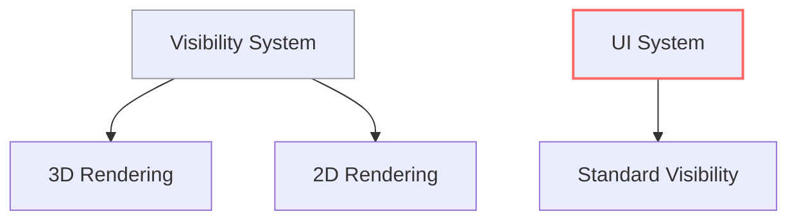

+++
title = "#17918 Unrequire `VisibilityClass` from `Node`"
date = "2025-05-31T00:00:00"
draft = false
template = "pull_request_page.html"
in_search_index = true

[taxonomies]
list_display = ["show"]

[extra]
current_language = "en"
available_languages = {"en" = { name = "English", url = "/pull_request/bevy/2025-05/pr-17918-en-20250531" }, "zh-cn" = { name = "中文", url = "/pull_request/bevy/2025-05/pr-17918-zh-cn-20250531" }}
labels = ["C-Bug", "D-Trivial", "A-UI"]
+++

## Unrequire `VisibilityClass` from `Node`

### Basic Information
- **Title**: Unrequire `VisibilityClass` from `Node`
- **PR Link**: https://github.com/bevyengine/bevy/pull/17918
- **Author**: ickshonpe
- **Status**: MERGED
- **Labels**: C-Bug, D-Trivial, A-UI, S-Ready-For-Final-Review
- **Created**: 2025-02-17T23:16:39Z
- **Merged**: 2025-05-31T08:37:56Z
- **Merged By**: mockersf

### Description Translation
The UI doesn't use `ViewVisibility` so it doesn't do anything.

## Solution

Remove it.

## The Story of This Pull Request

This PR addresses a minor inconsistency in Bevy's UI system where UI nodes were being assigned a `VisibilityClass` component that served no practical purpose. The issue originated from how visibility systems interact with different rendering subsystems in Bevy.

In Bevy's rendering architecture, visibility systems use `VisibilityClass` to categorize entities into buckets for efficient processing. As documented in `bevy_render`:

```rust
// crates/bevy_render/src/view/visibility/mod.rs
/// A bucket into which we group entities for the purposes of visibility.
///
/// Bevy's various rendering subsystems (3D, 2D, etc.) want to be able to
/// quickly winnow the set of entities to only those that the subsystem is
/// tasked with rendering...
```

However, UI rendering operates differently than 3D/2D rendering. The UI system doesn't utilize the `ViewVisibility` system that processes `VisibilityClass`, meaning this component was being unnecessarily added to every UI node. This resulted in:
1. Wasted memory allocation for each UI node
2. Unnecessary component processing during entity updates
3. Potential confusion for developers inspecting UI entities

The solution was straightforward: remove `VisibilityClass` from the UI node bundle. This involved two changes:

1. Removing the component from the `Node` bundle definition
2. Updating documentation to clarify that UI doesn't use the visibility bucket system

This change maintains consistency with how the UI system actually processes visibility. UI elements rely on the standard `Visibility` component for their display state, not the render pipeline-specific `VisibilityClass`. The removal simplifies the UI node structure without affecting functionality.

## Visual Representation



## Key Files Changed

### crates/bevy_ui/src/ui_node.rs
Removed the unused `VisibilityClass` from the UI node bundle.

```rust
// Before:
use bevy_render::{
    view::Visibility,
    view::VisibilityClass,
};

#[bundle]
pub struct NodeBundle {
    // ...
    pub visibility: Visibility,
    pub visibility_class: VisibilityClass,
    // ...
}
```

```rust
// After:
use bevy_render::view::Visibility;

#[bundle]
pub struct NodeBundle {
    // ...
    pub visibility: Visibility,
    // ...
}
```

### crates/bevy_render/src/view/visibility/mod.rs
Updated documentation to reflect that UI doesn't use the visibility bucket system.

```rust
// Before:
/// Bevy's various rendering subsystems (3D, 2D, UI, etc.) want to be able to
```

```rust
// After:
/// Bevy's various rendering subsystems (3D, 2D, etc.) want to be able to
```

## Further Reading
1. [Bevy UI System Documentation](https://docs.rs/bevy_ui/latest/bevy_ui/)
2. [Bevy Visibility Systems](https://github.com/bevyengine/bevy/blob/main/crates/bevy_render/src/view/visibility/mod.rs)
3. [Component Optimization Strategies](https://bevy-cheatbook.github.io/optimization/component-optimization.html)

## Full Code Diff
```diff
diff --git a/crates/bevy_render/src/view/visibility/mod.rs b/crates/bevy_render/src/view/visibility/mod.rs
index 3a0772b687530..43533b53540b7 100644
--- a/crates/bevy_render/src/view/visibility/mod.rs
+++ b/crates/bevy_render/src/view/visibility/mod.rs
@@ -129,7 +129,7 @@ impl InheritedVisibility {
 
 /// A bucket into which we group entities for the purposes of visibility.
 ///
-/// Bevy's various rendering subsystems (3D, 2D, UI, etc.) want to be able to
+/// Bevy's various rendering subsystems (3D, 2D, etc.) want to be able to
 /// quickly winnow the set of entities to only those that the subsystem is
 /// tasked with rendering, to avoid spending time examining irrelevant entities.
 /// At the same time, Bevy wants the [`check_visibility`] system to determine
diff --git a/crates/bevy_ui/src/ui_node.rs b/crates/bevy_ui/src/ui_node.rs
index 4592b091d9ce6..f5f914bdc01f6 100644
--- a/crates/bevy_ui/src/ui_node.rs
+++ b/crates/bevy_ui/src/ui_node.rs
@@ -7,7 +7,6 @@ use bevy_reflect::prelude::*;
 use bevy_render::{
     camera::{Camera, RenderTarget},
     view::Visibility,
-    view::VisibilityClass,
 };
 use bevy_sprite::BorderRect;
 use bevy_transform::components::Transform;
@@ -331,7 +330,6 @@ impl From<Vec2> for ScrollPosition {
     ScrollPosition,
     Transform,
     Visibility,
-    VisibilityClass,
     ZIndex
 )]
 #[reflect(Component, Default, PartialEq, Debug, Clone)]
```