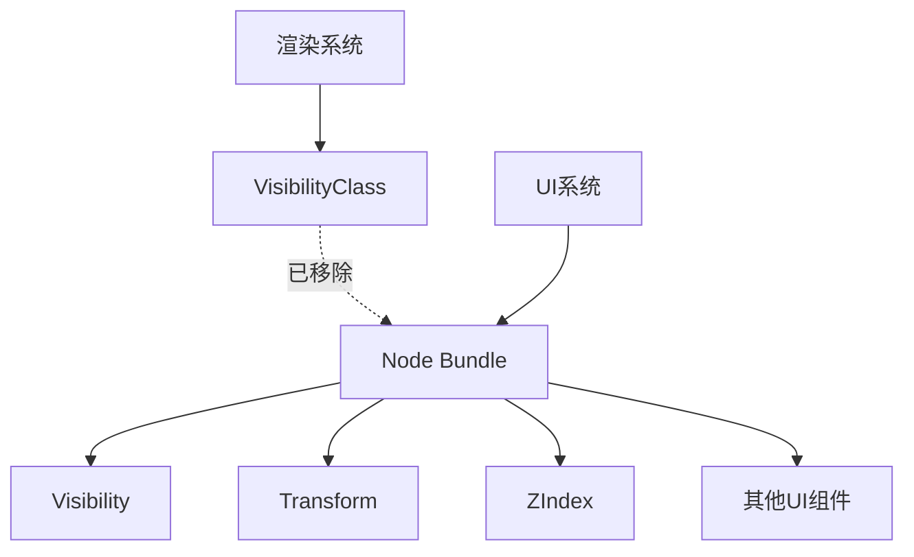

+++
title = "#17918 Unrequire `VisibilityClass` from `Node"
date = "2025-05-31T00:00:00"
draft = false
template = "pull_request_page.html"
in_search_index = false

[extra]
current_language = "zh-cn"
available_languages = {"en" = { name = "English", url = "/pull_request/bevy/2025-05/pr-17918-en-20250531" }, "zh-cn" = { name = "中文", url = "/pull_request/bevy/2025-05/pr-17918-zh-cn-20250531" }}
+++

# 分析报告：PR #17918 - Unrequire `VisibilityClass` from `Node`

## 基础信息
- **标题**: Unrequire `VisibilityClass` from `Node`
- **PR链接**: https://github.com/bevyengine/bevy/pull/17918
- **作者**: ickshonpe
- **状态**: 已合并
- **标签**: C-Bug, D-Trivial, A-UI, S-Ready-For-Final-Review
- **创建时间**: 2025-02-17T23:16:39Z
- **合并时间**: 2025-05-31T08:37:56Z
- **合并人**: mockersf

## 描述翻译
### Objective
UI 系统不使用 `ViewVisibility`，因此当前实现没有实际作用。

### Solution
移除相关代码。

## 修改背景与实现

### 问题背景
在 Bevy 引擎的 UI 系统中，`Node` 组件包(bundle)包含了一个未使用的 `VisibilityClass` 组件。该组件属于渲染系统的可见性计算体系，但 UI 系统并未实际利用其功能。这导致：
1. 冗余的组件存储开销
2. 潜在的维护混淆
3. 与 `bevy_render` 模块的文档描述不一致

### 解决方案
直接移除 UI 系统中所有对 `VisibilityClass` 的引用：
1. 从 `Node` 组件包中移除 `VisibilityClass` 组件
2. 更新渲染系统文档以反映 UI 不再使用可见性分类的事实

### 具体实现分析
修改集中在两个关键文件：

**1. `crates/bevy_render/src/view/visibility/mod.rs`**
```diff
--- a/crates/bevy_render/src/view/visibility/mod.rs
+++ b/crates/bevy_render/src/view/visibility/mod.rs
@@ -129,7 +129,7 @@ impl InheritedVisibility {
 
 /// A bucket into which we group entities for the purposes of visibility.
 ///
-/// Bevy's various rendering subsystems (3D, 2D, UI, etc.) want to be able to
+/// Bevy's various rendering subsystems (3D, 2D, etc.) want to be able to
 /// quickly winnow the set of entities to only those that the subsystem is
 /// tasked with rendering, to avoid spending time examining irrelevant entities.
 /// At the same time, Bevy wants the [`check_visibility`] system to determine
```
修改说明：
- 文档注释中移除了对 "UI" 的引用
- 反映 UI 系统不再参与可见性分类的事实
- 保持文档与实际架构的一致性

**2. `crates/bevy_ui/src/ui_node.rs`**
```diff
--- a/crates/bevy_ui/src/ui_node.rs
+++ b/crates/bevy_ui/src/ui_node.rs
@@ -7,7 +7,6 @@ use bevy_reflect::prelude::*;
 use bevy_render::{
     camera::{Camera, RenderTarget},
     view::Visibility,
-    view::VisibilityClass,
 };
 use bevy_sprite::BorderRect;
 use bevy_transform::components::Transform;
@@ -331,7 +330,6 @@ impl From<Vec2> for ScrollPosition {
     ScrollPosition,
     Transform,
     Visibility,
-    VisibilityClass,
     ZIndex
 )]
 #[reflect(Component, Default, PartialEq, Debug, Clone)]
```
修改说明：
1. **移除未使用的导入**
   - 删除 `VisibilityClass` 的引用，避免不必要的依赖
   
2. **精简组件包结构**
   - 从 `Node` 的 `bundle_derive` 宏中移除 `VisibilityClass`
   - 减少每个 UI 节点约 1 字节的内存占用（基于 `VisibilityClass` 的默认大小）
   - 消除冗余的系统处理开销

### 技术影响
1. **内存优化**：每个 UI 节点减少一个组件存储
2. **系统简化**：避免对无作用组件的处理逻辑
3. **架构清晰化**：消除文档与实际实现的不一致
4. **维护性提升**：减少未来开发者对无作用代码的困惑

## 组件关系图



## 关键文件变更

### 1. `crates/bevy_ui/src/ui_node.rs`
**变更原因**：移除 UI 系统中未使用的 `VisibilityClass` 组件

**关键修改**：
```rust
// 修改前：
use bevy_render::{
    camera::{Camera, RenderTarget},
    view::Visibility,
    view::VisibilityClass,  // 冗余导入
};

#[bundle_derive(Bundle)]
struct Node {
    // ...
    Visibility,
    VisibilityClass,  // 无效组件
    ZIndex
}

// 修改后：
use bevy_render::{
    camera::{Camera, RenderTarget},
    view::Visibility,  // 仅保留必要导入
};

#[bundle_derive(Bundle)]
struct Node {
    // ...
    Visibility,  // 实际使用的可见性组件
    ZIndex
}
```

### 2. `crates/bevy_render/src/view/visibility/mod.rs`
**变更原因**：更新文档以反映 UI 不再使用可见性分类

**关键修改**：
```rust
// 修改前：
/// Bevy's various rendering subsystems (3D, 2D, UI, etc.) want to be able to

// 修改后：
/// Bevy's various rendering subsystems (3D, 2D, etc.) want to be able to
```

## 技术总结
此 PR 解决了 UI 系统中存在的组件冗余问题：
1. 通过删除未使用的 `VisibilityClass` 组件简化了 UI 节点结构
2. 减少了每个 UI 节点的内存占用
3. 保持了代码与实际功能的一致性
4. 更新了相关文档以反映架构变更

此类清理工作有助于：
- 降低新贡献者的理解门槛
- 提升系统运行效率
- 保持代码库的整洁度
- 避免未来可能出现的维护问题

## 延伸阅读
1. [Bevy UI 系统架构](https://bevyengine.org/learn/book/getting-started/ui/)
2. [ECS 组件优化原则](https://github.com/bevyengine/bevy/blob/main/docs/plugins_guidelines.md#component-design)
3. [可见性系统文档](https://docs.rs/bevy_render/latest/bevy_render/view/visibility/index.html)