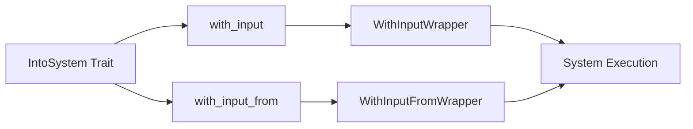

+++
title = "#18067 Add `IntoSystem::with_input` and `::with_input_from` system wrappers"
date = "2025-05-06T00:00:00"
draft = false
template = "pull_request_page.html"
in_search_index = true

[taxonomies]
list_display = ["show"]

[extra]
current_language = "en"
available_languages = {"en" = { name = "English", url = "/pull_request/bevy/2025-05/pr-18067-en-20250506" }, "zh-cn" = { name = "中文", url = "/pull_request/bevy/2025-05/pr-18067-zh-cn-20250506" }}
labels = ["C-Feature", "A-ECS", "D-Modest"]
+++

# Title

## Basic Information
- **Title**: Add `IntoSystem::with_input` and `::with_input_from` system wrappers
- **PR Link**: https://github.com/bevyengine/bevy/pull/18067
- **Author**: ItsDoot
- **Status**: MERGED
- **Labels**: C-Feature, A-ECS, S-Ready-For-Final-Review, D-Modest
- **Created**: 2025-02-27T06:00:13Z
- **Merged**: 2025-05-06T06:08:50Z
- **Merged By**: alice-i-cecile

## Description Translation

# Objective

Originally [provided as a solution to a user's problem in Discord](https://discord.com/channels/691052431525675048/1247654592838111302/1344431131277394042), library authors might find the need to present user-registered systems with system-specific data. Typically `Local<T>` is used for this type of thing, but its not generally feasible or possible to configure/set the underlying `T` data for locals. Alternatively, we can use `SystemInput` to pass the data.

## Solution

- Added `IntoSystem::with_input`: Allows system-specific data to be passed in explicitly.
- Added `IntoSystem::with_input_from`: Allows system-specific data to be created at initialization time via `FromWorld`.

## Testing

Added two new tests, testing each of `with_input` and `with_input_from`.

## The Story of This Pull Request

The PR addresses a common pain point in Bevy's ECS system configuration: passing system-specific data without relying solely on `Local<T>`. While `Local<T>` works for internal state management, it provides limited control for library authors who need to configure system inputs externally.

The core challenge was enabling two key scenarios:
1. Explicitly passing initial values to systems
2. Generating system-specific data during system initialization using world context

The solution introduces two new methods to the `IntoSystem` trait:
- `with_input` for direct value injection
- `with_input_from` for world-based initialization

The implementation creates wrapper types (`WithInputWrapper` and `WithInputFromWrapper`) that handle the input management while maintaining Bevy's system execution patterns. These wrappers implement the `System` trait, forwarding most operations to the wrapped system while managing the input value lifecycle.

Key technical decisions:
1. **Generics Constraints**: Using `for<'i> In: SystemInput<Inner<'i> = &'i mut T>` ensures type safety while allowing flexible input parameter types
2. **Lazy Initialization**: `with_input_from` delays value creation until `initialize()` to properly handle world dependencies
3. **Trait Integration**: Building on existing `FromWorld` and `SystemInput` traits maintains consistency with Bevy's ECS patterns

The tests verify both initialization paths:
- `with_input` demonstrates direct value mutation
- `with_input_from` validates world-based initialization through a custom `FromWorld` implementation

## Visual Representation



## Key Files Changed

### `crates/bevy_ecs/src/system/mod.rs`
Added trait methods and test cases:
```rust
// Added to IntoSystem trait
fn with_input<T>(self, value: T) -> WithInputWrapper<Self::System, T>
fn with_input_from<T>(self) -> WithInputFromWrapper<Self::System, T>

// Test case for with_input
fn with_input() {
    let mut system = IntoSystem::into_system(sys.with_input(42));
    system.run((), &mut world);
    assert_eq!(*system.value(), 43);
}

// Test case for with_input_from
fn with_input_from() {
    let mut system = IntoSystem::into_system(sys.with_input_from::<TestData>());
    system.initialize(&mut world);
    system.run((), &mut world);
    assert_eq!(system.value().unwrap().0, 6);
}
```

### `crates/bevy_ecs/src/system/schedule_system.rs`
Implemented wrapper types:
```rust
// WithInputWrapper implementation
unsafe fn run_unsafe(&mut self, _input: SystemIn<'_, Self>, world: UnsafeWorldCell) -> Self::Out {
    self.system.run_unsafe(&mut self.value, world)
}

// WithInputFromWrapper initialization
fn initialize(&mut self, world: &mut World) {
    self.system.initialize(world);
    if self.value.is_none() {
        self.value = Some(T::from_world(world));
    }
}
```

## Further Reading
- [Bevy System Parameters Documentation](https://bevyengine.org/learn/book/next/ecs/system-params/)
- [Rust HRTB (Higher-Rank Trait Bounds)](https://doc.rust-lang.org/nomicon/hrtb.html)
- [Entity Component System Pattern](https://en.wikipedia.org/wiki/Entity_component_system)

# Full Code Diff
[See original PR for full diff contents]