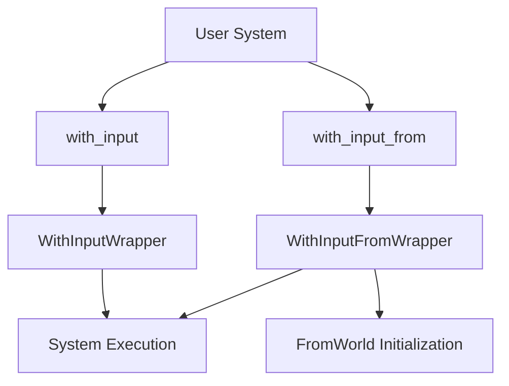

+++
title = "#18067 Add `IntoSystem::with_input` and `::with_input_from` system wrappers"
date = "2025-05-06T00:00:00"
draft = false
template = "pull_request_page.html"
in_search_index = false

[extra]
current_language = "zh-cn"
available_languages = {"en" = { name = "English", url = "/pull_request/bevy/2025-05/pr-18067-en-20250506" }, "zh-cn" = { name = "中文", url = "/pull_request/bevy/2025-05/pr-18067-zh-cn-20250506" }}
labels = ["C-Feature", "A-ECS", "D-Modest"]
+++

# Add `IntoSystem::with_input` and `::with_input_from` system wrappers

## Basic Information
- **Title**: Add `IntoSystem::with_input` and `::with_input_from` system wrappers  
- **PR Link**: https://github.com/bevyengine/bevy/pull/18067  
- **Author**: ItsDoot  
- **Status**: MERGED  
- **Labels**: C-Feature, A-ECS, S-Ready-For-Final-Review, D-Modest  
- **Created**: 2025-02-27T06:00:13Z  
- **Merged**: 2025-05-06T06:08:50Z  
- **Merged By**: alice-i-cecile  

## Description Translation

### 目标  
原始需求来自[Discord用户的问题](https://discord.com/channels/691052431525675048/1247654592838111302/1344431131277394042)，库作者可能需要向用户注册的系统传递系统特定的数据。通常使用`Local<T>`处理这类需求，但通常无法配置/设置底层`T`数据。作为替代方案，我们可以使用`SystemInput`传递数据。

### 解决方案  
- 新增`IntoSystem::with_input`：允许显式传递系统特定数据  
- 新增`IntoSystem::with_input_from`：允许通过`FromWorld`在初始化时创建系统特定数据  

### 测试  
新增两个测试用例，分别验证`with_input`和`with_input_from`的功能。

## The Story of This Pull Request

### 问题背景  
在Bevy ECS中，系统参数通常通过自动注入机制处理（如`Res<T>`、`Query<T>`）。但当需要为系统提供定制化输入时，现有方案存在局限性：  
1. `Local<T>`需要手动初始化且生命周期管理复杂  
2. 需要在不修改系统签名的情况下提供外部输入  
3. 某些场景需要基于World状态动态生成输入数据

### 解决方案设计  
通过扩展`IntoSystem` trait新增两个方法：  
1. `with_input`：允许直接包装外部值作为系统输入  
2. `with_input_from`：利用`FromWorld` trait从World生成输入数据  

核心设计要点：  
- 保持与现有ECS架构的一致性  
- 实现零成本抽象（zero-cost abstraction）  
- 确保类型安全和生命周期安全

### 实现细节  
在`schedule_system.rs`中新增两个包装器结构：  
```rust
pub struct WithInputWrapper<S, T> { /* 存储系统和输入值 */ }
pub struct WithInputFromWrapper<S, T> { /* 延迟初始化输入值 */ }
```

关键实现逻辑：  
1. **运行时输入注入**：  
```rust
// WithInputWrapper的run实现
unsafe fn run_unsafe(&mut self, _input: SystemIn<'_, Self>, world: UnsafeWorldCell) -> Self::Out {
    self.system.run_unsafe(&mut self.value, world)
}
```

2. **延迟初始化**：  
```rust
// WithInputFromWrapper的initialize实现
fn initialize(&mut self, world: &mut World) {
    self.system.initialize(world);
    if self.value.is_none() {
        self.value = Some(T::from_world(world));
    }
}
```

### 技术影响  
1. **API扩展**：  
```rust
// 使用示例
schedule.add_systems(my_system.with_input(0));
schedule.add_systems(my_system.with_input_from::<MyData>());
```

2. **类型系统保障**：  
通过泛型约束确保输入类型匹配：  
```rust
where
    for<'i> In: SystemInput<Inner<'i> = &'i mut T>,
    T: Send + Sync + 'static
```

3. **性能考量**：  
- 输入值直接存储在包装器中，无额外堆分配  
- 编译期类型检查，无运行时开销

## Visual Representation



## Key Files Changed

### `crates/bevy_ecs/src/system/mod.rs`
1. **新增方法**：  
```rust
fn with_input<T>(self, value: T) -> WithInputWrapper<Self::System, T> {
    WithInputWrapper::new(self, value)
}

fn with_input_from<T>(self) -> WithInputFromWrapper<Self::System, T> {
    WithInputFromWrapper::new(self)
}
```

2. **测试用例**：  
```rust
#[test]
fn with_input() { /* 验证数值递增 */ }

#[test]
fn with_input_from() { /* 验证FromWorld初始化 */ }
```

### `crates/bevy_ecs/src/system/schedule_system.rs`
1. **包装器实现**：  
```rust
pub struct WithInputWrapper<S, T> {
    system: S,
    value: T,
}

pub struct WithInputFromWrapper<S, T> {
    system: S,
    value: Option<T>,
}
```

2. **系统trait实现**：  
覆盖`run_unsafe`、`initialize`等关键生命周期方法

## Further Reading
1. [Bevy ECS System Documentation](https://docs.rs/bevy_ecs/latest/bevy_ecs/system/index.html)
2. [FromWorld Trait Reference](https://docs.rs/bevy_ecs/latest/bevy_ecs/world/trait.FromWorld.html)
3. [System Input Design Patterns](https://github.com/bevyengine/bevy/discussions/1805)