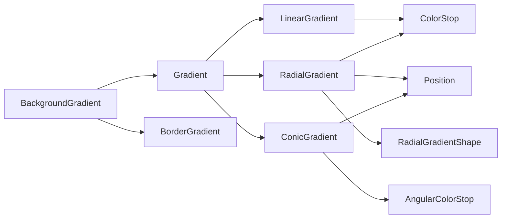

+++
title = "#18139 UI Node Gradients"
date = "2025-05-20T00:00:00"
draft = false
template = "pull_request_page.html"
in_search_index = true

[taxonomies]
list_display = ["show"]

[extra]
current_language = "en"
available_languages = {"en" = { name = "English", url = "/pull_request/bevy/2025-05/pr-18139-en-20250520" }, "zh-cn" = { name = "中文", url = "/pull_request/bevy/2025-05/pr-18139-zh-cn-20250520" }}
labels = ["C-Feature", "A-Rendering", "A-UI", "D-Shaders"]
+++

# Title

## Basic Information
- **Title**: UI Node Gradients
- **PR Link**: https://github.com/bevyengine/bevy/pull/18139
- **Author**: ickshonpe
- **Status**: MERGED
- **Labels**: C-Feature, A-Rendering, A-UI, S-Ready-For-Final-Review, M-Needs-Release-Note, D-Shaders
- **Created**: 2025-03-03T16:30:52Z
- **Merged**: 2025-05-20T15:05:42Z
- **Merged By**: alice-i-cecile

## Description Translation

# Objective

Allowing drawing of UI nodes with a gradient instead of a flat color.

## Solution

The are three gradient structs corresponding to the three types of gradients supported: `LinearGradient`, `ConicGradient` and `RadialGradient`. These are then wrapped in a `Gradient` enum discriminator which has `Linear`, `Conic` and `Radial` variants. 

Each gradient type consists of the geometric properties for that gradient and a list of color stops.
Color stops consist of a color, a position or angle and an optional hint.  If no position is specified for a stop, it's evenly spaced between the previous and following stops. Color stop positions are absolute, if you specify a list of stops:
```vec![vec![ColorStop::new(RED, Val::Percent(90.), ColorStop::new(Color::GREEN, Val::Percent(10.))```
the colors will be reordered and the gradient will transition from green at 10% to red at 90%. 

Colors are interpolated between the stops in SRGB space. The hint is a normalized value that can be used to shift the mid-point where the colors are mixed 50-50.  between the stop with the hint and the following stop.

For sharp stops with no interpolated transition, place two stops at the same position.

`ConicGradient`s and RadialGradient`s have a center which is set using the new `Position` type. `Position` consists of a normalized (relative to the UI node) `Vec2` anchor point and a responsive x, y offset.

To draw a UI node with a gradient you insert the components `BackgroundGradient` and `BorderGradient`, which both newtype a vector of `Gradient`s. If you set a background color, the background color is drawn first and the gradient(s) are drawn on top.

The implementation is deliberately simple and self contained. The shader draws the gradient in multiple passes which is quite inefficient for gradients with a very large number of color stops. It's simple though and there won't be any compatibility issues. We could make gradients a specialization for `UiPipeline` but I used a separate pipeline plugin for now to ensure that these changes don't break anything. 

#### Not supported in this PR
* Interpolation in other color spaces besides SRGB. 
* Images and text: This would need some breaking changes like a `UiColor` enum type with `Color` and `Gradient` variants, to enable `BorderColor`, `TextColor`, `BackgroundColor` and `ImageNode::color` to take either a `Color` or a gradient.
* Repeating gradients

## Testing

Includes three examples that can be used for testing:
```
cargo run --example linear_gradients
cargo run --example stacked_gradients
cargo run --example radial_gradients
```

Most of the code except the components API is contained within the `bevy_ui/src/render/linear_gradients` module.
There are no changes to any existing systems or plugins except for the addition of the gradients rendering systems to the render world schedule and the `Val` changes from #18164 . 

## Showcase


Conic gradients can be used to draw simple pie charts like in CSS:


## The Story of This Pull Request

### The Problem and Context
Bevy's UI system previously only supported solid colors for backgrounds and borders. While sufficient for basic interfaces, this limitation prevented more sophisticated visual designs using gradients. The lack of gradient support became particularly noticeable when trying to create modern UI elements or visual effects that require smooth color transitions.

The challenge involved adding gradient support without breaking existing UI rendering systems. Key constraints included maintaining compatibility with Bevy's existing ECS architecture, ensuring reasonable performance for common use cases, and providing a flexible API that supports multiple gradient types (linear, radial, conic).

### The Solution Approach
The implementation introduces three core gradient types through a new `Gradient` enum:
- `LinearGradient` with angle-based direction
- `RadialGradient` with configurable center and shape
- `ConicGradient` with angular color stops

Each gradient type uses color stops that can specify absolute positions or auto-calculate spacing. The new `Position` struct handles responsive positioning relative to UI nodes, using normalized anchor points and Val-based offsets.

The rendering approach uses separate WGSL shaders for gradient calculations, processed through multiple draw calls. While not optimal for gradients with many stops, this method ensures compatibility and isolates gradient rendering from existing UI pipelines.

### The Implementation
Key technical components include:

1. **Gradient Data Structures**:
```rust
pub enum Gradient {
    Linear(LinearGradient),
    Radial(RadialGradient),
    Conic(ConicGradient),
}
```

2. **Position Handling**:
```rust
pub struct Position {
    pub anchor: Vec2,
    pub x: Val,
    pub y: Val,
}
```

3. **Shader Integration**:
The `gradient.wgsl` shader implements gradient calculations using signed distance functions and SRGB color interpolation. The vertex format includes multiple attributes needed for gradient rendering:
```wgsl
struct UiGradientVertex {
    position: vec3<f32>,
    uv: vec2<f32>,
    flags: u32,
    radius: vec4<f32>,
    border: vec4<f32>,
    size: vec2<f32>,
    point: vec2<f32>,
    g_start: vec2<f32>,
    g_dir: vec2<f32>,
    start_color: vec4<f32>,
    start_len: f32,
    end_len: f32,
    end_color: vec4<f32>,
    hint: f32,
}
```

4. **Rendering Pipeline**:
The gradient rendering system uses a separate pipeline specialization to avoid conflicts with existing UI rendering:
```rust
pub struct GradientPipeline {
    pub view_layout: BindGroupLayout,
}
```

### Technical Insights
- **Color Stop Handling**: Automatic stop positioning uses linear interpolation between explicit stops
- **SRGB Interpolation**: Colors are mixed in SRGB space for perceptual accuracy
- **Performance Considerations**: Multiple draw calls per gradient segment could impact performance with complex gradients
- **Border Support**: Separate `BorderGradient` component allows gradient borders through specialized shader flags

### The Impact
- Enables sophisticated UI visual effects previously impossible
- Maintains backward compatibility through new components
- Adds ~1,700 lines of new code with minimal changes to existing systems
- Sets foundation for future gradient improvements (repeating patterns, HDR colors)

## Visual Representation



## Key Files Changed

### `crates/bevy_ui/src/render/gradient.rs` (+916/-0)
Implements gradient extraction and GPU data preparation. Key snippet:
```rust
pub fn prepare_gradient(
    mut commands: Commands,
    render_device: Res<RenderDevice>,
    render_queue: Res<RenderQueue>,
    mut ui_meta: ResMut<GradientMeta>,
    // ... other params
) {
    // Handles buffer creation and batch preparation
}
```

### `crates/bevy_ui/src/gradients.rs` (+575/-0)
Defines gradient data structures and component types:
```rust
pub struct LinearGradient {
    pub angle: f32,
    pub stops: Vec<ColorStop>,
}
```

### `crates/bevy_ui/src/geometry.rs` (+216/-26)
Adds `Position` type for responsive gradient positioning:
```rust
pub struct Position {
    pub anchor: Vec2,
    pub x: Val,
    pub y: Val,
}
```

### `crates/bevy_ui/src/render/gradient.wgsl` (+193/-0)
Implements gradient shader logic:
```wgsl
fn linear_distance(
    point: vec2<f32>,
    g_start: vec2<f32>,
    g_dir: vec2<f32>,
) -> f32 {
    return dot(point - g_start, g_dir);
}
```

### `examples/ui/gradients.rs` (+186/-0)
Demonstrates various gradient configurations:
```rust
commands.spawn((
    Node {
        width: Val::Px(100.),
        height: Val::Px(100.),
        border: UiRect::all(Val::Px(5.)),
        ..default()
    },
    BackgroundGradient::from(LinearGradient {
        angle: 0.5 * TAU,
        stops: vec![RED.into(), BLUE.into()],
    }),
));
```

## Further Reading
- [MDN Gradient Documentation](https://developer.mozilla.org/en-US/docs/Web/CSS/gradient)
- [WGSL Shader Language Spec](https://www.w3.org/TR/WGSL/)
- [Bevy UI Rendering Architecture](https://bevyengine.org/learn/book/plugins/ui/)