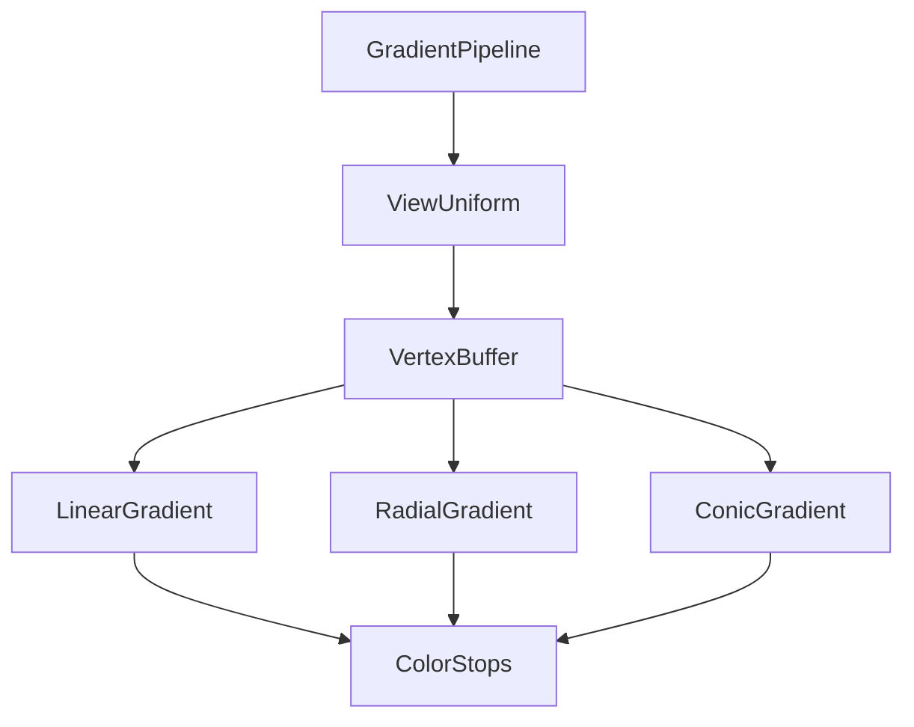

+++
title = "#18139 UI Node Gradients"
date = "2025-05-20T00:00:00"
draft = false
template = "pull_request_page.html"
in_search_index = false

[extra]
current_language = "zh-cn"
available_languages = {"en" = { name = "English", url = "/pull_request/bevy/2025-05/pr-18139-en-20250520" }, "zh-cn" = { name = "中文", url = "/pull_request/bevy/2025-05/pr-18139-zh-cn-20250520" }}
labels = ["C-Feature", "A-Rendering", "A-UI", "D-Shaders"]
+++

# Title

## Basic Information
- **Title**: UI Node Gradients
- **PR Link**: https://github.com/bevyengine/bevy/pull/18139
- **Author**: ickshonpe
- **Status**: MERGED
- **Labels**: C-Feature, A-Rendering, A-UI, S-Ready-For-Final-Review, M-Needs-Release-Note, D-Shaders
- **Created**: 2025-03-03T16:30:52Z
- **Merged**: 2025-05-20T15:05:42Z
- **Merged By**: alice-i-cecile

## Description Translation
### 目标
允许UI节点绘制渐变而非纯色

### 解决方案
实现三种渐变类型对应的结构体：`LinearGradient`（线性渐变）、`ConicGradient`（圆锥渐变）和`RadialGradient`（径向渐变），通过`Gradient`枚举进行统一管理。

渐变由几何属性和颜色停止点组成。颜色停止点包含颜色、位置/角度和可选的hint参数。未指定位置的颜色停止点会自动在前后停止点之间均匀分布。颜色在SRGB空间进行插值，hint参数用于调整颜色混合的中间点位置。

圆锥和径向渐变使用新增的`Position`类型定义中心点，该类型包含归一化的锚点坐标和响应式偏移量。

### 实现特点
- 新增`BackgroundGradient`和`BorderGradient`组件
- 渐变与背景颜色可叠加绘制
- 采用独立渲染管线确保兼容性
- 支持SRGB色彩空间插值


## The Story of This Pull Request

### 问题背景
Bevy UI系统此前仅支持纯色填充，缺乏现代UI框架常见的渐变效果支持。开发者需要实现数据可视化、现代界面设计时存在功能缺口。

### 技术实现
1. **数据结构设计**：
   - 新增`ColorStop`结构表示颜色停止点，支持自动位置分布
   - `Position`类型提供灵活的定位系统，支持相对节点尺寸的锚点定位
   ```rust
   pub struct Position {
       pub anchor: Vec2,
       pub x: Val,
       pub y: Val,
   }
   ```

2. **渲染管线**：
   - 独立`GradientPipeline`处理渐变渲染
   - 多趟渲染策略处理颜色停止点，保证兼容性
   - WGSL着色器实现三种渐变的数学计算

3. **布局系统增强**：
   - 修改`Val::resolve`方法支持物理像素计算
   ```rust
   pub fn resolve(
       self,
       scale_factor: f32,
       physical_base_value: f32,
       physical_target_size: Vec2,
   ) -> Result<f32, ValArithmeticError>
   ```

### 工程决策
- 采用枚举而非trait实现不同渐变类型，简化类型系统
- 颜色停止点排序逻辑确保渐变方向正确
- 保持与现有UI组件的兼容性，通过新增组件扩展功能

### 性能考量
- 多趟渲染策略在大量颜色停止点时效率较低，但保证实现简单性
- 顶点缓冲区复用优化内存使用
- 未来可通过管线优化提升性能

## Visual Representation



## Key Files Changed

### `crates/bevy_ui/src/gradients.rs` (+575)
定义渐变数据结构：
```rust
pub struct LinearGradient {
    pub angle: f32,
    pub stops: Vec<ColorStop>,
}

pub enum Gradient {
    Linear(LinearGradient),
    Radial(RadialGradient),
    Conic(ConicGradient),
}
```

### `crates/bevy_ui/src/render/gradient.wgsl` (+193)
渐变着色器核心算法：
```wgsl
fn linear_distance(point: vec2<f32>, g_start: vec2<f32>, g_dir: vec2<f32>) -> f32 {
    return dot(point - g_start, g_dir);
}
```

### `examples/ui/gradients.rs` (+186)
演示多种渐变组合：
```rust
BackgroundGradient::from(LinearGradient {
    angle: 0.,
    stops: vec![ColorStop::new(RED, Val::Percent(15.))],
})
```

## Further Reading
- [CSS渐变规范](https://developer.mozilla.org/en-US/docs/Web/CSS/gradient)
- [WGSL着色语言文档](https://gpuweb.github.io/gpuweb/wgsl/)
- [Bevy UI系统架构](https://bevyengine.org/learn/book/features/ui/)