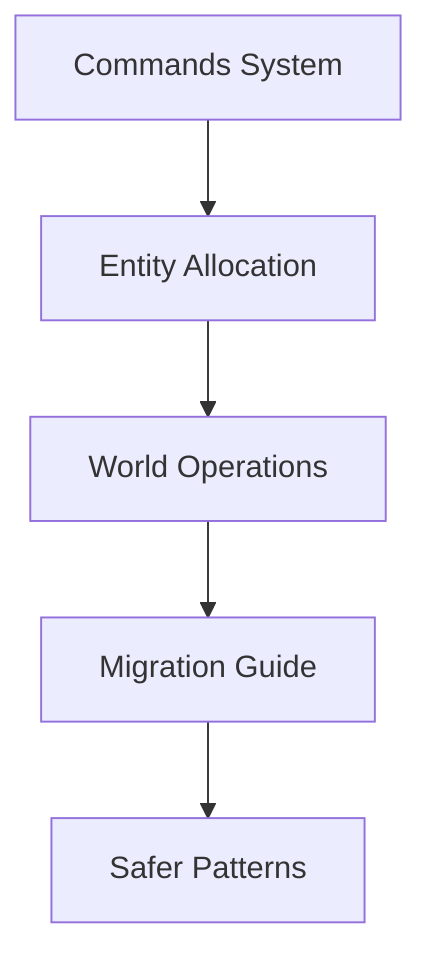

+++
title = "#18148 Removal of Deprecated Entity Spawning/Insertion APIs"
date = "2025-05-06T00:00:00"
draft = false
template = "pull_request_page.html"
in_search_index = true

[taxonomies]
list_display = ["show"]

[extra]
current_language = "en"
available_languages = {"en" = { name = "English", url = "/pull_request/bevy/2025-05/pr-18148-en-20250506" }, "zh-cn" = { name = "中文", url = "/pull_request/bevy/2025-05/pr-18148-zh-cn-20250506" }}
labels = ["A-ECS", "C-Code-Quality", "C-Usability"]
+++

# Title: Removal of Deprecated Entity Spawning/Insertion APIs

## Basic Information
- **Title**: Remove `insert_or_spawn` function family
- **PR Link**: https://github.com/bevyengine/bevy/pull/18148
- **Author**: ElliottjPierce
- **Status**: MERGED
- **Labels**: A-ECS, C-Code-Quality, C-Usability, S-Ready-For-Final-Review, M-Needs-Migration-Guide
- **Created**: 2025-03-03T23:59:41Z
- **Merged**: 2025-05-05T23:35:02Z
- **Merged By**: alice-i-cecile

## Description Translation
# Objective

Based on and closes #18054, this PR builds on #18035 and #18147 to remove:

- `Commands::insert_or_spawn_batch`
- `Entities::alloc_at_without_replacement`
- `Entities::alloc_at`
- `entity::AllocAtWithoutReplacement`
- `World::insert_or_spawn_batch`
- `World::insert_or_spawn_batch_with_caller`

## Testing

Just removing unused, deprecated code, so no new tests. Note that as of writing, #18035 is still under testing and review.

## Future Work

Per [this](https://github.com/bevyengine/bevy/issues/18054#issuecomment-2689088899) comment on #18054, there may be additional performance improvements possible to the entity allocator now that `alloc_at` no longer is supported. At a glance, I don't see anything obvious to improve, but it may be worth further investigation in the future.

## The Story of This Pull Request

### The Problem and Context
The Bevy ECS system contained deprecated APIs (`insert_or_spawn_batch` and related methods) that enabled two potentially dangerous patterns:
1. Forced allocation of specific entity IDs through `alloc_at`-style methods
2. Batch operations mixing entity insertion and spawning

These methods were flagged for removal due to:
- Documented performance risks when used after mass entity deletions
- Anti-pattern usage that could lead to fragmented entity tables
- Maintenance overhead from supporting deprecated code paths
- Violation of entity ID management best practices

### The Solution Approach
The PR completes a planned deprecation cycle by:
1. Removing all related functions from public APIs
2. Eliminating internal support structures like `AllocAtWithoutReplacement`
3. Updating documentation and migration guides
4. Removing associated test cases and benchmarks

Key engineering decisions included:
- Maintaining backward compatibility through prior deprecation warnings
- Providing clear migration paths in documentation
- Ensuring atomic removal of all related code paths
- Preserving core entity allocation performance characteristics

### The Implementation
The removal targeted three main areas:

1. **Command System**:
```rust
// Before in commands/mod.rs:
#[deprecated]
pub fn insert_or_spawn_batch<I, B>(&mut self, bundles_iter: I) { ... }

// After: Entire function removed
```

2. **Entity Allocation**:
```rust
// Before in entity/mod.rs:
#[deprecated]
pub fn alloc_at(&mut self, entity: Entity) -> Option<EntityLocation> { ... }

// After: Function and related enum removed
```

3. **World Operations**:
```rust
// Before in world/mod.rs:
#[deprecated]
pub fn insert_or_spawn_batch<I, B>(&mut self, iter: I) -> Result<(), Vec<Entity>> { ... }

// After: 177 lines of batch handling code removed
```

### Technical Insights
The removed APIs created several technical challenges:
- **Entity Table Fragmentation**: Forced allocations could create gaps in entity storage
- **Generation Conflicts**: Manual entity ID management risked generation mismatches
- **Batch Complexity**: Mixed insert/spawn logic complicated batching optimizations

The migration guide suggests two safer patterns:
1. **Component-based State Management**:
```rust
// Instead of despawning:
commands.entity(e).insert(Disabled);

// Reactivate later:
commands.entity(e).remove::<Disabled>();
```

2. **Pure Batch Operations**:
```rust
// Use dedicated spawn/insert batches:
world.spawn_batch(batch_of_new_entities);
world.insert_batch(existing_entities_with_components);
```

### The Impact
- **Codebase Health**: Reduces technical debt by ~434 lines of code
- **Performance**: Eliminates potential O(n) edge cases in entity allocation
- **API Clarity**: Removes footguns from public-facing APIs
- **Memory Usage**: Reduces metadata storage for entity tracking

## Visual Representation



## Key Files Changed

1. `crates/bevy_ecs/src/world/mod.rs` (+1/-177)
   - Removed bulk insertion/spawning implementation
   - Eliminated complex batch handling logic
   ```rust
   // Before:
   pub fn insert_or_spawn_batch<I, B>(...) { ... }
   
   // After: Entire function removed
   ```

2. `crates/bevy_ecs/src/entity/mod.rs` (+0/-91)
   - Removed low-level entity allocation methods
   ```rust
   // Removed:
   pub fn alloc_at(&mut self, entity: Entity) {...}
   enum AllocAtWithoutReplacement {...}
   ```

3. `crates/bevy_ecs/src/system/commands/mod.rs` (+1/-53)
   - Removed command API entry point
   ```rust
   // Before:
   #[deprecated]
   pub fn insert_or_spawn_batch(...) {...}
   
   // After: Function removed
   ```

## Further Reading
- [Entity Component System Best Practices](https://bevyengine.org/learn/book/ecs-best-practices/)
- [Bevy ECS Architecture Guide](https://bevyengine.org/learn/book/ecs-architecture/)
- [Data-Oriented Design Resources](https://www.dataorienteddesign.com/dodbook/)