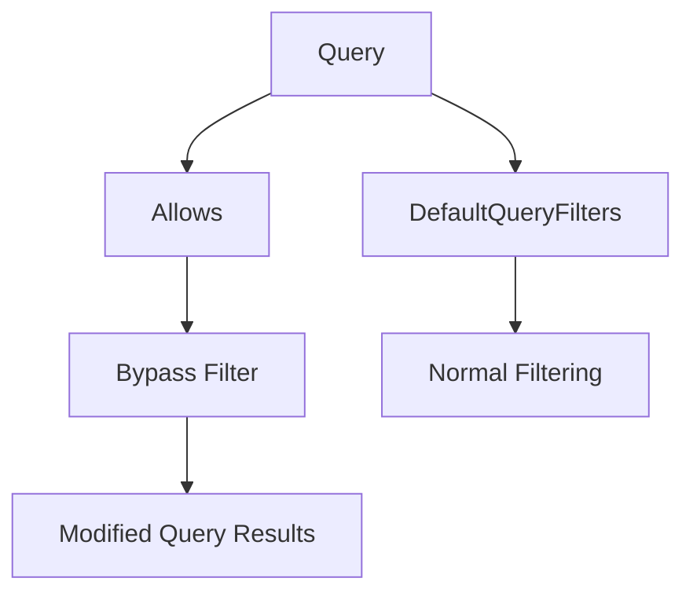

+++
title = "#18192 Add Allows filter to bypass DefaultQueryFilters"
date = "2025-05-06T00:00:00"
draft = false
template = "pull_request_page.html"
in_search_index = true

[taxonomies]
list_display = ["show"]

[extra]
current_language = "en"
available_languages = {"en" = { name = "English", url = "/pull_request/bevy/2025-05/pr-18192-en-20250506" }, "zh-cn" = { name = "中文", url = "/pull_request/bevy/2025-05/pr-18192-zh-cn-20250506" }}
labels = ["A-ECS", "C-Usability", "D-Straightforward", "D-Unsafe"]
+++

# Title: Add Allows filter to bypass DefaultQueryFilters

## Basic Information
- **Title**: Add Allows filter to bypass DefaultQueryFilters
- **PR Link**: https://github.com/bevyengine/bevy/pull/18192
- **Author**: NiseVoid
- **Status**: MERGED
- **Labels**: A-ECS, C-Usability, S-Ready-For-Final-Review, D-Straightforward, D-Unsafe
- **Created**: 2025-03-07T11:56:14Z
- **Merged**: 2025-05-05T23:42:36Z
- **Merged By**: alice-i-cecile

## Description Translation
The original description is in English and remains unchanged:

# Objective

Fixes #17803 

## Solution

- Add an `Allows<T>` `QueryFilter` that adds archetypal access for `T`
- Fix access merging to include archetypal from both sides

## Testing

- Added a case to the unit test for the application of `DefaultQueryFilters`

## The Story of This Pull Request

The PR addresses a limitation in Bevy's Entity Component System (ECS) query filtering where default filters couldn't be selectively bypassed. The core issue (#17803) involved scenarios where developers needed to query entities that would normally be excluded by `DefaultQueryFilters`, particularly when working with disabled entities or other filtered components.

The solution introduces a new `Allows<T>` query filter that explicitly permits entities containing component `T` to bypass default filtering rules. This required two key technical changes:

1. **New Filter Implementation**: The `Allows<T>` struct implements `WorldQuery` to add archetypal access without actual component data access. This tells the query system about the required component presence while avoiding data access conflicts:

```rust
// In crates/bevy_ecs/src/query/filter.rs
pub struct Allows<T>(PhantomData<T>);

unsafe impl<T: Component> WorldQuery for Allows<T> {
    // ... 
    fn update_component_access(&id: &ComponentId, access: &mut FilteredAccess<ComponentId>) {
        access.access_mut().add_archetypal(id);
    }
}
```

2. **Access Merging Fix**: The access merging logic was updated to properly combine archetypal accesses from multiple filters:

```rust
// In crates/bevy_ecs/src/query/access.rs
impl<T: SparseSetIndex> Access<T> {
    pub fn merge_with(&mut self, other: &Access<T>) {
        // ...
        self.archetypal.union_with(&other.archetypal);
    }
}
```

The implementation maintains safety through:
- Marker struct pattern using PhantomData
- Explicit archetypal access tracking
- Preservation of existing filter behaviors
- Unsafe implementation boundaries clearly marked

Testing verified the new functionality through a dedicated unit test case that demonstrates bypassing default filters while respecting other constraints:

```rust
// In crates/bevy_ecs/src/query/state.rs
let mut query = QueryState::<(), Allows<C>>::new(&mut world);
assert_eq!(3, query.iter(&world).count());
```

## Visual Representation



## Key Files Changed

1. **crates/bevy_ecs/src/query/filter.rs (+57/-0)**
   - Added `Allows<T>` implementation
   - Key code:
```rust
pub struct Allows<T>(PhantomData<T>);
unsafe impl<T: Component> WorldQuery for Allows<T> { /*...*/ }
unsafe impl<T: Component> QueryFilter for Allows<T> { /*...*/ }
```

2. **crates/bevy_ecs/src/query/access.rs (+3/-1)**
   - Fixed archetypal access merging:
```rust
// Before:
// self.archetypal not merged
// After:
self.archetypal.union_with(&other.archetypal);
```

3. **crates/bevy_ecs/src/query/state.rs (+4/-0)**
   - Added test case:
```rust
let mut query = QueryState::<(), Allows<C>>::new(&mut world);
assert_eq!(3, query.iter(&world).count());
```

4. **crates/bevy_ecs/src/lib.rs (+1/-1)**
   - Exported `Allows` in prelude:
```rust
query::{..., Allows, ...},
```

## Further Reading

- Bevy ECS Query System Documentation: https://bevyengine.org/learn/book/ecs/queries/
- Rust PhantomData Patterns: https://doc.rust-lang.org/std/marker/struct.PhantomData.html
- Entity Component System Architecture: https://en.wikipedia.org/wiki/Entity_component_system

## Full Code Diff
(See original PR for complete diff)