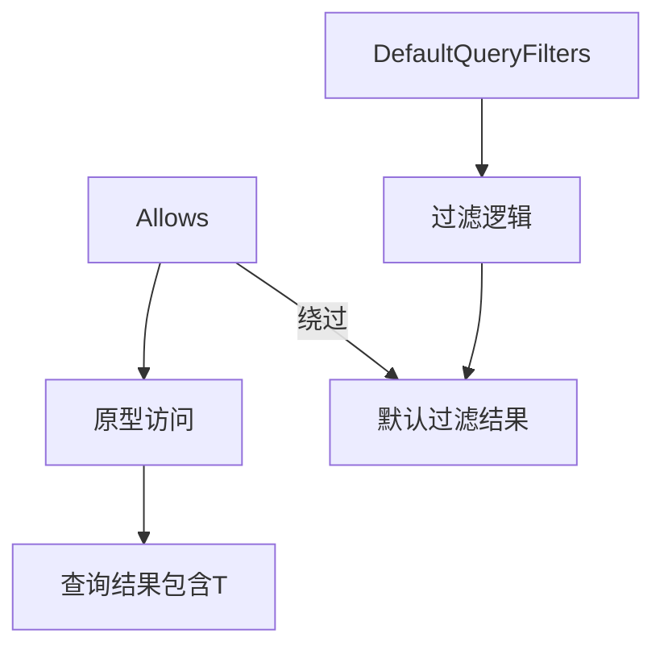

+++
title = "#18192 Add Allows filter to bypass DefaultQueryFilters"
date = "2025-05-06T00:00:00"
draft = false
template = "pull_request_page.html"
in_search_index = false

[extra]
current_language = "zh-cn"
available_languages = {"en" = { name = "English", url = "/pull_request/bevy/2025-05/pr-18192-en-20250506" }, "zh-cn" = { name = "中文", url = "/pull_request/bevy/2025-05/pr-18192-zh-cn-20250506" }}
labels = ["A-ECS", "C-Usability", "D-Straightforward", "D-Unsafe"]
+++

# Add Allows filter to bypass DefaultQueryFilters

## Basic Information
- **Title**: Add Allows filter to bypass DefaultQueryFilters
- **PR Link**: https://github.com/bevyengine/bevy/pull/18192
- **Author**: NiseVoid
- **Status**: MERGED
- **Labels**: A-ECS, C-Usability, S-Ready-For-Final-Review, D-Straightforward, D-Unsafe
- **Created**: 2025-03-07T11:56:14Z
- **Merged**: 2025-05-05T23:42:36Z
- **Merged By**: alice-i-cecile

## Description Translation
该PR实现了以下目标：

### 目标
修复 #17803

### 解决方案
- 新增 `Allows<T>` 查询过滤器，为 `T` 添加原型访问
- 修复访问合并逻辑以包含来自两边的原型访问

### 测试
- 在单元测试中新增用例验证 `DefaultQueryFilters` 的应用

## The Story of This Pull Request

### 问题背景
在Bevy的ECS系统中，`DefaultQueryFilters`会默认过滤包含特定组件的实体。当开发者需要访问这些被过滤的实体时，现有的过滤机制缺乏直接的绕过方式。这个问题在issue #17803中被明确提出，需要一种机制来选择性绕过默认过滤器。

### 解决方案
PR通过引入新的`Allows<T>`查询过滤器来解决这个问题。该方案包含两个关键修改：

1. **新增Allows过滤器**：创建一个新的`Allows<T>`类型，作为`WorldQuery`实现，在不实际访问组件数据的前提下，通过原型(archetypal)访问机制影响查询结果
2. **完善访问合并逻辑**：修复访问合并逻辑，确保原型访问信息能够正确合并

### 技术实现
在`filter.rs`中新增`Allows`结构体，实现其核心逻辑：

```rust
/// Allows a query to contain entities with the component `T`, bypassing [`DefaultQueryFilters`]
pub struct Allows<T>(PhantomData<T>);

unsafe impl<T: Component> WorldQuery for Allows<T> {
    // 精简后的实现保留核心访问逻辑
    fn update_component_access(&id: &ComponentId, access: &mut FilteredAccess<ComponentId>) {
        access.access_mut().add_archetypal(id);
    }
}
```

在`access.rs`中修正访问合并逻辑：

```rust
impl<T: SparseSetIndex> Access<T> {
    pub fn add_archetypal(&mut self, index: T) {
        self.archetypal.grow_and_insert(index.sparse_set_index());
    }

    pub fn union_with(&mut self, other: &Access<T>) {
        // 新增原型访问的合并
        self.archetypal.union_with(&other.archetypal);
    }
}
```

### 技术要点
1. **原型访问机制**：`Allows<T>`通过`add_archetypal`方法在查询构建阶段声明对目标组件的原型级访问，不影响实际数据获取
2. **安全实现**：虽然标记为`D-Unsafe`，但通过严格限制访问范围（不实际读写组件数据）保证内存安全
3. **查询优化**：保持`IS_DENSE = true`确保查询效率不受影响

### 影响验证
新增的单元测试验证了功能正确性：

```rust
// 在state.rs中的测试用例
let mut query = QueryState::<(), Allows<C>>::new(&mut world);
assert_eq!(3, query.iter(&world).count());
```

该测试确认了：
- `Allows`能正确绕过默认过滤器
- 访问合并逻辑正确处理原型访问信息
- 与其他过滤器（如`Without<B>`）能正确组合使用

## Visual Representation



## Key Files Changed

### `crates/bevy_ecs/src/query/filter.rs` (+57/-0)
新增`Allows<T>`过滤器的完整实现，包含：
- 结构体定义
- `WorldQuery` trait实现
- 安全约束注释
- 文档说明

关键代码片段：
```rust
unsafe impl<T: Component> QueryFilter for Allows<T> {
    const IS_ARCHETYPAL: bool = true;
    
    #[inline(always)]
    unsafe fn filter_fetch(_: &mut Self::Fetch<'_>, _: Entity, _: TableRow) -> bool {
        true
    }
}
```

### `crates/bevy_ecs/src/query/access.rs` (+3/-1)
修正访问合并逻辑：
```rust
// Before:
// pub fn union_with 中未合并archetypal

// After:
pub fn union_with(&mut self, other: &Access<T>) {
    self.archetypal.union_with(&other.archetypal);
}
```

### `crates/bevy_ecs/src/query/state.rs` (+4/-0)
新增测试用例验证Allows的行为：
```rust
let mut query = QueryState::<(), Allows<C>>::new(&mut world);
assert_eq!(3, query.iter(&world).count());
```

### `crates/bevy_ecs/src/lib.rs` (+1/-1)
将Allows加入prelude模块：
```rust
query::{Added, Allows, AnyOf, Changed, ...},
```

## Further Reading
1. [Bevy ECS查询系统文档](https://bevyengine.org/learn/book/ecs/queries/)
2. [实体组件系统设计模式](https://gameprogrammingpatterns.com/component.html)
3. [Rust PhantomData使用指南](https://doc.rust-lang.org/std/marker/struct.PhantomData.html)