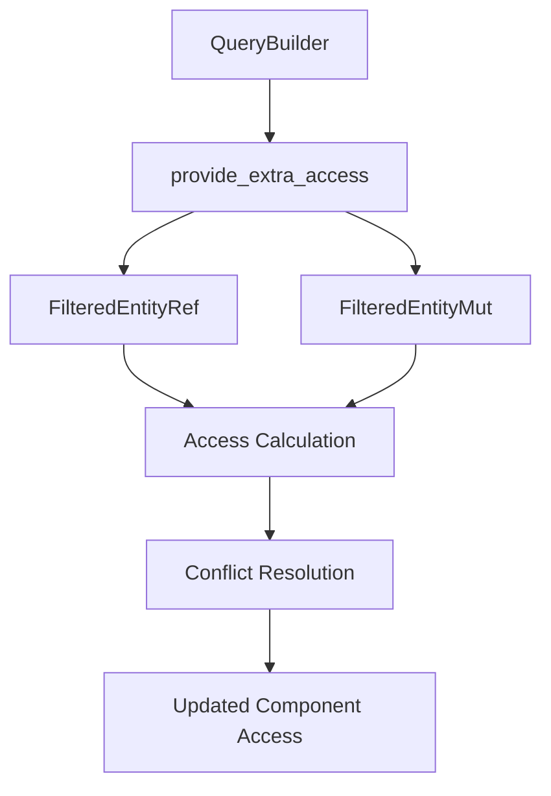

+++
title = "#18236 Let `FilteredEntity(Ref|Mut)` receive access when nested."
date = "2025-05-06T00:00:00"
draft = false
template = "pull_request_page.html"
in_search_index = true

[taxonomies]
list_display = ["show"]

[extra]
current_language = "en"
available_languages = {"en" = { name = "English", url = "/pull_request/bevy/2025-05/pr-18236-en-20250506" }, "zh-cn" = { name = "中文", url = "/pull_request/bevy/2025-05/pr-18236-zh-cn-20250506" }}
labels = ["C-Bug", "C-Feature", "A-ECS", "D-Complex", "D-Unsafe"]
+++

# Title

## Basic Information
- **Title**: Let `FilteredEntity(Ref|Mut)` receive access when nested.
- **PR Link**: https://github.com/bevyengine/bevy/pull/18236
- **Author**: chescock
- **Status**: MERGED
- **Labels**: C-Bug, C-Feature, A-ECS, S-Ready-For-Final-Review, D-Complex, X-Uncontroversial, D-Unsafe
- **Created**: 2025-03-10T18:16:41Z
- **Merged**: 2025-05-05T23:42:36Z
- **Merged By**: alice-i-cecile

## Description Translation
# Objective

Let `FilteredEntityRef` and `FilteredEntityMut` receive access when nested inside tuples or `#[derive(QueryData)]` types.  Make sure to exclude any access that would conflict with other subqueries!  

Fixes #14349

## Solution

Replace `WorldQuery::set_access(state, access)` with a new method, `QueryData::provide_extra_access(state, access, available_access)`, that passes both the total available access and the currently used access.  This is called after `WorldQuery::update_component_access()`, so any access used by ordinary subqueries will be known.  `FilteredEntityRef` and `FilteredEntityMut` can use the combination to determine how much access they can safely take, while tuples can safely pass those parameters directly to their subqueries.  

This requires a new `Access::remove_conflicting_access()` method that can be used to remove any access that would conflict with existing access.  Implementing this method was easier by first factoring some common set manipulation code out of `Access::extend`.  I can extract that refactoring to a separate PR if desired.  

Have `FilteredEntity(Ref|Mut)` store `Access` instead of `FilteredAccess` because they do not need to keep track of the filter.  This was necessary in an early draft but no longer is.  I left it in because it's small and I'm touching that code anyway, but I can extract it to a separate PR if desired.  

## The Story of This Pull Request

### The Problem and Context
The ECS system needed to handle nested `FilteredEntityRef` and `FilteredEntityMut` types in queries more effectively. Previous implementations couldn't properly manage component access when these filtered entity types were nested within tuples or derived query data structures. This led to either overly restrictive access (preventing legitimate component interactions) or potential conflicts when multiple query elements accessed the same components.

The core challenge was ensuring dynamic access control:
1. Filtered entities needed to claim available access without conflicting with other subqueries
2. Access calculations had to consider both existing claims and total available permissions
3. The solution needed to integrate with Bevy's existing query composition patterns

### The Solution Approach
The implementation introduced a new `provide_extra_access` method in the `QueryData` trait, replacing the previous `set_access` approach. This method receives three critical pieces of information:
- Current query state
- Accumulated access claims
- Total available access

Key technical decisions:
1. **Access Conflict Resolution**: Created `Access::remove_conflicting_access` to safely subtract conflicting permissions
2. **Set Operation Refactoring**: Extracted common bitwise operations into `invertible_union_with` and `invertible_difference_with` utilities
3. **State Simplification**: Changed filtered entities to store `Access` instead of `FilteredAccess` since they don't require filter tracking

### The Implementation
The solution required coordinated changes across multiple ECS modules:

**1. Access Management Overhaul (access.rs)**
```rust
// New conflict resolution method
pub fn remove_conflicting_access(&mut self, other: &Access<T>) {
    invertible_difference_with(
        &mut self.component_read_and_writes,
        &mut self.component_read_and_writes_inverted,
        &other.component_writes,
        other.component_writes_inverted,
    );
    // ... similar handling for other access types
}

// Refactored set operations
fn invertible_union_with(...) { /* Bitwise union logic */ }
fn invertible_difference_with(...) { /* Bitwise difference logic */ }
```

**2. Filtered Entity Implementation (fetch.rs)**
```rust
// FilteredEntityMut's provide_extra_access
fn provide_extra_access(
    state: &mut Self::State,
    access: &mut Access<ComponentId>,
    available_access: &Access<ComponentId>,
) {
    state.clone_from(available_access);
    state.remove_conflicting_access(access);
    access.extend(state);
}
```

**3. Query Building Integration (builder.rs)**
```rust
// Updated query transmutation logic
pub fn transmute_filtered<NewD: QueryData, NewF: QueryFilter>(
    &mut self,
) -> &mut QueryBuilder<'w, NewD, NewF> {
    let fetch_state = NewD::init_state(self.world);
    NewD::provide_extra_access(
        &mut fetch_state,
        component_access.access_mut(),
        self.access().access(),
    );
    // ... remaining setup
}
```

### Technical Insights
The implementation demonstrates several key patterns:
1. **Layered Access Control**: Uses a three-phase approach:
   - Collect base access requirements
   - Allow filtered entities to claim remaining access
   - Validate against conflicts

2. **Bitwise Set Operations**: The `invertible_union_with` and `invertible_difference_with` functions handle both normal and inverted bit sets efficiently:
```rust
fn invertible_union_with(...) {
    match (*self_inverted, other_inverted) {
        (true, true) => self_set.intersect_with(other_set),
        (true, false) => self_set.difference_with(other_set),
        // ... other cases
    }
}
```

3. **Query Composition Safety**: The system ensures nested queries:
   - Start with maximum available access
   - Subtract conflicts from parent queries
   - Propagate remaining access to child elements

### The Impact
These changes enable several critical improvements:
1. **Safe Nested Access**: Queries can now contain multiple filtered entities with non-conflicting access
2. **Dynamic Access Partitioning**: Different parts of a query can claim specific access rights without manual coordination
3. **Improved Composition**: Complex query patterns become possible without risking access conflicts

Example of valid usage post-PR:
```rust
// Query with multiple filtered entities
QueryBuilder::<(FilteredEntityMut, FilteredEntityMut)>::new(&mut world)
    .data::<&mut A>()
    .data::<&B>()
    .build();

// First entity gets write access to A, second gets read-only
let (mut e1, mut e2) = query.single_mut().unwrap();
e1.get_mut::<A>(); // Allowed
e2.get::<A>();     // Allowed
e2.get_mut::<A>(); // Blocked
```

## Visual Representation



## Key Files Changed

1. **crates/bevy_ecs/src/query/access.rs** (+186/-61)
   - Added conflict resolution logic
   - Refactored set operations
   - Implemented new test cases

2. **crates/bevy_ecs/src/query/fetch.rs** (+76/-25)
   - Updated filtered entity implementations
   - Integrated new access methods
```rust
// Before: Using FilteredAccess
type State = FilteredAccess<ComponentId>;

// After: Simplified to Access
type State = Access<ComponentId>;
```

3. **crates/bevy_ecs/src/query/builder.rs** (+88/-4)
   - Added comprehensive test cases
   - Implemented access propagation logic

4. **crates/bevy_ecs/macros/src/query_data.rs** (+16/-0)
   - Added macro support for `provide_extra_access`

## Further Reading
- [Entity Component System Architecture](https://bevyengine.org/learn/book/ecs-intro/)
- [Bevy Query System Documentation](https://docs.rs/bevy_ecs/latest/bevy_ecs/query/index.html)
- [Bitwise Set Operations in Rust](https://docs.rs/fixedbitset/latest/fixedbitset/struct.FixedBitSet.html)