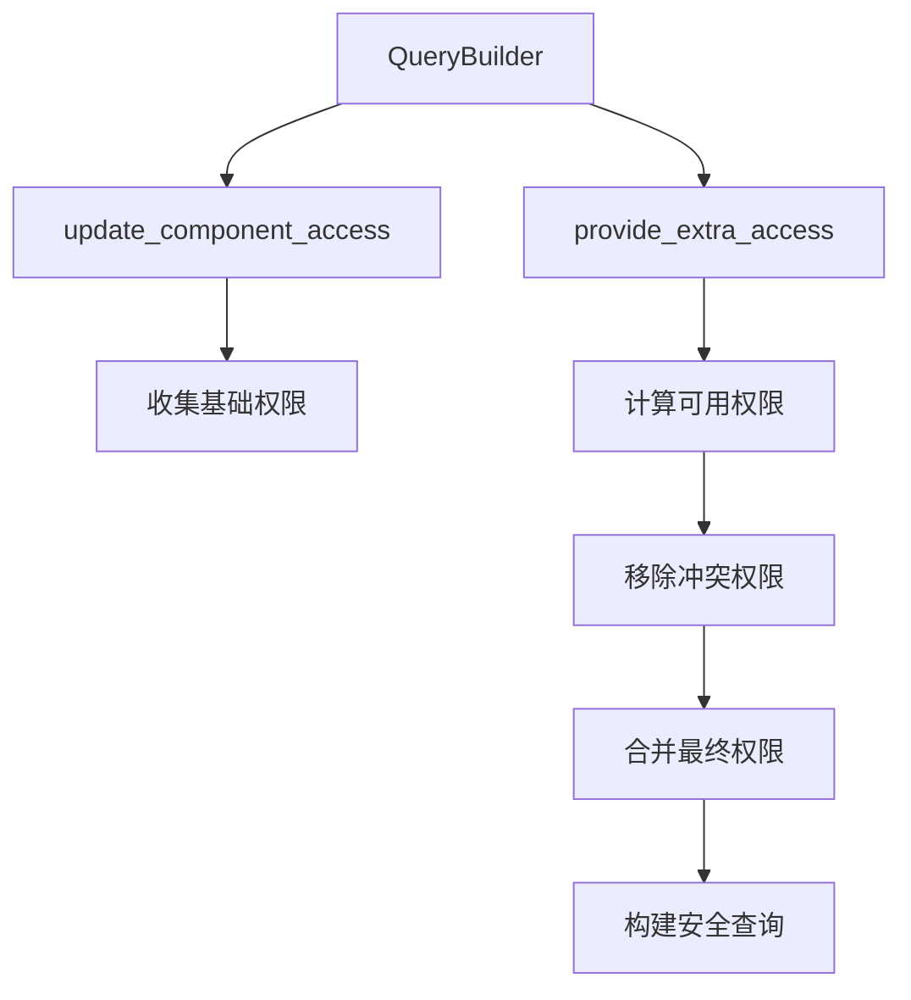

+++
title = "#18236 Let `FilteredEntity(Ref|Mut)` receive access when nested."
date = "2025-05-06T00:00:00"
draft = false
template = "pull_request_page.html"
in_search_index = false

[extra]
current_language = "zh-cn"
available_languages = {"en" = { name = "English", url = "/pull_request/bevy/2025-05/pr-18236-en-20250506" }, "zh-cn" = { name = "中文", url = "/pull_request/bevy/2025-05/pr-18236-zh-cn-20250506" }}
labels = ["C-Bug", "C-Feature", "A-ECS", "D-Complex", "D-Unsafe"]
+++

# Title

## Basic Information
- **Title**: Let `FilteredEntity(Ref|Mut)` receive access when nested.
- **PR Link**: https://github.com/bevyengine/bevy/pull/18236
- **Author**: chescock
- **Status**: MERGED
- **Labels**: C-Bug, C-Feature, A-ECS, S-Ready-For-Final-Review, D-Complex, X-Uncontroversial, D-Unsafe
- **Created**: 2025-03-10T18:16:41Z
- **Merged**: 2025-05-05T23:42:36Z
- **Merged By**: alice-i-cecile

## Description Translation
该PR解决当`FilteredEntityRef`和`FilteredEntityMut`嵌套在元组或`#[derive(QueryData)]`类型中时的组件访问权限问题。主要变更包括：

1. 新增`QueryData::provide_extra_access`方法用于动态管理访问权限
2. 重构`Access`类型的集合操作逻辑
3. 修改`FilteredEntityRef/Mut`的存储类型为`Access`
4. 增加多个测试用例验证嵌套场景下的访问控制

完整PR描述见原始英文版本。

## The Story of This Pull Request

### 问题背景与约束
Bevy ECS的查询系统需要精确控制组件访问权限以避免数据竞争。当使用`FilteredEntityRef`和`FilteredEntityMut`这类动态访问类型时，原有实现在嵌套场景（如元组查询）中存在两个关键问题：

1. **访问权限丢失**：嵌套的过滤实体类型无法继承父查询的访问权限
2. **潜在冲突**：多个子查询可能请求冲突的访问权限（如同时写同一组件）

```rust
// 问题示例：嵌套的FilteredEntityMut无法获取正确权限
let mut query = QueryBuilder::<(Entity, FilteredEntityMut)>::new(&mut world)
    .data::<&mut A>()
    .build();

let (_, mut entity) = query.single_mut(&mut world).unwrap();
// entity.get_mut::<A>() 返回None，不符合预期
```

### 解决方案设计
核心思路是引入分层访问控制机制：

1. **两阶段权限计算**：
   - 第一阶段：通过`update_component_access`收集基本权限
   - 第二阶段：通过`provide_extra_access`动态分配剩余可用权限

2. **冲突检测**：
   - 新增`Access::remove_conflicting_access`方法
   - 使用位集合操作精确计算不冲突的访问权限

```rust
// 新增的权限计算方法
fn provide_extra_access(
    state: &mut Self::State,
    access: &mut Access<ComponentId>,
    available_access: &Access<ComponentId>,
) {
    state.clone_from(available_access);
    state.remove_conflicting_access(access);
    access.extend(state);
}
```

### 实现细节与架构调整
1. **Access类型重构**：
   - 提取通用集合操作到`invertible_union_with`和`invertible_difference_with`
   - 新增`remove_conflicting_access`实现冲突检测

```rust
// 重构后的extend方法
pub fn extend(&mut self, other: &Access<T>) {
    invertible_union_with(
        &mut self.component_read_and_writes,
        &mut self.component_read_and_writes_inverted,
        &other.component_read_and_writes,
        other.component_read_and_writes_inverted,
    );
    // 类似处理其他字段...
}
```

2. **查询构建流程改造**：
   - 在`QueryState::from_builder`中调用`provide_extra_access`
   - 修改`FilteredEntityRef/Mut`的state类型为`Access`

```diff
- type State = FilteredAccess<ComponentId>;
+ type State = Access<ComponentId>;
```

### 技术洞察与优化
1. **动态权限分配**：通过available_access参数实现权限的按需分配
2. **位集合高效操作**：使用FixedBitSet实现高性能的集合运算
3. **编译时与运行时结合**：在查询构建阶段完成权限验证，运行时仅做快速检查

### 影响与验证
1. **功能增强**：
   - 支持任意层级的嵌套查询
   - 自动处理权限冲突

```rust
// 现在可以正确获取嵌套权限
let mut query = QueryBuilder::<(FilteredEntityMut, &mut A, &B)>::new(&mut world)
    .data::<&mut A>()
    .data::<&mut B>()
    .build();

let (mut entity, _a, _b) = query.single_mut(&mut world).unwrap();
assert!(entity.get::<B>().is_some()); // 现在能正确获取只读权限
```

2. **测试覆盖**：
   - 新增11个测试用例验证不同嵌套场景
   - 覆盖权限冲突、类型转换、边界条件等

## Visual Representation



## Key Files Changed

### crates/bevy_ecs/src/query/access.rs (+186/-61)
1. 核心变更：
   - 新增`remove_conflicting_access`方法
   - 提取通用集合操作为独立函数

```rust
// 新增冲突移除方法
pub fn remove_conflicting_access(&mut self, other: &Access<T>) {
    invertible_difference_with(
        &mut self.component_read_and_writes,
        &mut self.component_read_and_writes_inverted,
        &other.component_writes,
        other.component_writes_inverted,
    );
    // 处理其他字段...
}
```

### crates/bevy_ecs/src/query/fetch.rs (+76/-25)
1. FilteredEntityRef/Mut改造：
   - 修改state类型
   - 实现provide_extra_access

```rust
// FilteredEntityMut的权限提供实现
fn provide_extra_access(
    state: &mut Self::State,
    access: &mut Access<ComponentId>,
    available_access: &Access<ComponentId>,
) {
    state.clone_from(available_access);
    state.remove_conflicting_access(access);
    access.extend(state);
}
```

### crates/bevy_ecs/macros/src/query_data.rs (+16/-0)
1. 派生宏增强：
   - 自动生成provide_extra_access方法

```rust
fn provide_extra_access(
    state: &mut Self::State,
    access: &mut #path::query::Access<#path::component::ComponentId>,
    available_access: &#path::query::Access<#path::component::ComponentId>,
) {
    #(<#field_types>::provide_extra_access(&mut state.#named_field_idents, access, available_access);)*
}
```

## Further Reading
1. [Bevy ECS Query System Documentation](https://bevyengine.org/learn/book/ecs/queries/)
2. [Rust BitSet Operations Guide](https://docs.rs/fixedbitset/latest/fixedbitset/)
3. [Entity Component System Pattern](https://en.wikipedia.org/wiki/Entity_component_system)