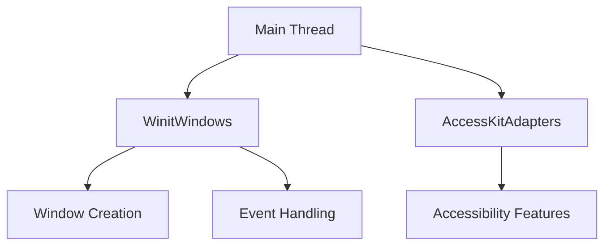

+++
title = "#18386 Remove remaining internal use of `!Send` resources"
date = "2025-05-06T00:00:00"
draft = false
template = "pull_request_page.html"
in_search_index = true

[taxonomies]
list_display = ["show"]

[extra]
current_language = "en"
available_languages = {"en" = { name = "English", url = "/pull_request/bevy/2025-05/pr-18386-en-20250506" }, "zh-cn" = { name = "中文", url = "/pull_request/bevy/2025-05/pr-18386-zh-cn-20250506" }}
labels = ["A-ECS", "A-App", "X-Blessed", "S-Waiting-on-Author"]
+++

# Title: Remove remaining internal use of `!Send` resources

## Basic Information
- **Title**: Remove remaining internal use of `!Send` resources
- **PR Link**: https://github.com/bevyengine/bevy/pull/18386
- **Author**: joshua-holmes
- **Status**: MERGED
- **Labels**: A-ECS, A-App, X-Blessed, S-Waiting-on-Author
- **Created**: 2025-03-18T03:09:29Z
- **Merged**: 2025-05-06T22:43:56Z
- **Merged By**: alice-i-cecile

## Description Translation
# Objective

Remaining work for and closes #17682. First half of work for that issue was completed in [PR 17730](https://github.com/bevyengine/bevy/pull/17730). However, the rest of the work ended up getting blocked because we needed a way of forcing systems to run on the main thread without the use of `!Send` resources. That was unblocked by [PR 18301](https://github.com/bevyengine/bevy/pull/18301).

This work should finish unblocking the resources-as-components effort.

# Testing

Ran several examples using my Linux machine, just to make sure things are working as expected and no surprises pop up.

## The Story of This Pull Request

This PR completes the removal of internal `!Send` resource usage that was blocking progress on Bevy's resources-as-components initiative. The core challenge involved managing platform-specific windowing and accessibility features that require main thread execution, while maintaining Bevy's Send-safety guarantees.

### Problem and Context
The original implementation used `NonSend` resources like `WinitWindows` and `AccessKitAdapters` to handle window management and accessibility features. These resources couldn't be made `Send` due to platform constraints, creating architectural limitations. This became a blocker for features requiring full Send compatibility across the ECS.

### Solution Approach
The key insight was to use thread-local storage for platform-specific resources while maintaining a Send-safe interface. This approach:
1. Moves non-Send data into thread-local `RefCell` storage
2. Modifies systems to access this data through controlled thread-local APIs
3. Removes all remaining `NonSend` resource dependencies

### Implementation Details
The main technical changes involve refactoring window management and accessibility systems:

**Accessibility System (accessibility.rs):**
```rust
thread_local! {
    static ACCESS_KIT_ADAPTERS: RefCell<AccessKitAdapters> = const { RefCell::new(AccessKitAdapters::new()) };
}

fn update_accessibility_nodes(
    // Removed NonSendMut parameter
    _non_send_marker: NonSendMarker,
) {
    ACCESS_KIT_ADAPTERS.with_borrow_mut(|adapters| {
        // Accessibility logic using thread-local adapters
    });
}
```

**Window Management (state.rs):**
```rust
thread_local! {
    static WINIT_WINDOWS: RefCell<WinitWindows> = const { RefCell::new(WinitWindows::new()) };
}

// Modified event handler pattern
WINIT_WINDOWS.with_borrow(|winit_windows| {
    // Window event processing using thread-local storage
});
```

### Technical Insights
1. **Thread-Local Storage**: Enforces main thread access while maintaining Send safety
2. **System Param Removal**: Eliminates `NonSendMut` parameters from 15+ systems
3. **Architectural Alignment**: Prepares for future resources-as-components implementation

### Impact
- Removes last internal uses of `!Send` resources
- Reduces special-case handling in Bevy's ECS
- Unblocks #17682 resources-as-components work
- Improves cross-platform consistency

## Visual Representation



## Key Files Changed

### `crates/bevy_winit/src/accessibility.rs` (+52/-35)
**Purpose:** Refactor accessibility system to use thread-local storage  
**Key Change:**
```rust
// Before: NonSend resource
fn update_accessibility_nodes(mut adapters: NonSendMut<AccessKitAdapters>) {
    // ... 
}

// After: Thread-local access
fn update_accessibility_nodes(_non_send_marker: NonSendMarker) {
    ACCESS_KIT_ADAPTERS.with_borrow_mut(|adapters| {
        // ...
    });
}
```

### `crates/bevy_winit/src/state.rs` (+299/-286)
**Purpose:** Refactor window state management  
**Key Change:**
```rust
// Thread-local storage initialization
thread_local! {
    static WINIT_WINDOWS: RefCell<WinitWindows> = /* ... */
}

// Event processing pattern
WINIT_WINDOWS.with_borrow(|winit_windows| {
    // Window event handling logic
});
```

### `crates/bevy_gilrs/src/lib.rs` (+19/-0)
**Purpose:** Add regression test for Send safety  
**Key Addition:**
```rust
#[test]
fn world_is_truly_send() {
    // Verifies world Send status after system changes
    let handler = std::thread::spawn(move || {
        drop(world);
    });
    handler.join().unwrap();
}
```

## Further Reading
- [Bevy ECS System Params](https://bevyengine.org/learn/book/next/ecs/system-params/)
- [Winit Window Management](https://docs.rs/winit/latest/winit/)
- [AccessKit Accessibility Framework](https://accesskit.dev/)
- [Thread-Local Storage in Rust](https://doc.rust-lang.org/std/thread/struct.LocalKey.html)