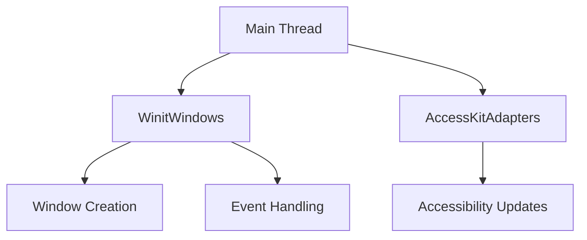

+++
title = "#18386 Remove remaining internal use of `!Send` resources"
date = "2025-05-06T00:00:00"
draft = false
template = "pull_request_page.html"
in_search_index = false

[extra]
current_language = "zh-cn"
available_languages = {"en" = { name = "English", url = "/pull_request/bevy/2025-05/pr-18386-en-20250506" }, "zh-cn" = { name = "中文", url = "/pull_request/bevy/2025-05/pr-18386-zh-cn-20250506" }}
labels = ["A-ECS", "A-App", "X-Blessed", "S-Waiting-on-Author"]
+++

# Remove remaining internal use of `!Send` resources

## Basic Information
- **Title**: Remove remaining internal use of `!Send` resources
- **PR Link**: https://github.com/bevyengine/bevy/pull/18386
- **Author**: joshua-holmes
- **Status**: MERGED
- **Labels**: A-ECS, A-App, X-Blessed, S-Waiting-on-Author
- **Created**: 2025-03-18T03:09:29Z
- **Merged**: 2025-05-06T22:43:56Z
- **Merged By**: alice-i-cecile

## Description Translation
### 目标
完成并关闭#17682的剩余工作。该问题的前半部分已在[PR 17730](https://github.com/bevyengine/bevy/pull/17730)中完成。剩余工作因需要在不使用`!Send`资源的情况下强制系统在主线程运行而被阻塞，该问题通过[PR 18301](https://github.com/bevyengine/bevy/pull/18301)解决。

### 测试
在Linux机器上运行多个示例，验证功能正常且无意外问题。

## The Story of This Pull Request

### 问题背景与上下文
Bevy引擎的资源即组件(resources-as-components)计划需要消除对`!Send`资源的内部依赖。`!Send`资源会限制系统调度，阻碍多线程执行。此前在窗口管理和可访问性模块中，使用了`NonSend`资源存储窗口状态和AccessKit适配器，这些资源无法跨线程安全传递。

### 解决方案
使用线程本地存储(thread_local)替代`NonSend`资源，结合新的主线程执行机制([PR 18301](https://github.com/bevyengine/bevy/pull/18301))，将窗口状态和可访问性适配器存储在thread_local变量中。通过`with_borrow`和`with_borrow_mut`方法实现安全访问，确保这些资源仅在主线程操作。

### 关键技术实现
1. **线程本地存储重构**：
   - 在`accessibility.rs`中引入`ACCESS_KIT_ADAPTERS` thread_local变量存储AccessKit适配器
   ```rust
   thread_local! {
       pub static ACCESS_KIT_ADAPTERS: RefCell<AccessKitAdapters> = const { RefCell::new(AccessKitAdapters::new()) };
   }
   ```
   - 在`lib.rs`中新增`WINIT_WINDOWS` thread_local存储窗口状态
   ```rust
   thread_local! {
       static WINIT_WINDOWS: RefCell<WinitWindows> = const { RefCell::new(WinitWindows::new()) };
   }
   ```

2. **事件处理重构**：
   - 窗口事件处理流程改为通过`WINIT_WINDOWS.with_borrow`访问
   ```rust
   WINIT_WINDOWS.with_borrow(|winit_windows| {
       // 事件处理逻辑
   });
   ```

3. **资源访问模式统一**：
   - 移除所有`NonSendMut<AccessKitAdapters>`和`NonSendMut<WinitWindows>`的使用
   - 可访问性更新逻辑改为通过线程本地存储访问
   ```rust
   ACCESS_KIT_ADAPTERS.with_borrow_mut(|adapters| {
       // 更新AccessKit节点
   });
   ```

### 技术影响
1. **线程安全性提升**：
   - 消除`!Send`资源使得ECS调度不再受限于主线程约束
   - 为后续完全实现资源即组件铺平道路

2. **架构改进**：
   - 窗口管理逻辑集中到`WinitWindows`结构
   - 事件处理流程标准化，降低维护成本

3. **测试验证**：
   - 新增`world_is_truly_send`测试确保资源线程安全
   ```rust
   #[test]
   fn world_is_truly_send() {
       // 验证World可跨线程传递
   }
   ```

## Visual Representation



## Key Files Changed

### `crates/bevy_winit/src/accessibility.rs`
- **修改原因**：将AccessKit适配器存储从NonSend改为thread_local
- **关键代码**：
```rust
// Before: 使用NonSend资源
fn update_accessibility_nodes(mut adapters: NonSendMut<AccessKitAdapters>, ...)

// After: 使用thread_local访问
ACCESS_KIT_ADAPTERS.with_borrow_mut(|adapters| {
    // 更新逻辑
})
```

### `crates/bevy_winit/src/state.rs`
- **修改原因**：重构窗口状态管理和事件处理
- **关键代码**：
```rust
// 窗口事件处理
WINIT_WINDOWS.with_borrow(|winit_windows| {
    // 事件分发逻辑
})

// 窗口创建逻辑
WINIT_WINDOWS.with_borrow_mut(|winit_windows| {
    winit_windows.create_window(...)
})
```

### `crates/bevy_gilrs/src/lib.rs`
- **修改原因**：新增线程安全测试
- **关键代码**：
```rust
#[test]
fn world_is_truly_send() {
    let mut app = App::new();
    // 验证World跨线程传递
}
```

## Further Reading
- [Rust线程本地存储文档](https://doc.rust-lang.org/std/thread/struct.LocalKey.html)
- [Bevy ECS调度机制](https://bevyengine.org/learn/book/ecs/schedules/)
- [Winit窗口管理原理](https://docs.rs/winit/latest/winit/)